# FAQ・AI 回答・未解決質問・処理エラー(機能要件)

> **このページは、FAQ・AI 回答・未解決質問・処理エラー に関する機能要件を定義します。**

*複数の個別要件を統合したカテゴリ別ページ。各要件の優先度・トレースは各節を参照。 ステータス ドラフト*

## FR-047: FAQ の登録・編集・削除

> **この機能要件は「FAQ の登録・編集・削除」を定義します。**

*種別 機能要件 ・ 機能グループ FAQ 管理 ・ 優先度 P0 ・ ステータス ドラフト*

### 要件

FAQ を登録、編集、削除できること

### シーケンス

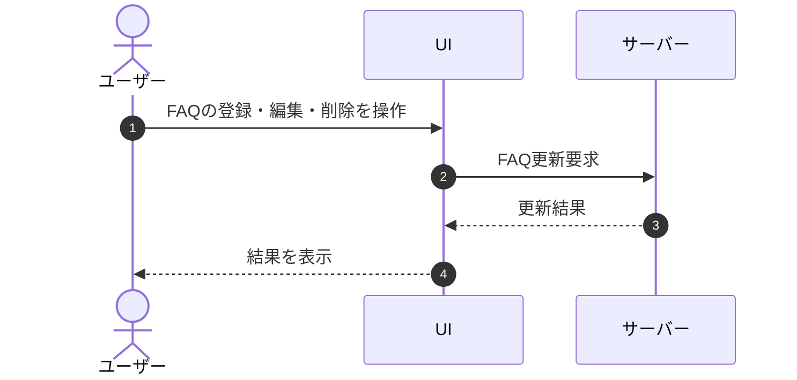
```mermaid
sequenceDiagram
  autonumber
  actor U as ユーザー
  participant UI as UI
  participant S as サーバー
  U->>UI: FAQの登録・編集・削除を操作
  UI->>S: FAQ更新要求
  S-->>UI: 更新結果
  UI-->>U: 結果を表示
```

## FR-048: 管理画面からの削除の不可逆性

> **この機能要件は「管理画面からの削除の不可逆性」を定義します。**

*種別 機能要件 ・ 機能グループ FAQ 管理 ・ 優先度 P0 ・ ステータス ドラフト*

### 要件

FAQ・プロジェクト・メンバーユーザー・お知らせ・契約の削除は管理画面から復元できないこと(誤削除時はサポート窓口経由でのみ救済される)

### シーケンス

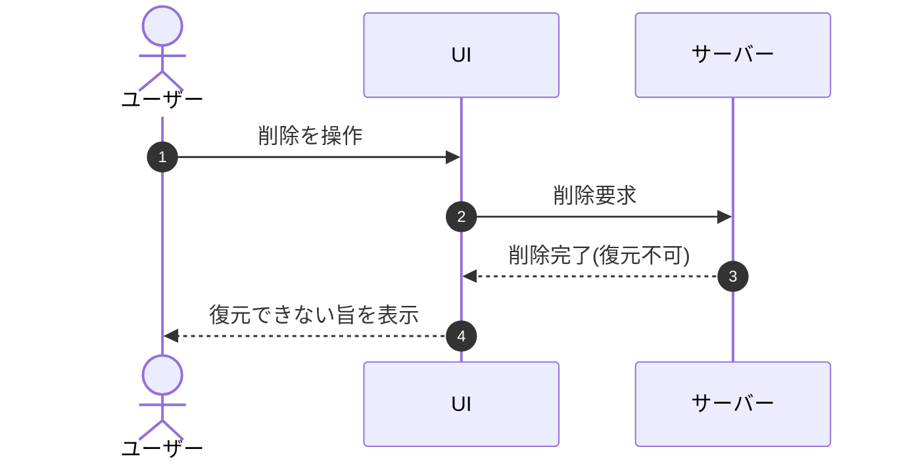
```mermaid
sequenceDiagram
  autonumber
  actor U as ユーザー
  participant UI as UI
  participant S as サーバー
  U->>UI: 削除を操作
  UI->>S: 削除要求
  S-->>UI: 削除完了(復元不可)
  UI-->>U: 復元できない旨を表示
```

## FR-049: FAQ に質問と回答を登録

> **この機能要件は「FAQ に質問と回答を登録」を定義します。**

*種別 機能要件 ・ 機能グループ FAQ 管理 ・ 優先度 P0 ・ ステータス ドラフト*

### 要件

FAQ に質問と回答を登録できること

### シーケンス

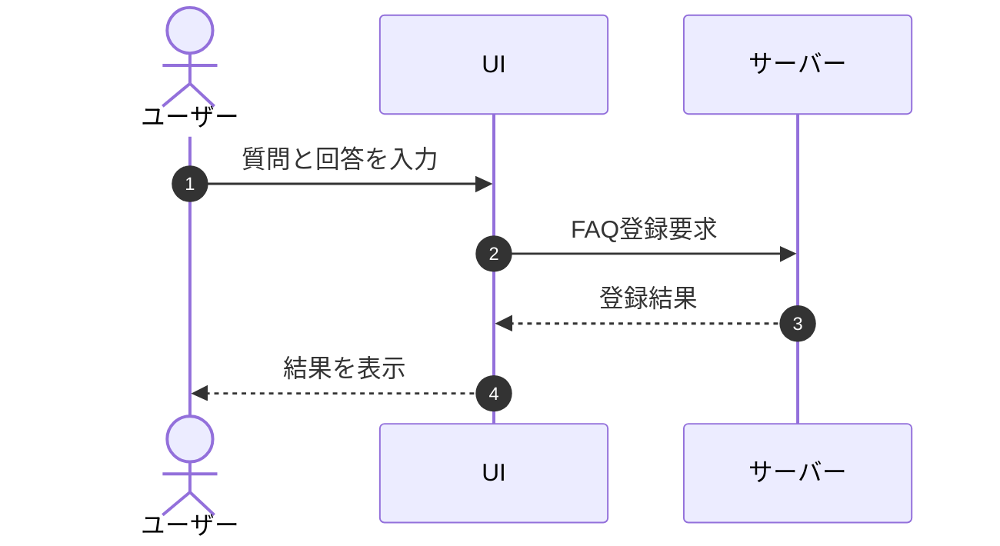
```mermaid
sequenceDiagram
  autonumber
  actor U as ユーザー
  participant UI as UI
  participant S as サーバー
  U->>UI: 質問と回答を入力
  UI->>S: FAQ登録要求
  S-->>UI: 登録結果
  UI-->>U: 結果を表示
```

## FR-050: FAQ を下書き、公開中、非公開の状態で管理

> **この機能要件は「FAQ を下書き、公開中、非公開の状態で管理」を定義します。**

*種別 機能要件 ・ 機能グループ FAQ 管理 ・ 優先度 P0 ・ ステータス ドラフト*

### 要件

FAQ を下書き、公開中、非公開の状態で管理できること

### シーケンス

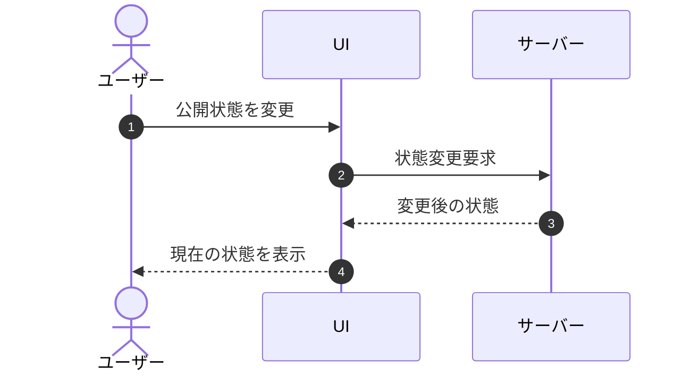
```mermaid
sequenceDiagram
  autonumber
  actor U as ユーザー
  participant UI as UI
  participant S as サーバー
  U->>UI: 公開状態を変更
  UI->>S: 状態変更要求
  S-->>UI: 変更後の状態
  UI-->>U: 現在の状態を表示
```

## FR-051: FAQ をカテゴリで整理

> **この機能要件は「FAQ をカテゴリで整理」を定義します。**

*種別 機能要件 ・ 機能グループ FAQ 管理 ・ 優先度 P1 ・ ステータス ドラフト*

### 要件

FAQ をカテゴリで整理できること

### シーケンス

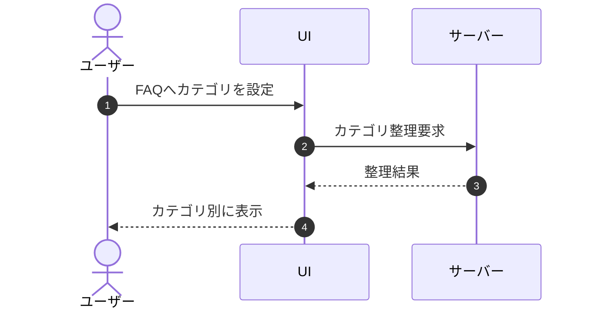
```mermaid
sequenceDiagram
  autonumber
  actor U as ユーザー
  participant UI as UI
  participant S as サーバー
  U->>UI: FAQへカテゴリを設定
  UI->>S: カテゴリ整理要求
  S-->>UI: 整理結果
  UI-->>U: カテゴリ別に表示
```

## FR-052: FAQ の検索・並び替え・絞り込み

> **この機能要件は「FAQ の検索・並び替え・絞り込み」を定義します。**

*種別 機能要件 ・ 機能グループ FAQ 管理 ・ 優先度 P1 ・ ステータス ドラフト*

### 要件

FAQ の検索、並び替え、絞り込みができること

### シーケンス

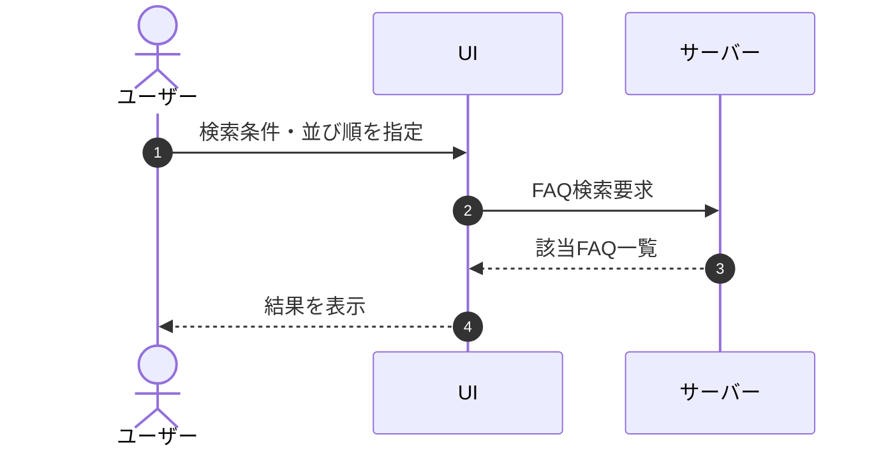
```mermaid
sequenceDiagram
  autonumber
  actor U as ユーザー
  participant UI as UI
  participant S as サーバー
  U->>UI: 検索条件・並び順を指定
  UI->>S: FAQ検索要求
  S-->>UI: 該当FAQ一覧
  UI-->>U: 結果を表示
```

## FR-053: 公開前の内容確認

> **この機能要件は「公開前の内容確認」を定義します。**

*種別 機能要件 ・ 機能グループ FAQ 管理 ・ 優先度 P0 ・ ステータス ドラフト*

### 要件

FAQ の公開前にアカウント利用者が内容を確認できること

### シーケンス

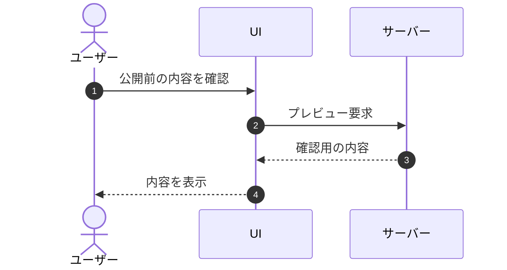
```mermaid
sequenceDiagram
  autonumber
  actor U as ユーザー
  participant UI as UI
  participant S as サーバー
  U->>UI: 公開前の内容を確認
  UI->>S: プレビュー要求
  S-->>UI: 確認用の内容
  UI-->>U: 内容を表示
```

## FR-054: FAQ 件数・文字数の上限管理

> **この機能要件は「FAQ 件数・文字数の上限管理」を定義します。**

*種別 機能要件 ・ 機能グループ FAQ 管理 ・ 優先度 P0 ・ ステータス ドラフト*

### 要件

FAQ 件数および 1 件あたりの文字数の上限は契約共通の基準とし、極端に大きい場合は警告または登録拒否できること。
1. 1 契約あたり FAQ 件数 = 警告 **8,000 件**、登録拒否 **12,000 件**
2. FAQ 質問 文字数上限 = **500 文字**
3. FAQ 回答 文字数上限 = **5,000 文字**
4. 文字数超過は登録時にエラー、件数上限は段階通知(80% / 100%)で警告し 120% で新規登録拒否

### シーケンス

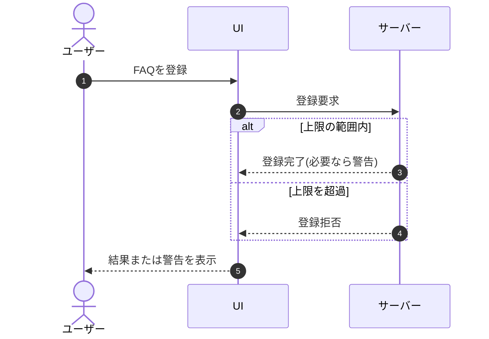
```mermaid
sequenceDiagram
  autonumber
  actor U as ユーザー
  participant UI as UI
  participant S as サーバー
  U->>UI: FAQを登録
  UI->>S: 登録要求
  alt 上限の範囲内
    S-->>UI: 登録完了(必要なら警告)
  else 上限を超過
    S-->>UI: 登録拒否
  end
  UI-->>U: 結果または警告を表示
```

## FR-055: 同時編集の競合検出

> **この機能要件は「同時編集の競合検出」を定義します。**

*種別 機能要件 ・ 機能グループ FAQ 管理 ・ 優先度 P1 ・ ステータス ドラフト*

### 要件

FAQ 更新時、同時編集による競合を検出できること

### シーケンス

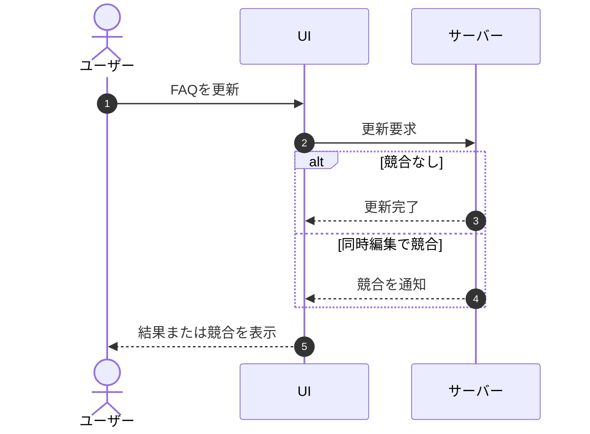
```mermaid
sequenceDiagram
  autonumber
  actor U as ユーザー
  participant UI as UI
  participant S as サーバー
  U->>UI: FAQを更新
  UI->>S: 更新要求
  alt 競合なし
    S-->>UI: 更新完了
  else 同時編集で競合
    S-->>UI: 競合を通知
  end
  UI-->>U: 結果または競合を表示
```

## FR-056: FAQ 登録元の保持

> **この機能要件は「FAQ 登録元の保持」を定義します。**

*種別 機能要件 ・ 機能グループ FAQ 管理 ・ 優先度 P1 ・ ステータス ドラフト*

### 要件

FAQ の登録元(未解決質問からの登録か手動登録か)を保持できること

### シーケンス

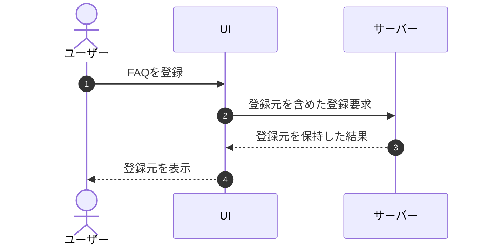
```mermaid
sequenceDiagram
  autonumber
  actor U as ユーザー
  participant UI as UI
  participant S as サーバー
  U->>UI: FAQを登録
  UI->>S: 登録元を含めた登録要求
  S-->>UI: 登録元を保持した結果
  UI-->>U: 登録元を表示
```

## FR-057: 公開中 FAQ のみを根拠とする回答

> **この機能要件は「公開中 FAQ のみを根拠とする回答」を定義します。**

*種別 機能要件 ・ 機能グループ AI 回答 ・ 優先度 P0 ・ ステータス ドラフト*

### 要件

ウィジェット利用者の質問に対し、公開中の登録済み FAQ のみを根拠として回答できること

### シーケンス

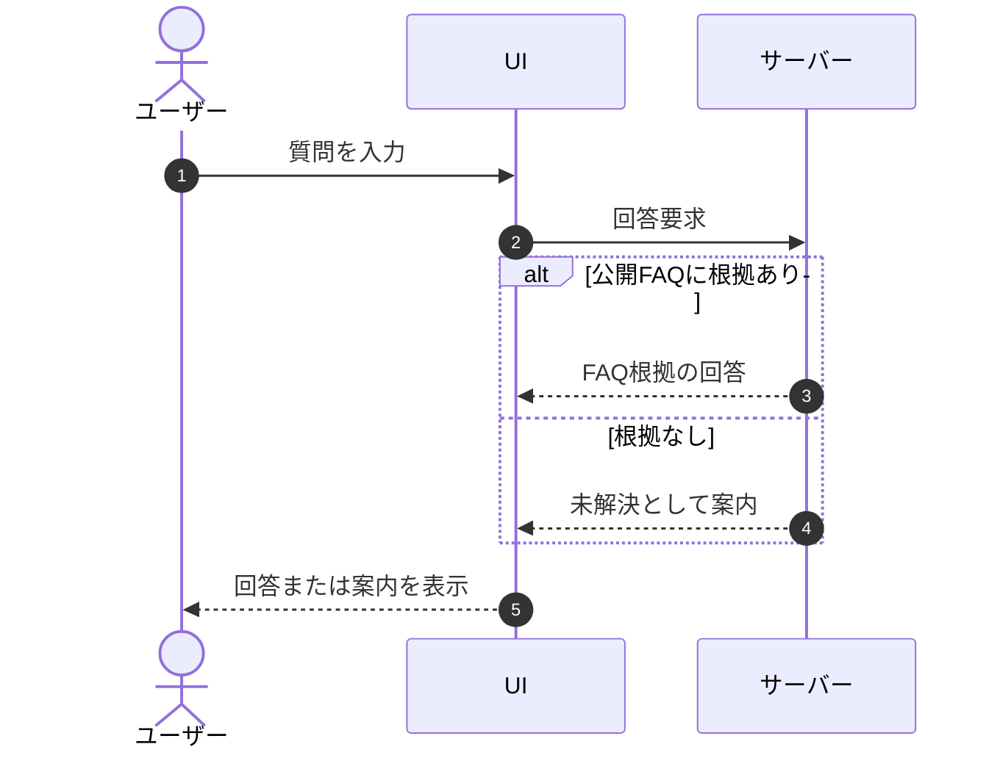
```mermaid
sequenceDiagram
  autonumber
  actor U as ユーザー
  participant UI as UI
  participant S as サーバー
  U->>UI: 質問を入力
  UI->>S: 回答要求
  alt 公開FAQに根拠あり
    S-->>UI: FAQ根拠の回答
  else 根拠なし
    S-->>UI: 未解決として案内
  end
  UI-->>U: 回答または案内を表示
```

## FR-058: 根拠なき独自生成の抑止

> **この機能要件は「根拠なき独自生成の抑止」を定義します。**

*種別 機能要件 ・ 機能グループ AI 回答 ・ 優先度 P0 ・ ステータス ドラフト*

### 要件

FAQ に根拠がない内容を AI が独自に作成しないこと

### シーケンス

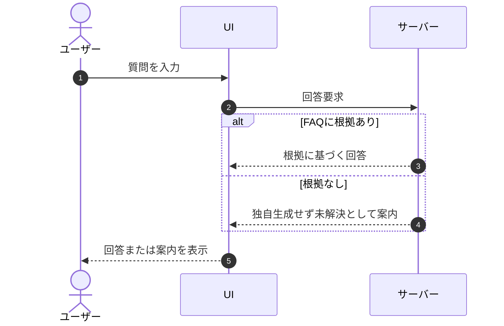
```mermaid
sequenceDiagram
  autonumber
  actor U as ユーザー
  participant UI as UI
  participant S as サーバー
  U->>UI: 質問を入力
  UI->>S: 回答要求
  alt FAQに根拠あり
    S-->>UI: 根拠に基づく回答
  else 根拠なし
    S-->>UI: 独自生成せず未解決として案内
  end
  UI-->>U: 回答または案内を表示
```

## FR-059: FAQ 表現の整理にとどめる加工

> **この機能要件は「FAQ 表現の整理にとどめる加工」を定義します。**

*種別 機能要件 ・ 機能グループ AI 回答 ・ 優先度 P0 ・ ステータス ドラフト*

### 要件

AI は FAQ の内容を要約・言い換え・整理できるが、新しい事実・数値・固有名詞・手順を追加しないこと

### シーケンス

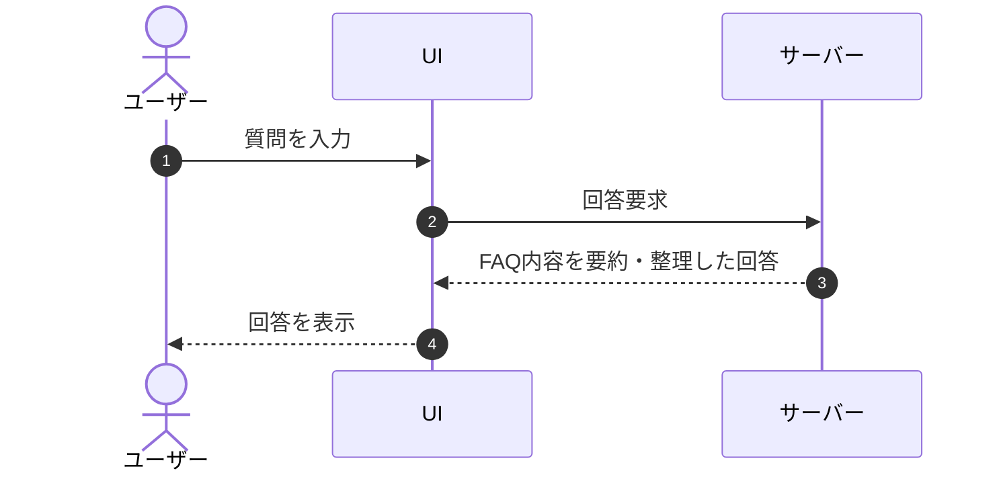
```mermaid
sequenceDiagram
  autonumber
  actor U as ユーザー
  participant UI as UI
  participant S as サーバー
  U->>UI: 質問を入力
  UI->>S: 回答要求
  S-->>UI: FAQ内容を要約・整理した回答
  UI-->>U: 回答を表示
```

## FR-060: 参照 FAQ の記録と提示

> **この機能要件は「参照 FAQ の記録と提示」を定義します。**

*種別 機能要件 ・ 機能グループ AI 回答 ・ 優先度 P0 ・ ステータス ドラフト*

### 要件

回答に利用した FAQ を記録し、ウィジェット利用者にも参照 FAQ を提示できること

### シーケンス

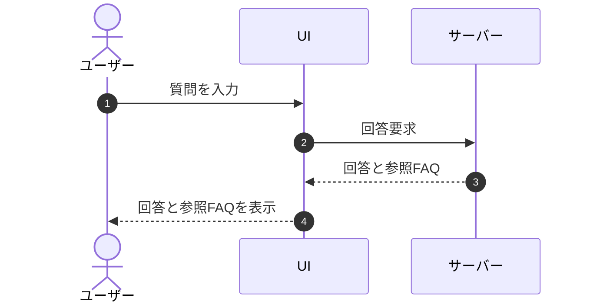
```mermaid
sequenceDiagram
  autonumber
  actor U as ユーザー
  participant UI as UI
  participant S as サーバー
  U->>UI: 質問を入力
  UI->>S: 回答要求
  S-->>UI: 回答と参照FAQ
  UI-->>U: 回答と参照FAQを表示
```

## FR-061: FAQ 矛盾時の未解決扱い

> **この機能要件は「FAQ 矛盾時の未解決扱い」を定義します。**

*種別 機能要件 ・ 機能グループ AI 回答 ・ 優先度 P0 ・ ステータス ドラフト*

### 要件

FAQ 同士に矛盾がある場合、断定回答せず未解決として扱えること

### シーケンス

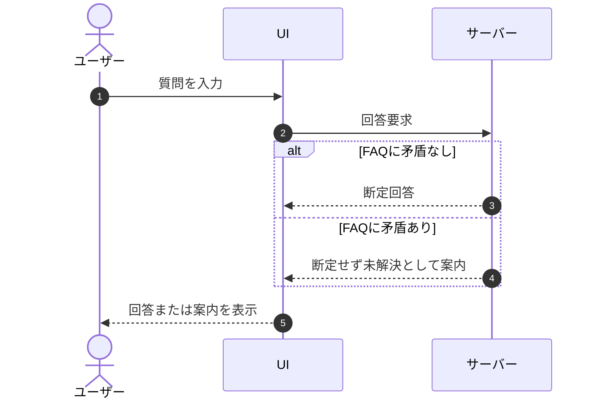
```mermaid
sequenceDiagram
  autonumber
  actor U as ユーザー
  participant UI as UI
  participant S as サーバー
  U->>UI: 質問を入力
  UI->>S: 回答要求
  alt FAQに矛盾なし
    S-->>UI: 断定回答
  else FAQに矛盾あり
    S-->>UI: 断定せず未解決として案内
  end
  UI-->>U: 回答または案内を表示
```

## FR-062: しきい値の 3 階層調整

> **この機能要件は「しきい値の 3 階層調整」を定義します。**

*種別 機能要件 ・ 機能グループ AI 回答 ・ 優先度 P1 ・ ステータス ドラフト*

### 要件

回答可否の判定に信頼度・関連度のしきい値をグローバル / 契約別 / プロジェクト別の **3 階層**で調整できること。
1. 優先順位は **プロジェクト &gt; オーナー &gt; グローバル**(より具体的な設定が優先)
2. 設定値は保存と同時に有効化される
3. MVP 初期値は **信頼度 0.60 / 関連度 0.50**

### シーケンス

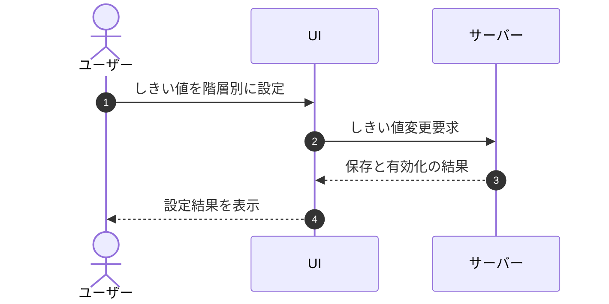
```mermaid
sequenceDiagram
  autonumber
  actor U as ユーザー
  participant UI as UI
  participant S as サーバー
  U->>UI: しきい値を階層別に設定
  UI->>S: しきい値変更要求
  S-->>UI: 保存と有効化の結果
  UI-->>U: 設定結果を表示
```

## FR-063: 問い合わせ ID 付与と回答不可案内

> **この機能要件は「問い合わせ ID 付与と回答不可案内」を定義します。**

*種別 機能要件 ・ 機能グループ AI 回答 ・ 優先度 P0 ・ ステータス ドラフト*

### 要件

FAQ 登録済みデータでは回答できなかった場合、管理用の問い合わせ ID を付与して未解決質問を登録すること。
1. 同じウィジェットの会話欄へは回答できなかった旨・確認済みプロジェクト連絡先メール(設定済みの場合)を表示する
2. 問い合わせ ID はウィジェットに表示しない
3. FAQ 質問入力は継続可能とする

### シーケンス

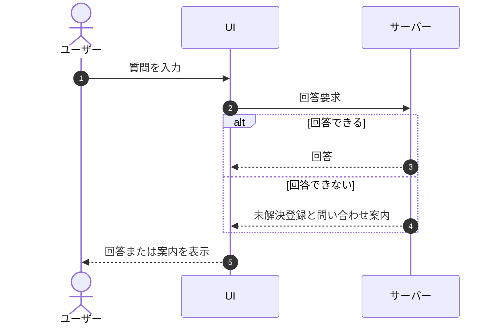
```mermaid
sequenceDiagram
  autonumber
  actor U as ユーザー
  participant UI as UI
  participant S as サーバー
  U->>UI: 質問を入力
  UI->>S: 回答要求
  alt 回答できる
    S-->>UI: 回答
  else 回答できない
    S-->>UI: 未解決登録と問い合わせ案内
  end
  UI-->>U: 回答または案内を表示
```

## FR-064: 処理エラー時のエラー表示

> **この機能要件は「処理エラー時のエラー表示」を定義します。**

*種別 機能要件 ・ 機能グループ AI 回答 ・ 優先度 P0 ・ ステータス ドラフト*

### 要件

処理エラーの場合は、未解決質問登録ではなくエラー表示を行えること

### シーケンス

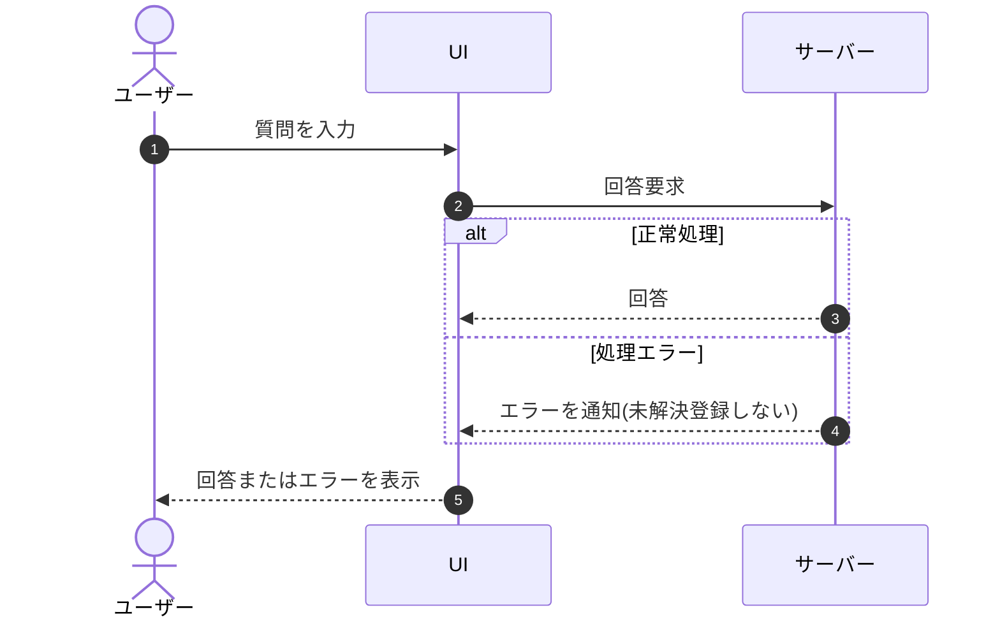
```mermaid
sequenceDiagram
  autonumber
  actor U as ユーザー
  participant UI as UI
  participant S as サーバー
  U->>UI: 質問を入力
  UI->>S: 回答要求
  alt 正常処理
    S-->>UI: 回答
  else 処理エラー
    S-->>UI: エラーを通知(未解決登録しない)
  end
  UI-->>U: 回答またはエラーを表示
```

## FR-065: プロンプト注入耐性

> **この機能要件は「プロンプト注入耐性」を定義します。**

*種別 機能要件 ・ 機能グループ AI 回答 ・ 優先度 P0 ・ ステータス ドラフト*

### 要件

ウィジェット利用者の入力により AI の動作方針(FAQ 限定回答方針)が変更されないこと(プロンプト注入耐性)。
1. 代表的な攻撃パターンを含む回帰テストを AI モデル更新時およびプロンプト変更時に実行する

### シーケンス

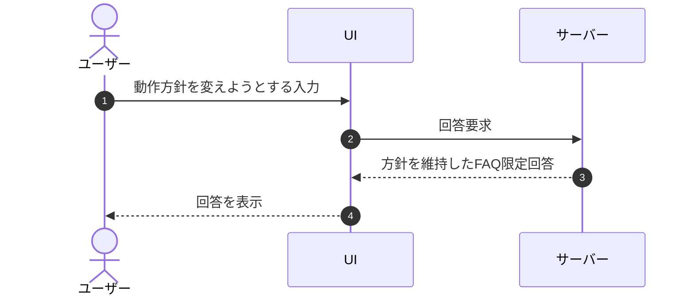
```mermaid
sequenceDiagram
  autonumber
  actor U as ユーザー
  participant UI as UI
  participant S as サーバー
  U->>UI: 動作方針を変えようとする入力
  UI->>S: 回答要求
  S-->>UI: 方針を維持したFAQ限定回答
  UI-->>U: 回答を表示
```

## FR-066: モデル切替時の品質回帰とロールバック

> **この機能要件は「モデル切替時の品質回帰とロールバック」を定義します。**

*種別 機能要件 ・ 機能グループ AI 回答 ・ 優先度 P1 ・ ステータス ドラフト*

### 要件

利用する AI モデルや基盤の変更時に、動作確認・切替・品質回帰確認・必要時のロールバックを行えること。
1. 標準テストデータセットは FAQ × 想定質問のペア **50 組以上** とする

### シーケンス

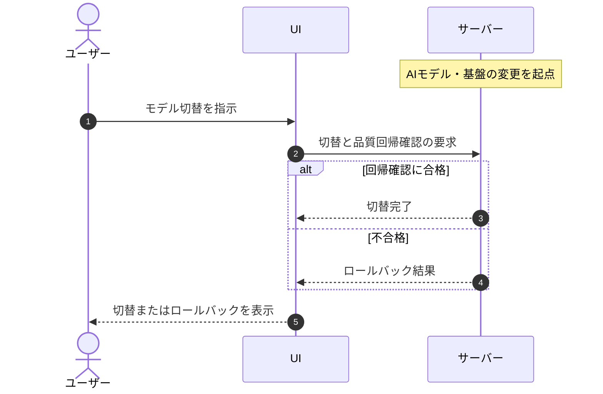
```mermaid
sequenceDiagram
  autonumber
  actor U as ユーザー
  participant UI as UI
  participant S as サーバー
  Note over S: AIモデル・基盤の変更を起点
  U->>UI: モデル切替を指示
  UI->>S: 切替と品質回帰確認の要求
  alt 回帰確認に合格
    S-->>UI: 切替完了
  else 不合格
    S-->>UI: ロールバック結果
  end
  UI-->>U: 切替またはロールバックを表示
```

## FR-067: 回答出力前の検査

> **この機能要件は「回答出力前の検査」を定義します。**

*種別 機能要件 ・ 機能グループ AI 回答 ・ 優先度 P1 ・ ステータス ドラフト*

### 要件

AI 回答の出力前に検査を行えること。
1. 参照 FAQ 外の固有名詞・数値・手順を検出した AI 回答は返却せず未解決登録に倒す
2. 個人情報を検出した場合は所定の形式でマスキングして返却し、検出種別を記録する

### シーケンス

```mermaid
sequenceDiagram
  autonumber
  actor U as ユーザー
  participant UI as UI
  participant S as サーバー
  U->>UI: 質問を入力
  UI->>S: 回答要求
  alt 検査に合格
    S-->>UI: 検査済みの回答
  else 不適切を検出
    S-->>UI: マスキングまたは未解決へ倒す
  end
  UI-->>U: 回答または案内を表示
```

## FR-068: 回答不可質問の未解決登録

> **この機能要件は「回答不可質問の未解決登録」を定義します。**

*種別 機能要件 ・ 機能グループ 未解決質問登録 ・ 優先度 P0 ・ ステータス ドラフト*

### 要件

FAQ 登録済みデータでは回答できなかった質問を未解決質問として登録できること

### シーケンス

```mermaid
sequenceDiagram
  autonumber
  actor U as ユーザー
  participant UI as UI
  participant S as サーバー
  U->>UI: 質問を入力
  UI->>S: 回答要求
  alt 回答できる
    S-->>UI: 回答
  else 回答できない
    S-->>UI: 未解決質問として登録し案内
  end
  UI-->>U: 回答または案内を表示
```

## FR-069: 未解決申告による未解決登録

> **この機能要件は「未解決申告による未解決登録」を定義します。**

*種別 機能要件 ・ 機能グループ 未解決質問登録 ・ 優先度 P0 ・ ステータス ドラフト*

### 要件

ウィジェット利用者が「解決しなかった」を選択した場合、未解決質問として登録できること

### シーケンス

```mermaid
sequenceDiagram
  autonumber
  actor U as ユーザー
  participant UI as UI
  participant S as サーバー
  U->>UI: 解決しなかったを選択
  UI->>S: 未解決登録要求
  S-->>UI: 登録結果
  UI-->>U: 受付を案内
```

## FR-070: 未解決質問の記録項目

> **この機能要件は「未解決質問の記録項目」を定義します。**

*種別 機能要件 ・ 機能グループ 未解決質問登録 ・ 優先度 P0 ・ ステータス ドラフト*

### 要件

未解決質問には、質問・未解決理由・発生日時・関連プロジェクト・関連質問ログを記録できること

### シーケンス

```mermaid
sequenceDiagram
  autonumber
  actor U as ユーザー
  participant UI as UI
  participant S as サーバー
  U->>UI: 未解決質問を確認
  UI->>S: 未解決質問の詳細要求
  S-->>UI: 記録された項目
  UI-->>U: 詳細を表示
```

## FR-071: 未解決質問への問い合わせ ID 付与

> **この機能要件は「未解決質問への問い合わせ ID 付与」を定義します。**

*種別 機能要件 ・ 機能グループ 未解決質問登録 ・ 優先度 P0 ・ ステータス ドラフト*

### 要件

未解決質問には問い合わせ ID を付与できること

### シーケンス

```mermaid
sequenceDiagram
  autonumber
  actor U as ユーザー
  participant UI as UI
  participant S as サーバー
  U->>UI: 未解決質問の発生
  UI->>S: 未解決登録要求
  S-->>UI: 問い合わせIDを付与した結果
  UI-->>U: 問い合わせIDを表示
```

## FR-072: 状況の 2 区分管理

> **この機能要件は「状況の 2 区分管理」を定義します。**

*種別 機能要件 ・ 機能グループ 未解決質問登録 ・ 優先度 P0 ・ ステータス ドラフト*

### 要件

未解決質問の状況は「対応中 / 対応済み」の 2 区分とし、保持すること

### シーケンス

```mermaid
sequenceDiagram
  autonumber
  actor U as ユーザー
  participant UI as UI
  participant S as サーバー
  U->>UI: 未解決質問の状況を確認
  UI->>S: 状況の取得要求
  S-->>UI: 保持された状況
  UI-->>U: 状況を表示
```

## FR-073: 登録時の初期状況「対応中」

> **この機能要件は「登録時の初期状況「対応中」」を定義します。**

*種別 機能要件 ・ 機能グループ 未解決質問登録 ・ 優先度 P0 ・ ステータス ドラフト*

### 要件

状況は未解決質問の登録時に「対応中」とすること。
1. 状況変更は詳細画面からの手動操作のみで行う
2. FAQ 下書き保存・FAQ 公開成功とは連動しない

### シーケンス

```mermaid
sequenceDiagram
  autonumber
  actor U as ユーザー
  participant UI as UI
  participant S as サーバー
  U->>UI: 未解決質問の発生
  UI->>S: 未解決登録要求
  S-->>UI: 初期状況を対応中で登録
  UI-->>U: 状況を表示
```

## FR-074: 状況の一覧・詳細表示

> **この機能要件は「状況の一覧・詳細表示」を定義します。**

*種別 機能要件 ・ 機能グループ 未解決質問登録 ・ 優先度 P0 ・ ステータス ドラフト*

### 要件

未解決質問について、現在の状況(対応中 / 対応済み)を一覧画面・詳細画面で確認できること。
1. 状況は詳細画面からの手動切替のみを表す
2. FAQ 操作から派生または更新しない

### シーケンス

```mermaid
sequenceDiagram
  autonumber
  actor U as ユーザー
  participant UI as UI
  participant S as サーバー
  U->>UI: 一覧または詳細を開く
  UI->>S: 状況の取得要求
  S-->>UI: 現在の状況
  UI-->>U: 状況を表示
```

## FR-075: 状況変更の手動操作限定

> **この機能要件は「状況変更の手動操作限定」を定義します。**

*種別 機能要件 ・ 機能グループ 未解決質問登録 ・ 優先度 P0 ・ ステータス ドラフト*

### 要件

未解決質問の状況変更は詳細画面からの手動操作のみとすること。
1. FAQ 下書き保存・FAQ 公開成功からは変更しない
2. 対応中 ↔︎ 対応済み の双方向の切替を許可する
3. 再オープン回数に制限を設けない

### シーケンス

```mermaid
sequenceDiagram
  autonumber
  actor U as ユーザー
  participant UI as UI
  participant S as サーバー
  U->>UI: 詳細画面で状況を切替
  UI->>S: 状況変更要求
  S-->>UI: 変更後の状況
  UI-->>U: 変更結果を表示
```

## FR-076: 未解決質問からの FAQ 登録開始

> **この機能要件は「未解決質問からの FAQ 登録開始」を定義します。**

*種別 機能要件 ・ 機能グループ 未解決質問から FAQ 登録 ・ 優先度 P0 ・ ステータス ドラフト*

### 要件

アカウント利用者は未解決質問から FAQ 登録を開始できること

### シーケンス

```mermaid
sequenceDiagram
  autonumber
  actor U as ユーザー
  participant UI as UI
  participant S as サーバー
  U->>UI: 未解決質問からFAQ登録を開始
  UI->>S: FAQ登録画面の準備要求
  S-->>UI: 登録開始用の情報
  UI-->>U: FAQ登録画面を表示
```

## FR-077: 質問文の質問欄への初期反映

> **この機能要件は「質問文の質問欄への初期反映」を定義します。**

*種別 機能要件 ・ 機能グループ 未解決質問から FAQ 登録 ・ 優先度 P0 ・ ステータス ドラフト*

### 要件

未解決質問の質問文を、新しい FAQ の質問欄へ初期反映できること

### シーケンス

```mermaid
sequenceDiagram
  autonumber
  actor U as ユーザー
  participant UI as UI
  participant S as サーバー
  U->>UI: 未解決質問からFAQ登録を開始
  UI->>S: 質問文の取得要求
  S-->>UI: 未解決質問の質問文
  UI-->>U: 質問欄へ初期反映して表示
```

## FR-078: 回答の手動入力と自動反映の禁止

> **この機能要件は「回答の手動入力と自動反映の禁止」を定義します。**

*種別 機能要件 ・ 機能グループ 未解決質問から FAQ 登録 ・ 優先度 P1 ・ ステータス ドラフト*

### 要件

FAQ 回答はアカウント利用者が入力・編集でき、未解決質問の質問文以外を回答欄へ自動取得または初期反映しないこと

### シーケンス

```mermaid
sequenceDiagram
  autonumber
  actor U as ユーザー
  participant UI as UI
  participant S as サーバー
  U->>UI: 回答を入力・編集
  UI->>S: 回答の保存要求
  S-->>UI: 保存結果(回答は自動反映しない)
  UI-->>U: 結果を表示
```

## FR-079: 登録前の内容確認・編集

> **この機能要件は「登録前の内容確認・編集」を定義します。**

*種別 機能要件 ・ 機能グループ 未解決質問から FAQ 登録 ・ 優先度 P0 ・ ステータス ドラフト*

### 要件

FAQ 登録前に、アカウント利用者が質問・回答・公開状態を確認・編集できること

### シーケンス

```mermaid
sequenceDiagram
  autonumber
  actor U as ユーザー
  participant UI as UI
  participant S as サーバー
  U->>UI: 質問・回答・公開状態を確認し編集
  UI->>S: 登録要求
  S-->>UI: 登録結果
  UI-->>U: 結果を表示
```

## FR-080: FAQ 操作と状況の非連動

> **この機能要件は「FAQ 操作と状況の非連動」を定義します。**

*種別 機能要件 ・ 機能グループ 未解決質問から FAQ 登録 ・ 優先度 P0 ・ ステータス ドラフト*

### 要件

FAQ の下書き初回保存・公開は、未解決質問の状況を変更しないこと。
1. FAQ 下書きの初回保存・FAQ 公開は未解決質問の状況を変更しない
2. 未解決質問の状況は詳細画面からの手動操作のみで 対応中 ↔︎ 対応済み を切替する(連動ロジックなし)

### シーケンス

```mermaid
sequenceDiagram
  autonumber
  actor U as ユーザー
  participant UI as UI
  participant S as サーバー
  U->>UI: FAQの下書き保存または公開
  UI->>S: 保存または公開要求
  S-->>UI: 結果(未解決質問の状況は不変)
  UI-->>U: 結果を表示
```

## FR-081: 登録先 FAQ の参照

> **この機能要件は「登録先 FAQ の参照」を定義します。**

*種別 機能要件 ・ 機能グループ 未解決質問から FAQ 登録 ・ 優先度 P1 ・ ステータス ドラフト*

### 要件

未解決質問から登録先 FAQ を参照できること

### シーケンス

```mermaid
sequenceDiagram
  autonumber
  actor U as ユーザー
  participant UI as UI
  participant S as サーバー
  U->>UI: 未解決質問から登録先FAQを開く
  UI->>S: 登録先FAQの取得要求
  S-->>UI: 登録先FAQの内容
  UI-->>U: FAQを表示
```

## FR-082: 処理エラーの検知とエラー応答

> **この機能要件は「処理エラーの検知とエラー応答」を定義します。**

*種別 機能要件 ・ 機能グループ 処理エラー ・ 優先度 P0 ・ ステータス ドラフト*

### 要件

処理エラー(通信障害・上流障害・入力不備・認可エラー等)を検知し、ウィジェット利用者向けにエラー表示と適切な応答ができること

### シーケンス

```mermaid
sequenceDiagram
  autonumber
  actor U as ユーザー
  participant UI as UI
  participant S as サーバー
  U->>UI: 操作を実行
  UI->>S: 処理要求
  alt 正常
    S-->>UI: 正常応答
  else 処理エラーを検知
    S-->>UI: エラーと適切な応答
  end
  UI-->>U: 結果またはエラーを表示
```

## FR-083: 処理エラーと未解決登録の区別

> **この機能要件は「処理エラーと未解決登録の区別」を定義します。**

*種別 機能要件 ・ 機能グループ 処理エラー ・ 優先度 P0 ・ ステータス ドラフト*

### 要件

処理エラーは未解決登録分岐(FAQ なし・信頼度不足・FAQ 矛盾)と区別し、未解決質問として自動登録しないこと

### シーケンス

```mermaid
sequenceDiagram
  autonumber
  actor U as ユーザー
  participant UI as UI
  participant S as サーバー
  U->>UI: 質問を入力
  UI->>S: 回答要求
  alt 回答できない(未解決分岐)
    S-->>UI: 未解決質問として登録
  else 処理エラー
    S-->>UI: エラー応答(自動登録しない)
  end
  UI-->>U: 案内またはエラーを表示
```

## FR-084: 再試行案内の表示

> **この機能要件は「再試行案内の表示」を定義します。**

*種別 機能要件 ・ 機能グループ 処理エラー ・ 優先度 P0 ・ ステータス ドラフト*

### 要件

再試行案内を表示できること。
1. 自動再試行で回復しなかった場合に表示する
2. ウィジェット利用者による再試行が妥当な場合に表示する
3. 再試行操作の連打防止を備える

### シーケンス

```mermaid
sequenceDiagram
  autonumber
  actor U as ユーザー
  participant UI as UI
  participant S as サーバー
  U->>UI: 操作を実行
  UI->>S: 処理要求
  S-->>UI: 回復しなかったエラー
  UI-->>U: 再試行案内を表示
  U->>UI: 再試行を操作
```

## FR-085: 内部エラーの運用記録と識別子提示

> **この機能要件は「内部エラーの運用記録と識別子提示」を定義します。**

*種別 機能要件 ・ 機能グループ 処理エラー ・ 優先度 P0 ・ ステータス ドラフト*

### 要件

サーバー内部起因のエラーは運用確認できるように記録すること。エラー識別子をウィジェット利用者にも提示し、サポート問い合わせで紐付け可能にする

### シーケンス

```mermaid
sequenceDiagram
  autonumber
  actor U as ユーザー
  participant UI as UI
  participant S as サーバー
  U->>UI: 操作を実行
  UI->>S: 処理要求
  Note over S: 内部エラーを記録
  S-->>UI: エラー識別子付きの応答
  UI-->>U: エラー識別子を表示
```

## FR-086: エラー記録の機密を保護

> **この機能要件は「エラー記録の機密を保護」を定義します。**

*種別 機能要件 ・ 機能グループ 処理エラー ・ 優先度 P0 ・ ステータス ドラフト*

### 要件

エラー記録の機密を保護すること。
1. 個人情報・認証トークン・パスワードハッシュ・カード情報を含めない
2. ウィジェット利用者の入力はそのまま全文保存せず、最小限の記録にとどめる

### シーケンス

```mermaid
sequenceDiagram
  autonumber
  actor U as ユーザー
  participant UI as UI
  participant S as サーバー
  U->>UI: 操作を実行
  UI->>S: 処理要求
  Note over S: 機密を除いた最小限のエラー記録
  S-->>UI: 応答
  UI-->>U: 結果を表示
```

## FR-192: AI 推論のタイムアウト上限

> **この機能要件は「AI 推論のタイムアウト上限」を定義します。**

*種別 機能要件 ・ 機能グループ AI 推論動作 ・ 優先度 P0 ・ ステータス ドラフト*

### 要件

AI 推論のタイムアウト上限は **8 秒** とし、超過時は処理エラーとして扱うこと

### シーケンス

```mermaid
sequenceDiagram
  autonumber
  actor U as ユーザー
  participant UI as UI
  participant S as サーバー
  U->>UI: 質問を入力
  UI->>S: 回答要求
  Note over S: 推論を実行
  alt 上限内に完了
    S-->>UI: 回答
  else タイムアウト超過
    S-->>UI: 処理エラーとして応答
  end
  UI-->>U: 回答またはエラーを表示
```

## FR-193: しきい値変更の推論反映とフォールバック

> **この機能要件は「しきい値変更の推論反映とフォールバック」を定義します。**

*種別 機能要件 ・ 機能グループ AI 推論動作 ・ 優先度 P0 ・ ステータス ドラフト*

### 要件

AI しきい値の変更を短時間で推論動作へ反映できること。
1. しきい値変更を短時間で反映する
2. しきい値設定の長期障害時は、最後に取得できた設定またはグローバル既定値(信頼度 **0.60** / 関連度 **0.50**)で動作を継続する
3. フォールバックで動作している間はアラート通知する

### シーケンス

```mermaid
sequenceDiagram
  autonumber
  actor U as ユーザー
  participant UI as UI
  participant S as サーバー
  U->>UI: しきい値を変更
  UI->>S: しきい値変更要求
  Note over S: 推論動作へ反映
  alt 設定を取得できる
    S-->>UI: 変更を反映した結果
  else 設定取得が長期障害
    S-->>UI: 既定値で継続しアラート通知
  end
  UI-->>U: 反映状況を表示
```

## FR-194: プロンプト編集時の品質回帰

> **この機能要件は「プロンプト編集時の品質回帰」を定義します。**

*種別 機能要件 ・ 機能グループ AI 推論動作 ・ 優先度 P0 ・ ステータス ドラフト*

### 要件

プロンプトテンプレートの編集を、品質を担保したうえで行えること。
1. 編集時に AI 品質回帰テストを連動して実行する
2. 回帰テストに合格しない場合は本番へ反映できない

### シーケンス

```mermaid
sequenceDiagram
  autonumber
  actor U as ユーザー
  participant UI as UI
  participant S as サーバー
  U->>UI: プロンプトテンプレートを編集
  UI->>S: 反映要求
  Note over S: 品質回帰テストを連動実行
  alt 回帰テストに合格
    S-->>UI: 本番へ反映
  else 不合格
    S-->>UI: 反映を拒否
  end
  UI-->>U: 反映結果を表示
```
