# 利用量・課金・ダッシュボード・運用(機能要件)

> **このページは、利用量・課金・ダッシュボード・運用 に関する機能要件を定義します。**

*複数の個別要件を統合したカテゴリ別ページ。各要件の優先度・トレースは各節を参照。 ステータス ドラフト*

## FR-087: 利用量・AI 利用コストの集計

> **この機能要件は「利用量・AI 利用コストの集計」を定義します。**

*種別 機能要件 ・ 機能グループ 利用量・課金 ・ 優先度 P0 ・ ステータス ドラフト*

### 要件

質問数、AI 回答数(参考値)、未解決質問数、AI 利用コスト(原価)、FAQ 件数を集計できること。集計粒度は課金対象の定義に従い、課金対象外(失敗時)の区別も保持すること

### シーケンス

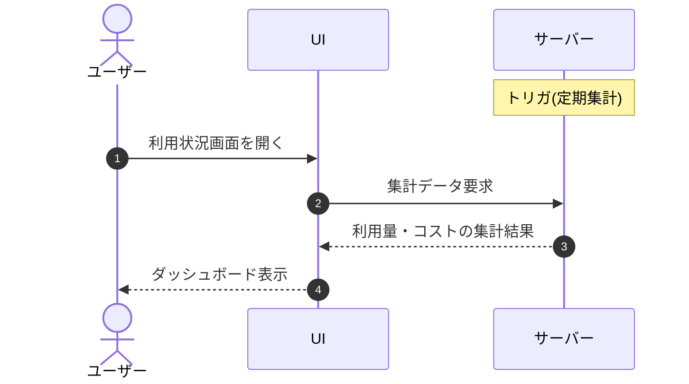
```mermaid
sequenceDiagram
  autonumber
  actor U as ユーザー
  participant UI as UI
  participant S as サーバー
  Note over S: トリガ(定期集計)
  U->>UI: 利用状況画面を開く
  UI->>S: 集計データ要求
  S-->>UI: 利用量・コストの集計結果
  UI-->>U: ダッシュボード表示
```

## FR-088: プロジェクト別の月次上限・アラート設定

> **この機能要件は「プロジェクト別の月次上限・アラート設定」を定義します。**

*種別 機能要件 ・ 機能グループ 利用量・課金 ・ 優先度 P0 ・ ステータス ドラフト*

### 要件

プロジェクトごとに質問数の月次上限件数と上限アラートを任意に設定できること。
1. 月次上限はオン / オフを切り替えできる
2. 設定の優先順位は「プロジェクト設定(オーナー / 当該プロジェクトのメンバー)&gt; デフォルト推奨値」とする
3. プロジェクト単位の上限管理では質問数のみを対象とし、当月利用・今月の利用上限・利用量を簡潔に確認できる
4. FAQ 件数は上限・アラートの対象とせず、アカウント利用者向けの設定も提供しない

### シーケンス

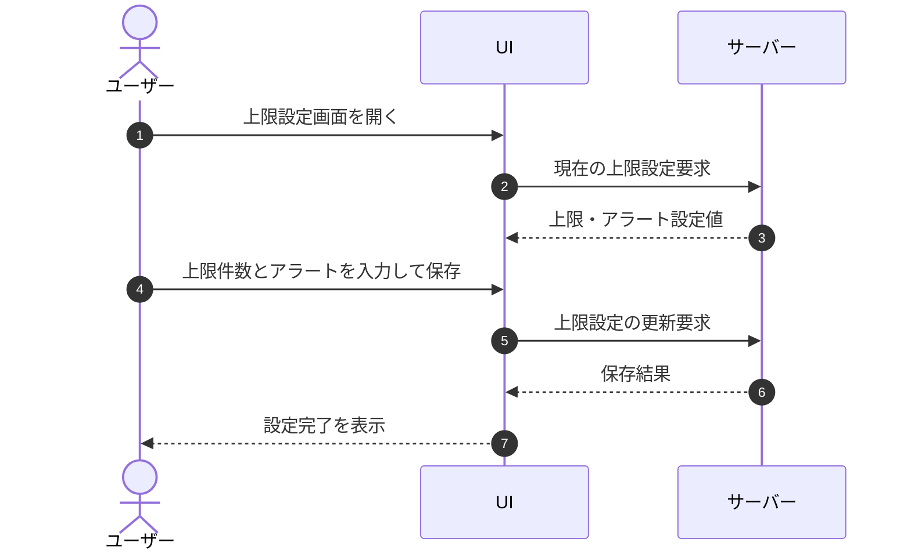
```mermaid
sequenceDiagram
  autonumber
  actor U as ユーザー
  participant UI as UI
  participant S as サーバー
  U->>UI: 上限設定画面を開く
  UI->>S: 現在の上限設定要求
  S-->>UI: 上限・アラート設定値
  U->>UI: 上限件数とアラートを入力して保存
  UI->>S: 上限設定の更新要求
  S-->>UI: 保存結果
  UI-->>U: 設定完了を表示
```

## FR-089: 上限到達時のウィジェット受付停止

> **この機能要件は「上限到達時のウィジェット受付停止」を定義します。**

*種別 機能要件 ・ 機能グループ 利用量・課金 ・ 優先度 P0 ・ ステータス ドラフト*

### 要件

プロジェクトごとの質問数上限がオンの場合、上限到達時にウィジェットの新規質問受付を停止できること。
1. 質問数が当該プロジェクトの設定上限件数の **100%** に到達した時点で、支払方法の有無に関わらず当該プロジェクトのウィジェット新規質問受付を停止する(契約は有効のまま、エンドユーザーにはプロジェクト連絡先メールへの問い合わせを促す安全な定型文をチャット内のシステム返信として表示し、質問入力と送信を無効化する)
2. **125%** は集計遅延・誤差対策の最終ガードとして追加のアラート通知を行う
3. 管理者向けメールは [FR-094](#FR-094) で選択された閾値に従い、100% が未選択の場合も停止処理自体は行う
4. 上限オフ時は利用率の算出・上限アラート・上限到達による停止を行わない
5. 停止からの復帰は、翌月 1 日のリセット、質問数上限の引き上げ、または上限オフのいずれかで即時とする
6. FAQ 件数は本判定と月次件数による作成停止の対象外とする
7. 支払方法未登録の契約のいずれかのプロジェクトが質問数無料枠を超過した場合も、[FR-096](#FR-096) の支払方法ゲートにより同様に当該プロジェクトのウィジェット質問受付を停止する

### シーケンス

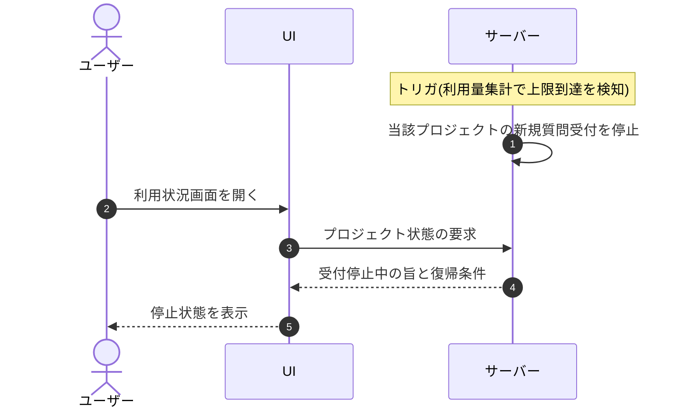
```mermaid
sequenceDiagram
  autonumber
  actor U as ユーザー
  participant UI as UI
  participant S as サーバー
  Note over S: トリガ(利用量集計で上限到達を検知)
  S->>S: 当該プロジェクトの新規質問受付を停止
  U->>UI: 利用状況画面を開く
  UI->>S: プロジェクト状態の要求
  S-->>UI: 受付停止中の旨と復帰条件
  UI-->>U: 停止状態を表示
```

## FR-090: 請求情報の確認(支払方法・履歴・見込み)

> **この機能要件は「請求情報の確認(支払方法・履歴・見込み)」を定義します。**

*種別 機能要件 ・ 機能グループ 利用量・課金 ・ 優先度 P0 ・ ステータス ドラフト*

### 要件

オーナーは請求画面で、支払方法・請求状態・請求履歴・契約全体の請求見込み・プロジェクト別の課金内訳を確認できること。契約全体と各プロジェクトの利用量、およびプロジェクト単位の上限詳細を確認できること

### シーケンス

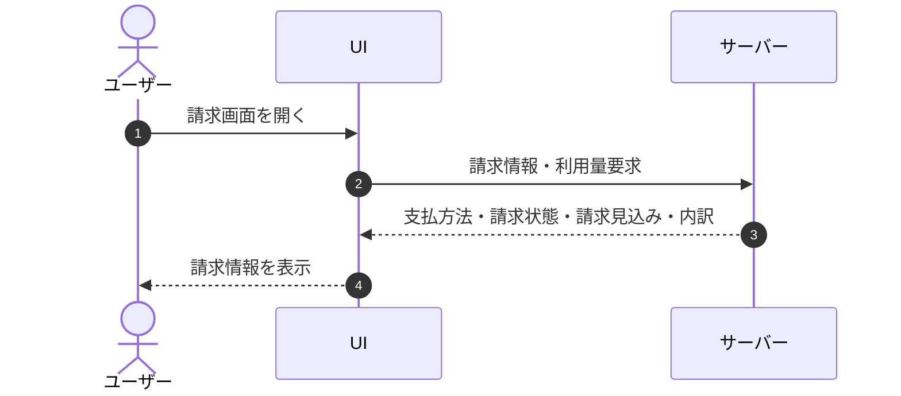
```mermaid
sequenceDiagram
  autonumber
  actor U as ユーザー
  participant UI as UI
  participant S as サーバー
  U->>UI: 請求画面を開く
  UI->>S: 請求情報・利用量要求
  S-->>UI: 支払方法・請求状態・請求見込み・内訳
  UI-->>U: 請求情報を表示
```

## FR-091: 支払い失敗や停止時の利用制限を行える

> **この機能要件は「支払い失敗や停止時の利用制限を行える」を定義します。**

*種別 機能要件 ・ 機能グループ 利用量・課金 ・ 優先度 P0 ・ ステータス ドラフト*

### 要件

支払い失敗や停止時の利用制限を行えること。
1. 決済失敗確定の通知を受信した時刻を起点として **7 日間**の猶予期間を計測する
2. 猶予期間中もアカウント利用者の管理画面ログイン・支払方法更新を許可する
3. 猶予期間中の再決済成功(支払い成功の通知受信)時は即時に猶予を解除する
4. 猶予期間経過後は契約をサスペンション中へ移行させ、ウィジェット応答を機能停止の旨を示す応答に切り替える
5. サスペンション中もアカウント利用者は管理画面の課金・退会のみアクセス可能とし、それ以外の機能は利用不可とする

### シーケンス

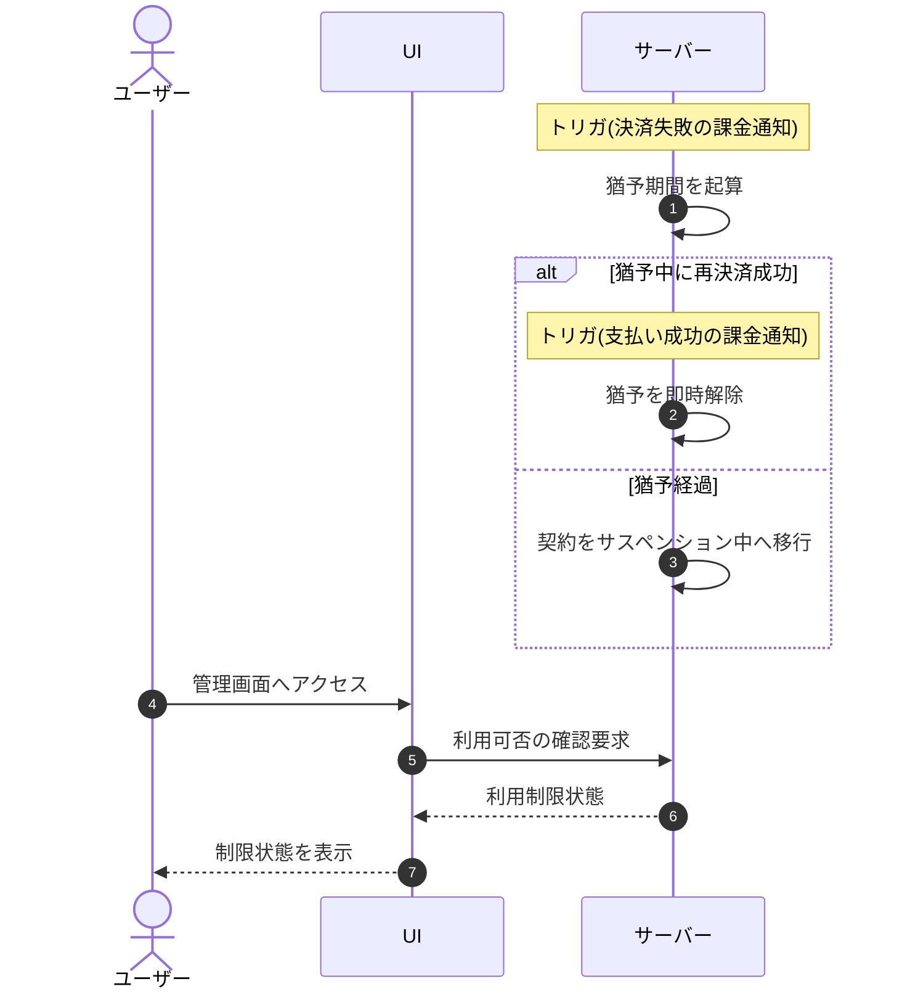
```mermaid
sequenceDiagram
  autonumber
  actor U as ユーザー
  participant UI as UI
  participant S as サーバー
  Note over S: トリガ(決済失敗の課金通知)
  S->>S: 猶予期間を起算
  alt 猶予中に再決済成功
    Note over S: トリガ(支払い成功の課金通知)
    S->>S: 猶予を即時解除
  else 猶予経過
    S->>S: 契約をサスペンション中へ移行
  end
  U->>UI: 管理画面へアクセス
  UI->>S: 利用可否の確認要求
  S-->>UI: 利用制限状態
  UI-->>U: 制限状態を表示
```

## FR-092: 上限・アラート設定変更と解約申請

> **この機能要件は「上限・アラート設定変更と解約申請」を定義します。**

*種別 機能要件 ・ 機能グループ 利用量・課金 ・ 優先度 P0 ・ ステータス ドラフト*

### 要件

プロジェクトごとの質問数上限と上限アラートの設定変更を、オーナー / 当該プロジェクトのメンバーが行えること。利用契約の解約申請はオーナーが行えること(解約はオーナー専有)

### シーケンス

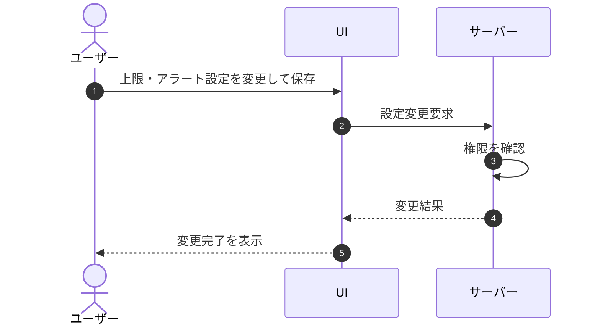
```mermaid
sequenceDiagram
  autonumber
  actor U as ユーザー
  participant UI as UI
  participant S as サーバー
  U->>UI: 上限・アラート設定を変更して保存
  UI->>S: 設定変更要求
  S->>S: 権限を確認
  S-->>UI: 変更結果
  UI-->>U: 変更完了を表示
```

## FR-093: 利用量のリアルタイム集計と反映

> **この機能要件は「利用量のリアルタイム集計と反映」を定義します。**

*種別 機能要件 ・ 機能グループ 利用量・課金 ・ 優先度 P1 ・ ステータス ドラフト*

### 要件

質問数の選択アラート閾値への到達、100% 停止判定、125% 追加通知について、利用発生時のリアルタイム集計を行い、アカウント利用者向けサマリ表示は **5 分以内の遅延**で反映されること

### シーケンス

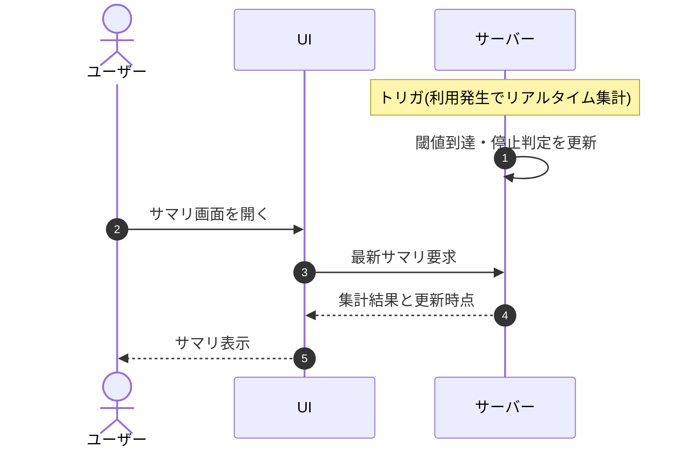
```mermaid
sequenceDiagram
  autonumber
  actor U as ユーザー
  participant UI as UI
  participant S as サーバー
  Note over S: トリガ(利用発生でリアルタイム集計)
  S->>S: 閾値到達・停止判定を更新
  U->>UI: サマリ画面を開く
  UI->>S: 最新サマリ要求
  S-->>UI: 集計結果と更新時点
  UI-->>U: サマリ表示
```

## FR-094: 上限アラート閾値の通知

> **この機能要件は「上限アラート閾値の通知」を定義します。**

*種別 機能要件 ・ 機能グループ 利用量・課金 ・ 優先度 P0 ・ ステータス ドラフト*

### 要件

プロジェクトごとに質問数上限に対する **25% / 50% / 80% / 90% / 100%** のアラート閾値を複数選択でき、選択した各閾値へ当月初回到達した時点で、オーナー + 当該プロジェクトの有効なメンバーへメール送信できること(同一メールアドレスは重複排除)。送信先は固定とし、全閾値未選択はアラート通知なしとする。FAQ 件数は上限アラート対象外とする

### シーケンス

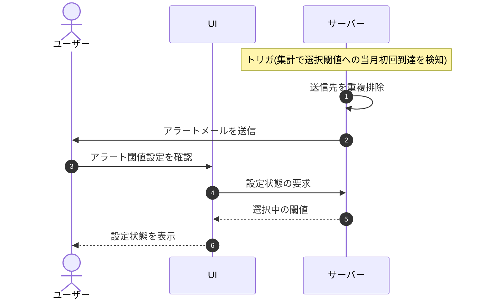
```mermaid
sequenceDiagram
  autonumber
  actor U as ユーザー
  participant UI as UI
  participant S as サーバー
  Note over S: トリガ(集計で選択閾値への当月初回到達を検知)
  S->>S: 送信先を重複排除
  S->>U: アラートメールを送信
  U->>UI: アラート閾値設定を確認
  UI->>S: 設定状態の要求
  S-->>UI: 選択中の閾値
  UI-->>U: 設定状態を表示
```

## FR-095: 契約・種別別のレート制限

> **この機能要件は「契約・種別別のレート制限」を定義します。**

*種別 機能要件 ・ 機能グループ 利用量・課金 ・ 優先度 P0 ・ ステータス ドラフト*

### 要件

各機能に対して契約・種別別のレート制限を DDoS / Bot / 暴走対策(セキュリティ目的)として適用すること。本レート制限は契約単位で管理し、プロジェクト単位化([FR-088](#FR-088))の対象外とすること(月次上限件数・無料枠のみプロジェクト単位)

### シーケンス

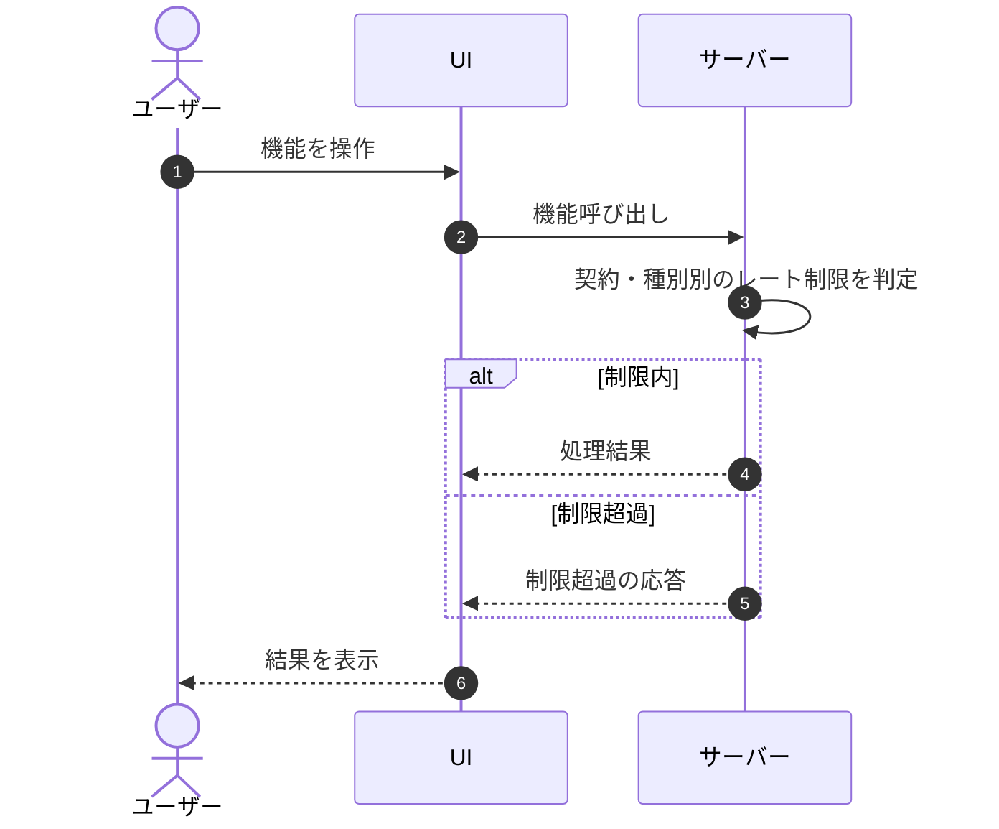
```mermaid
sequenceDiagram
  autonumber
  actor U as ユーザー
  participant UI as UI
  participant S as サーバー
  U->>UI: 機能を操作
  UI->>S: 機能呼び出し
  S->>S: 契約・種別別のレート制限を判定
  alt 制限内
    S-->>UI: 処理結果
  else 制限超過
    S-->>UI: 制限超過の応答
  end
  UI-->>U: 結果を表示
```

## FR-096: 支払い方式はクレジットカード払いとし、支払方法ゲートを設ける

> **この機能要件は「支払い方式はクレジットカード払いとし、支払方法ゲートを設ける」を定義します。**

*種別 機能要件 ・ 機能グループ 利用量・課金 ・ 優先度 P0 ・ ステータス ドラフト*

### 要件

支払い方式はクレジットカード払いとし、支払方法ゲートを設けること。新規登録時点では支払方法の登録は必須としない(月次無料利用枠内は支払方法未登録でも利用可能)。無料利用枠判定はプロジェクト単位、支払方法は契約単位とする。
1. いずれかのプロジェクトが無料利用枠の **80%** に到達した場合、利用状況の該当プロジェクト・お知らせ・メールで事前告知する
2. 未登録のまま無料利用枠を超過した場合は当該プロジェクトのウィジェット新規質問受付のみを停止し、請求(支払方法登録)へ誘導する
3. 支払方法登録後は即時再開する

### シーケンス

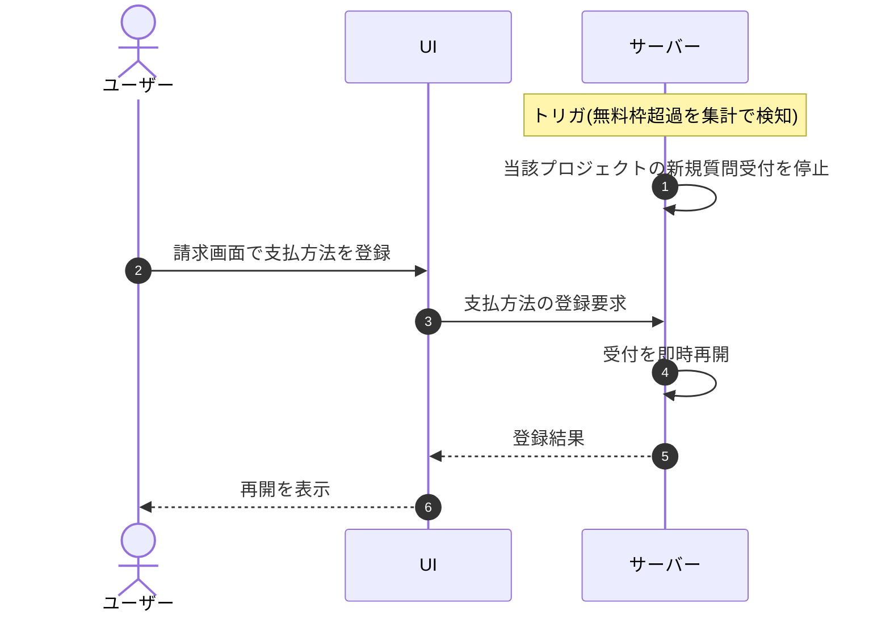
```mermaid
sequenceDiagram
  autonumber
  actor U as ユーザー
  participant UI as UI
  participant S as サーバー
  Note over S: トリガ(無料枠超過を集計で検知)
  S->>S: 当該プロジェクトの新規質問受付を停止
  U->>UI: 請求画面で支払方法を登録
  UI->>S: 支払方法の登録要求
  S->>S: 受付を即時再開
  S-->>UI: 登録結果
  UI-->>U: 再開を表示
```

## FR-097: 猶予期間経過後のサスペンション移行

> **この機能要件は「猶予期間経過後のサスペンション移行」を定義します。**

*種別 機能要件 ・ 機能グループ 利用量・課金 ・ 優先度 P0 ・ ステータス ドラフト*

### 要件

支払い失敗を検知した場合、猶予期間(**7 日**)を経過後に契約をサスペンション状態へ移行すること

### シーケンス

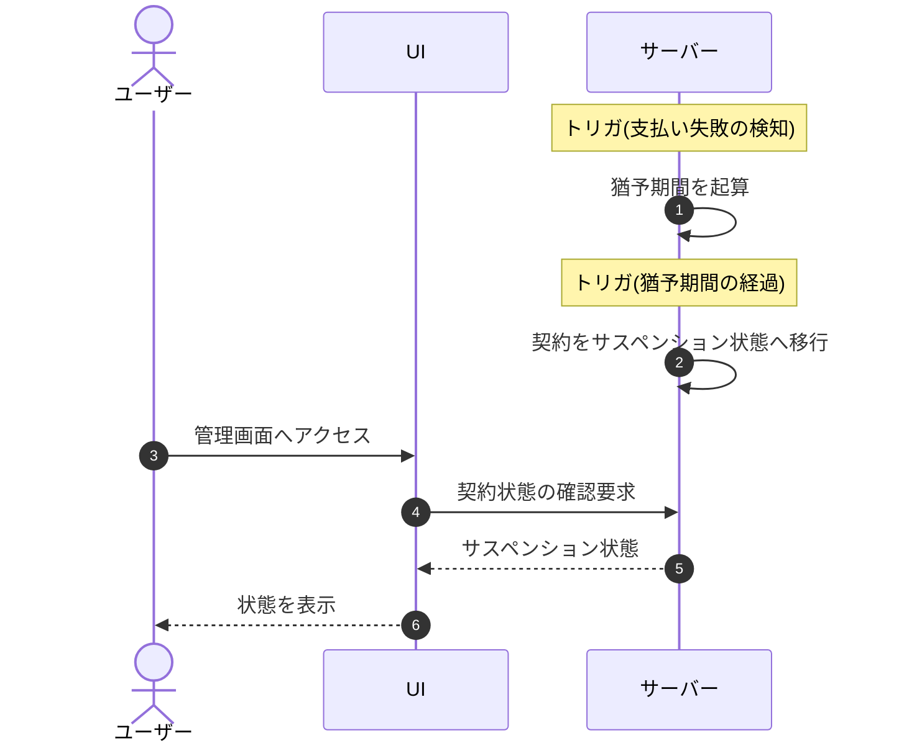
```mermaid
sequenceDiagram
  autonumber
  actor U as ユーザー
  participant UI as UI
  participant S as サーバー
  Note over S: トリガ(支払い失敗の検知)
  S->>S: 猶予期間を起算
  Note over S: トリガ(猶予期間の経過)
  S->>S: 契約をサスペンション状態へ移行
  U->>UI: 管理画面へアクセス
  UI->>S: 契約状態の確認要求
  S-->>UI: サスペンション状態
  UI-->>U: 状態を表示
```

## FR-098: サスペンション中の機能制限

> **この機能要件は「サスペンション中の機能制限」を定義します。**

*種別 機能要件 ・ 機能グループ 利用量・課金 ・ 優先度 P0 ・ ステータス ドラフト*

### 要件

サスペンション中は管理者ログインと請求情報更新のみ可能とし、その他の機能および新規ウィジェット応答は機能停止の旨を示す応答に切り替えること

### シーケンス

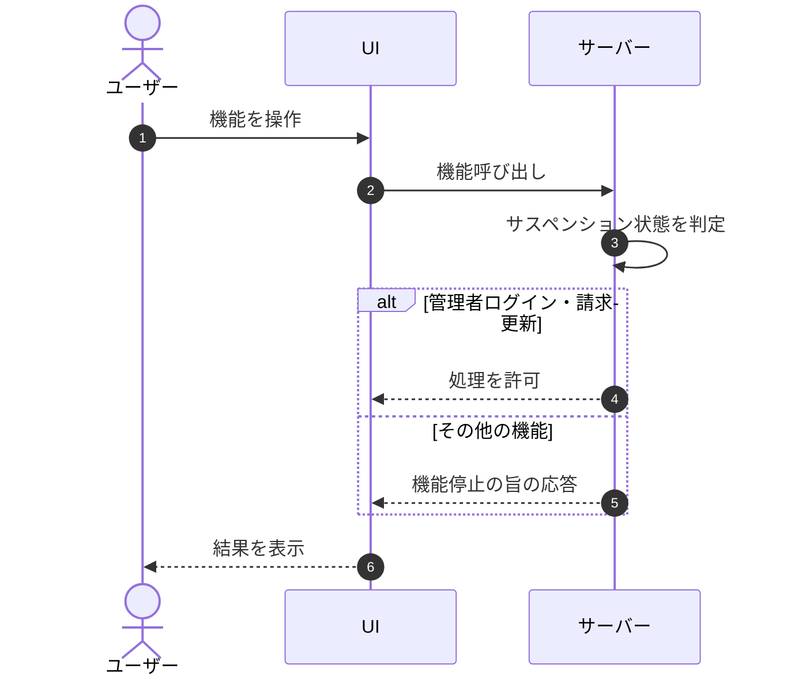
```mermaid
sequenceDiagram
  autonumber
  actor U as ユーザー
  participant UI as UI
  participant S as サーバー
  U->>UI: 機能を操作
  UI->>S: 機能呼び出し
  S->>S: サスペンション状態を判定
  alt 管理者ログイン・請求更新
    S-->>UI: 処理を許可
  else その他の機能
    S-->>UI: 機能停止の旨の応答
  end
  UI-->>U: 結果を表示
```

## FR-099: 課金プロバイダ通知の受信処理

> **この機能要件は「課金プロバイダ通知の受信処理」を定義します。**

*種別 機能要件 ・ 機能グループ 利用量・課金 ・ 優先度 P0 ・ ステータス ドラフト*

### 要件

課金プロバイダからの通知(イベント)を受信し、送信元の正当性確認、重複処理防止、直近 **30 日**の受信履歴、再処理、処理失敗時の通知を備えること

### シーケンス

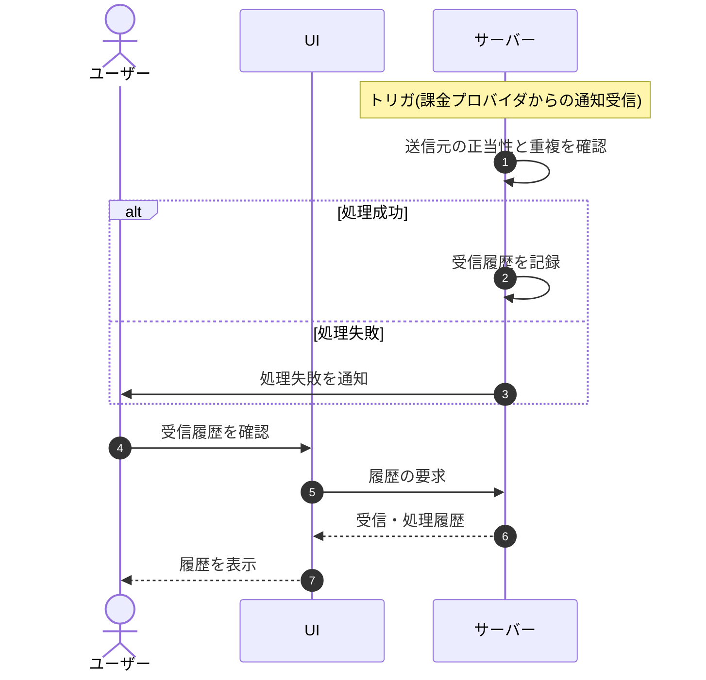
```mermaid
sequenceDiagram
  autonumber
  actor U as ユーザー
  participant UI as UI
  participant S as サーバー
  Note over S: トリガ(課金プロバイダからの通知受信)
  S->>S: 送信元の正当性と重複を確認
  alt 処理成功
    S->>S: 受信履歴を記録
  else 処理失敗
    S->>U: 処理失敗を通知
  end
  U->>UI: 受信履歴を確認
  UI->>S: 履歴の要求
  S-->>UI: 受信・処理履歴
  UI-->>U: 履歴を表示
```

## FR-100: 質問数・未解決数を確認

> **この機能要件は「質問数・未解決数を確認」を定義します。**

*種別 機能要件 ・ 機能グループ 管理ダッシュボード ・ 優先度 P0 ・ ステータス ドラフト*

### 要件

質問数・未解決数を確認できること

### シーケンス

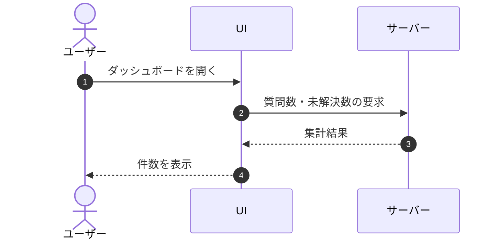
```mermaid
sequenceDiagram
  autonumber
  actor U as ユーザー
  participant UI as UI
  participant S as サーバー
  U->>UI: ダッシュボードを開く
  UI->>S: 質問数・未解決数の要求
  S-->>UI: 集計結果
  UI-->>U: 件数を表示
```

## FR-101: 要対応質問の対応状況確認

> **この機能要件は「要対応質問の対応状況確認」を定義します。**

*種別 機能要件 ・ 機能グループ 管理ダッシュボード ・ 優先度 P0 ・ ステータス ドラフト*

### 要件

要対応の質問の状況を、アカウント利用者向けには「対応中 / 対応済み」で確認できること

### シーケンス

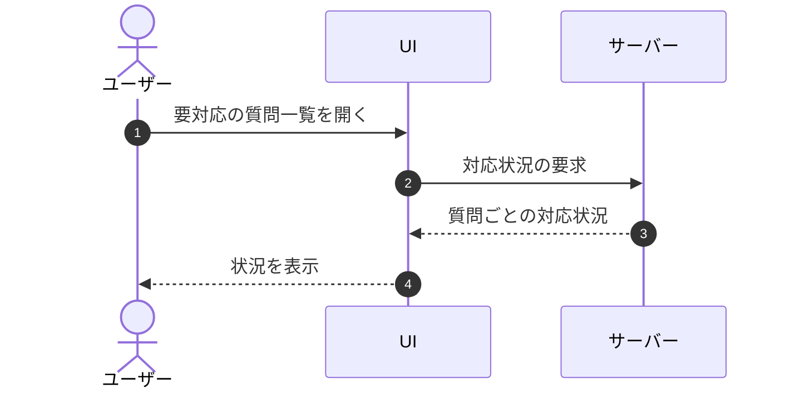
```mermaid
sequenceDiagram
  autonumber
  actor U as ユーザー
  participant UI as UI
  participant S as サーバー
  U->>UI: 要対応の質問一覧を開く
  UI->>S: 対応状況の要求
  S-->>UI: 質問ごとの対応状況
  UI-->>U: 状況を表示
```

## FR-102: よく聞かれる質問や未解決傾向を確認

> **この機能要件は「よく聞かれる質問や未解決傾向を確認」を定義します。**

*種別 機能要件 ・ 機能グループ 管理ダッシュボード ・ 優先度 P1 ・ ステータス ドラフト*

### 要件

よく聞かれる質問や未解決傾向を確認できること

### シーケンス

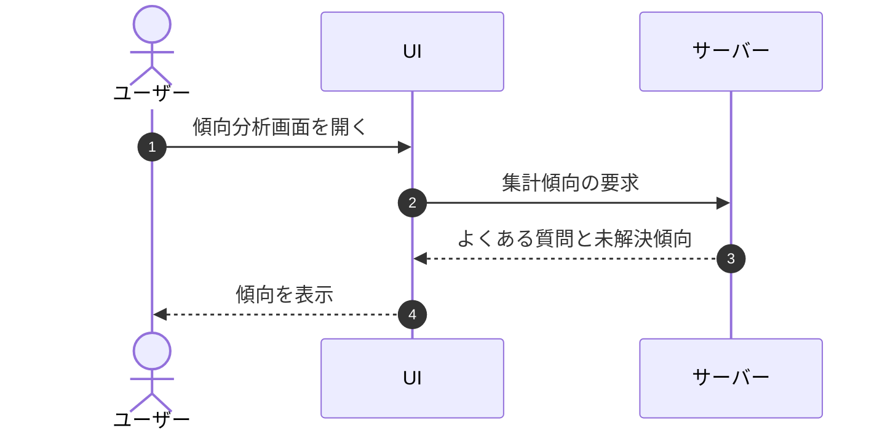
```mermaid
sequenceDiagram
  autonumber
  actor U as ユーザー
  participant UI as UI
  participant S as サーバー
  U->>UI: 傾向分析画面を開く
  UI->>S: 集計傾向の要求
  S-->>UI: よくある質問と未解決傾向
  UI-->>U: 傾向を表示
```

## FR-103: 期間絞り込み

> **この機能要件は「期間絞り込み」を定義します。**

*種別 機能要件 ・ 機能グループ 管理ダッシュボード ・ 優先度 P0 ・ ステータス ドラフト*

### 要件

期間絞り込みができること

### シーケンス

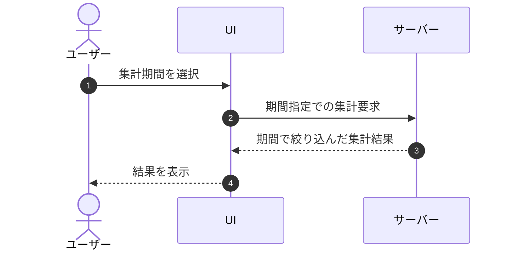
```mermaid
sequenceDiagram
  autonumber
  actor U as ユーザー
  participant UI as UI
  participant S as サーバー
  U->>UI: 集計期間を選択
  UI->>S: 期間指定での集計要求
  S-->>UI: 期間で絞り込んだ集計結果
  UI-->>U: 結果を表示
```

## FR-104: 通知失敗・バウンス件数を確認

> **この機能要件は「通知失敗・バウンス件数を確認」を定義します。**

*種別 機能要件 ・ 機能グループ 管理ダッシュボード ・ 優先度 P0 ・ ステータス ドラフト*

### 要件

通知失敗・バウンス件数を確認できること

### シーケンス

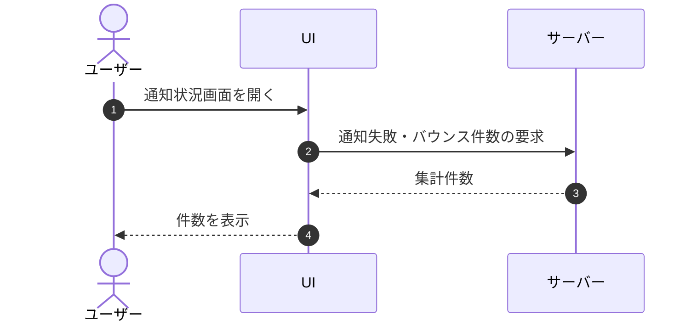
```mermaid
sequenceDiagram
  autonumber
  actor U as ユーザー
  participant UI as UI
  participant S as サーバー
  U->>UI: 通知状況画面を開く
  UI->>S: 通知失敗・バウンス件数の要求
  S-->>UI: 集計件数
  UI-->>U: 件数を表示
```

## FR-105: 管理範囲とユーザー種別に応じて表示範囲を切り替えられる

> **この機能要件は「管理範囲とユーザー種別に応じて表示範囲を切り替えられる」を定義します。**

*種別 機能要件 ・ 機能グループ 管理ダッシュボード ・ 優先度 P0 ・ ステータス ドラフト*

### 要件

管理範囲とユーザー種別に応じて表示範囲を切り替えられること。
1. オーナーは管理範囲の切替から、契約全体の利用状況と各プロジェクトの概要を切り替えられる
2. メンバーには参加プロジェクトのみを表示し、契約全体の範囲は表示しない
3. 現在の管理範囲を確認できる

### シーケンス

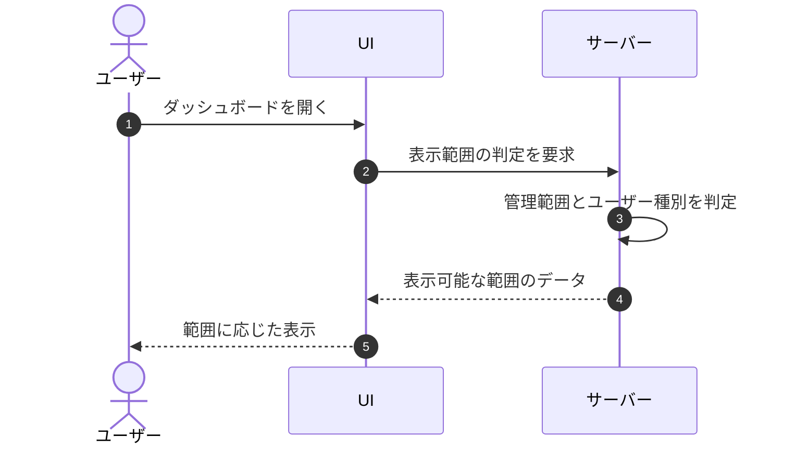
```mermaid
sequenceDiagram
  autonumber
  actor U as ユーザー
  participant UI as UI
  participant S as サーバー
  U->>UI: ダッシュボードを開く
  UI->>S: 表示範囲の判定を要求
  S->>S: 管理範囲とユーザー種別を判定
  S-->>UI: 表示可能な範囲のデータ
  UI-->>U: 範囲に応じた表示
```

## FR-106: 利用状況と概要の間を、迷わず行き来

> **この機能要件は「利用状況と概要の間を、迷わず行き来」を定義します。**

*種別 機能要件 ・ 機能グループ 管理ダッシュボード ・ 優先度 P0 ・ ステータス ドラフト*

### 要件

利用状況と概要の間を、迷わず行き来できること。
1. 契約全体の利用状況は当月固定・読み取り専用の表示とする
2. プロジェクトを開く・作成・編集は契約範囲の「プロジェクト」に集約する
3. 各プロジェクトの概要へは、管理範囲の切替から 1 操作で遷移できる
4. オーナーは 1 操作で利用状況へ戻れる

### シーケンス

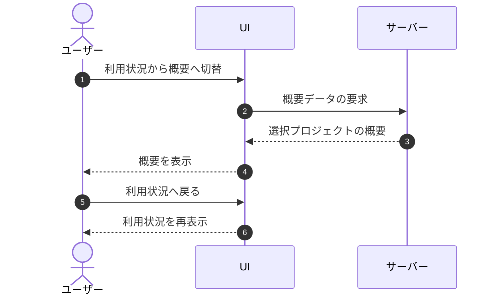
```mermaid
sequenceDiagram
  autonumber
  actor U as ユーザー
  participant UI as UI
  participant S as サーバー
  U->>UI: 利用状況から概要へ切替
  UI->>S: 概要データの要求
  S-->>UI: 選択プロジェクトの概要
  UI-->>U: 概要を表示
  U->>UI: 利用状況へ戻る
  UI-->>U: 利用状況を再表示
```

## FR-107: 画面目的の冒頭宣言

> **この機能要件は「画面目的の冒頭宣言」を定義します。**

*種別 機能要件 ・ 機能グループ 管理ダッシュボード ・ 優先度 P0 ・ ステータス ドラフト*

### 要件

概要画面と利用状況画面は、冒頭に目的を 1 行で宣言すること。
1. 概要は、選択中プロジェクトの利用状況の把握を目的とする
2. 利用状況は、契約全体と各プロジェクトの当月利用状況の把握を目的とする

### シーケンス

```mermaid
sequenceDiagram
  autonumber
  actor U as ユーザー
  participant UI as UI
  participant S as サーバー
  U->>UI: 概要・利用状況画面を開く
  UI->>S: 画面表示データの要求
  S-->>UI: 目的宣言と集計データ
  UI-->>U: 冒頭に目的を宣言して表示
```

## FR-108: 集計時点を明示し、リアルタイム値との誤認を防ぐ

> **この機能要件は「集計時点を明示し、リアルタイム値との誤認を防ぐ」を定義します。**

*種別 機能要件 ・ 機能グループ 管理ダッシュボード ・ 優先度 P0 ・ ステータス ドラフト*

### 要件

集計時点を明示し、リアルタイム値との誤認を防ぐこと。
1. 最終更新時刻を表示する画面では、いつ時点の集計かを明示する
2. 集計が遅延している場合は、利用者がリアルタイム値と誤認しないよう警告表示する
3. 読み取り専用スナップショットである利用状況には、最終更新時刻を表示しない

### シーケンス

```mermaid
sequenceDiagram
  autonumber
  actor U as ユーザー
  participant UI as UI
  participant S as サーバー
  U->>UI: 集計画面を開く
  UI->>S: 集計データと集計時点の要求
  S-->>UI: 集計結果・集計時点・遅延有無
  UI-->>U: 集計時点を明示して表示
```

## FR-109: KPI カードからの一覧遷移

> **この機能要件は「KPI カードからの一覧遷移」を定義します。**

*種別 機能要件 ・ 機能グループ 管理ダッシュボード ・ 優先度 P1 ・ ステータス ドラフト*

### 要件

主要指標(KPI)カード(質問数 / 未解決数 / 公開 FAQ 件数等)はクリックで該当一覧画面へ遷移できること。
1. 各カードは対応する指標の一覧へ、当該指標で絞り込んだ状態で遷移する
2. 0 件・集計中・取得失敗の状態ではクリック不可とする

### シーケンス

```mermaid
sequenceDiagram
  autonumber
  actor U as ユーザー
  participant UI as UI
  participant S as サーバー
  U->>UI: KPI カードをクリック
  UI->>S: 該当一覧データの要求
  S-->>UI: フィルタ条件付きの一覧
  UI-->>U: 一覧画面へ遷移して表示
```

## FR-110: 比較値の表記を統一

> **この機能要件は「比較値の表記を統一」を定義します。**

*種別 機能要件 ・ 機能グループ 管理ダッシュボード ・ 優先度 P1 ・ ステータス ドラフト*

### 要件

比較値の表記を統一すること。
1. 比較値を表示する画面では、前月比・前週比の表記を統一する
2. 概要の KPI カードは項目名と件数だけを表示し、前月比・状態説明等のコメントやゲージは表示しない

### シーケンス

```mermaid
sequenceDiagram
  autonumber
  actor U as ユーザー
  participant UI as UI
  participant S as サーバー
  U->>UI: 比較値を含む画面を開く
  UI->>S: 比較値データの要求
  S-->>UI: 前月比・前週比の値
  UI-->>U: 統一表記で比較値を表示
```

## FR-111: 集計状態の区別表示

> **この機能要件は「集計状態の区別表示」を定義します。**

*種別 機能要件 ・ 機能グループ 管理ダッシュボード ・ 優先度 P0 ・ ステータス ドラフト*

### 要件

KPI / 一覧 / アラートの各表示要素は、0 件・未集計・集計中・取得失敗・期間外 の状態を、利用者がそれぞれ区別して認識できるよう表示できること。

### シーケンス

```mermaid
sequenceDiagram
  autonumber
  actor U as ユーザー
  participant UI as UI
  participant S as サーバー
  U->>UI: ダッシュボードを開く
  UI->>S: 表示要素データの要求
  S-->>UI: 集計値と取得状態
  UI-->>U: 状態を区別して表示
```

## FR-112: プロジェクト 0 件時の空状態表示

> **この機能要件は「プロジェクト 0 件時の空状態表示」を定義します。**

*種別 機能要件 ・ 機能グループ 管理ダッシュボード ・ 優先度 P2 ・ ステータス ドラフト*

### 要件

利用状況でプロジェクトが 0 件の場合は、複雑なセットアップチェックリストを表示せず、「プロジェクトがまだありません」と「新規プロジェクトを作成」する導線を持つ空状態を表示すること

### シーケンス

```mermaid
sequenceDiagram
  autonumber
  actor U as ユーザー
  participant UI as UI
  participant S as サーバー
  U->>UI: 利用状況画面を開く
  UI->>S: プロジェクト一覧の要求
  S-->>UI: プロジェクトなしの応答
  UI-->>U: 空状態と作成導線を表示
```

## FR-168: FAQ 編集は同時編集時の衝突を検出

> **この機能要件は「FAQ 編集は同時編集時の衝突を検出」を定義します。**

*種別 機能要件 ・ 機能グループ UX 細部・データ運用 ・ 優先度 P1 ・ ステータス ドラフト*

### 要件

FAQ 編集は同時編集時の衝突を検出できること。衝突時は最新版の確認を促し、再読み込みの導線を提供すること。

### シーケンス

```mermaid
sequenceDiagram
  autonumber
  actor U as ユーザー
  participant UI as UI
  participant S as サーバー
  U->>UI: FAQ を編集して保存
  UI->>S: 更新要求
  S->>S: 同時編集の衝突を検出
  alt 衝突なし
    S-->>UI: 保存結果
  else 衝突あり
    S-->>UI: 衝突と最新版の確認案内
  end
  UI-->>U: 結果または再読み込み導線を表示
```

## FR-169: 下書き自動保存と離脱警告

> **この機能要件は「下書き自動保存と離脱警告」を定義します。**

*種別 機能要件 ・ 機能グループ UX 細部・データ運用 ・ 優先度 P2 ・ ステータス ドラフト*

### 要件

FAQ 下書きは自動保存し、未保存の変更がある状態でページ離脱を試みた際は警告すること

### シーケンス

```mermaid
sequenceDiagram
  autonumber
  actor U as ユーザー
  participant UI as UI
  participant S as サーバー
  U->>UI: FAQ を編集
  UI->>S: 下書きを自動保存
  S-->>UI: 保存結果
  U->>UI: ページ離脱を試みる
  UI-->>U: 未保存変更の警告を表示
```

## FR-170: 一括操作の 1 操作あたりの上限を設ける

> **この機能要件は「一括操作の 1 操作あたりの上限を設ける」を定義します。**

*種別 機能要件 ・ 機能グループ UX 細部・データ運用 ・ 優先度 P1 ・ ステータス ドラフト*

### 要件

一括操作の 1 操作あたりの上限を設けること。
1. お知らせの一括既読は **最大 100 件**
2. FAQ の一括状態変更は **最大 50 件**

### シーケンス

```mermaid
sequenceDiagram
  autonumber
  actor U as ユーザー
  participant UI as UI
  participant S as サーバー
  U->>UI: 複数件を選択して一括操作
  UI->>S: 一括操作要求
  S->>S: 1 操作あたりの上限を判定
  alt 上限内
    S-->>UI: 一括処理結果
  else 上限超過
    S-->>UI: 上限超過の案内
  end
  UI-->>U: 結果を表示
```

## FR-171: 影響度に応じた確認レベルの割当

> **この機能要件は「影響度に応じた確認レベルの割当」を定義します。**

*種別 機能要件 ・ 機能グループ UX 細部・データ運用 ・ 優先度 P0 ・ ステータス ドラフト*

### 要件

不可逆または影響範囲の大きい操作に、影響度に応じた確認レベルを必ず割り当てること。
1. 対象操作には、削除・公開キー再発行・退会・上限件数変更・規約再同意拒否などを含む
2. 確認レベルは、確認ダイアログ・対象名のタイプ確認・本人確認(再認証)に区分する
3. 影響度の大きい操作ほど高い確認レベルを割り当てる

### シーケンス

```mermaid
sequenceDiagram
  autonumber
  actor U as ユーザー
  participant UI as UI
  participant S as サーバー
  U->>UI: 影響の大きい操作を実行
  UI->>U: 影響度に応じた確認を要求
  U->>UI: 確認を完了
  UI->>S: 操作の実行要求
  S-->>UI: 実行結果
  UI-->>U: 結果を表示
```

## FR-172: 管理スコープの分離表示

> **この機能要件は「管理スコープの分離表示」を定義します。**

*種別 機能要件 ・ 機能グループ UX 細部・データ運用 ・ 優先度 P1 ・ ステータス ドラフト*

> [!NOTE]
> 横断的品質要件。特定の業務ユースケースに帰属せず、非機能要件および各設計層の共通方針で担保する(トレーサビリティ一覧の業務UC×要件表には掲載しない)。

### 要件

利用者向け管理コンソールは、管理スコープ(契約範囲 / プロジェクト範囲 / 認証フロー / 共通領域)を画面から判別できるよう分離すること。

### シーケンス

```mermaid
sequenceDiagram
  autonumber
  actor U as ユーザー
  participant UI as UI
  participant S as サーバー
  U->>UI: 管理コンソールを開く
  UI->>S: 画面と管理スコープの要求
  S-->>UI: スコープ区分と画面データ
  UI-->>U: スコープを判別できる表示
```

## FR-173: 空状態の作成導線のみ表示

> **この機能要件は「空状態の作成導線のみ表示」を定義します。**

*種別 機能要件 ・ 機能グループ UX 細部・データ運用 ・ 優先度 P1 ・ ステータス ドラフト*

### 要件

利用状況でプロジェクトが 0 件の場合は、説明文と「新規プロジェクトを作成」する導線だけを持つ空状態を表示すること。段階型のセットアップチェックリストは表示しない

### シーケンス

```mermaid
sequenceDiagram
  autonumber
  actor U as ユーザー
  participant UI as UI
  participant S as サーバー
  U->>UI: 利用状況画面を開く
  UI->>S: プロジェクト一覧の要求
  S-->>UI: プロジェクトなしの応答
  UI-->>U: 説明文と作成導線のみ表示
```

## FR-174: 契約項目の利用中プロジェクト数併記

> **この機能要件は「契約項目の利用中プロジェクト数併記」を定義します。**

*種別 機能要件 ・ 機能グループ UX 細部・データ運用 ・ 優先度 P2 ・ ステータス ドラフト*

### 要件

契約スコープの参照表示には、影響範囲を示す「利用中のプロジェクト: N」を併記すること。N=0 の場合は「未使用」と表示する。月次利用上限・無料利用枠はプロジェクト単位のため対象外とする

### シーケンス

```mermaid
sequenceDiagram
  autonumber
  actor U as ユーザー
  participant UI as UI
  participant S as サーバー
  U->>UI: 契約スコープの参照画面を開く
  UI->>S: 影響範囲データの要求
  S-->>UI: 利用中プロジェクト件数
  UI-->>U: 影響範囲を併記して表示
```

## FR-175: 主ナビゲーションはユーザーの目的語を優先して構成

> **この機能要件は「主ナビゲーションはユーザーの目的語を優先して構成」を定義します。**

*種別 機能要件 ・ 機能グループ UX 細部・データ運用 ・ 優先度 P0 ・ ステータス ドラフト*

### 要件

主ナビゲーションはユーザーの目的語を優先して構成すること。
1. 契約範囲では「利用状況 / プロジェクト / 請求 / 設定」の 4 項目だけを用いる
2. プロジェクト範囲では「概要 / 要対応の質問 / FAQ / ウィジェット / メンバー / 利用量と上限」を用いる
3. 配置の例外は次のとおりとする
    1. プロジェクトの作成・編集・削除は契約範囲の「プロジェクト」へ置く
    2. 通知はヘッダーへ置く
    3. 法務文書はヘルプまたはフッターへ置く

### シーケンス

```mermaid
sequenceDiagram
  autonumber
  actor U as ユーザー
  participant UI as UI
  participant S as サーバー
  U->>UI: 管理コンソールを開く
  UI->>S: ナビゲーション構成の要求
  S-->>UI: 範囲別のメニュー項目
  UI-->>U: 目的語を優先したナビを表示
```

## FR-176: 一覧では名称を主リンク、システム識別子をコピー可能な補助情報として表示

> **この機能要件は「一覧では名称を主リンク、システム識別子をコピー可能な補助情報として表示」を定義します。**

*種別 機能要件 ・ 機能グループ UX 細部・データ運用 ・ 優先度 P0 ・ ステータス ドラフト*

> [!NOTE]
> 横断的品質要件。特定の業務ユースケースに帰属せず、非機能要件および各設計層の共通方針で担保する(トレーサビリティ一覧の業務UC×要件表には掲載しない)。

### 要件

一覧では名称を主リンク、システム識別子をコピー可能な補助情報として表示すること。内部の英語値(状態コード等)はユーザー向け表示へ直接露出させず、日本語の業務語彙へ変換すること

### シーケンス

```mermaid
sequenceDiagram
  autonumber
  actor U as ユーザー
  participant UI as UI
  participant S as サーバー
  U->>UI: 一覧画面を開く
  UI->>S: 一覧データの要求
  S-->>UI: 名称と識別子・状態
  UI-->>U: 名称を主リンク・識別子を補助で表示
```

## FR-177: 設定種別の分離と影響範囲の判別

> **この機能要件は「設定種別の分離と影響範囲の判別」を定義します。**

*種別 機能要件 ・ 機能グループ UX 細部・データ運用 ・ 優先度 P0 ・ ステータス ドラフト*

### 要件

個人設定・契約設定・プロジェクト編集を分離し、設定対象と影響範囲を画面タイトル・説明から判別できること

### シーケンス

```mermaid
sequenceDiagram
  autonumber
  actor U as ユーザー
  participant UI as UI
  participant S as サーバー
  U->>UI: 設定画面を開く
  UI->>S: 設定対象データの要求
  S-->>UI: 設定対象と影響範囲
  UI-->>U: 画面タイトル・説明で判別表示
```

## FR-178: 画面見出しの簡潔化

> **この機能要件は「画面見出しの簡潔化」を定義します。**

*種別 機能要件 ・ 機能グループ UX 細部・データ運用 ・ 優先度 P1 ・ ステータス ドラフト*

> [!NOTE]
> 横断的品質要件。特定の業務ユースケースに帰属せず、非機能要件および各設計層の共通方針で担保する(トレーサビリティ一覧の業務UC×要件表には掲載しない)。

### 要件

画面見出しは画面名だけを表示し、組織名・プロジェクト名・サイト名を連結しないこと。現在の管理範囲名は管理範囲の切替表示に集約すること。ただし、削除・公開キー再発行等の対象確認文やデータ名称そのものを扱う編集画面では、誤操作防止に必要な対象名表示を維持すること

### シーケンス

```mermaid
sequenceDiagram
  autonumber
  actor U as ユーザー
  participant UI as UI
  participant S as サーバー
  U->>UI: 画面を開く
  UI->>S: 画面見出しと管理範囲の要求
  S-->>UI: 画面名と現在の管理範囲名
  UI-->>U: 画面名のみの見出しを表示
```

## FR-191: ダッシュボードのセットアップ進捗表示と KPI 表示の切替

> **この機能要件は「ダッシュボードのセットアップ進捗表示と KPI 表示の切替」を定義します。**

*種別 機能要件 ・ 機能グループ 管理ダッシュボード ・ 優先度 P1 ・ ステータス ドラフト*

### 要件

ダッシュボードは、ウィジェットを利用可能にするための初期設定(セットアップ)の完了状態に応じて表示を切り替えること。

1. 設定が未完了の間は、セットアップ進捗(プロジェクト作成・FAQ 登録・ウィジェット埋め込みコード配置の各ステップの完了 / 未完了と次アクション導線)を表示する。
2. 全ステップ完了後は、主要指標(質問数・未解決数・公開 FAQ 件数・利用率)を表示する。
3. セットアップ進捗は独立した画面・メニューとしては設けず、ダッシュボードの一表示パターンとする。
