# ウィジェット・検索・入出力(機能要件)

> **このページは、ウィジェット・検索・入出力 に関する機能要件を定義します。**

*複数の個別要件を統合したカテゴリ別ページ。各要件の優先度・トレースは各節を参照。 ステータス ドラフト*

## FR-125: 埋め込みコードの取得と設置

> **この機能要件は「埋め込みコードの取得と設置」を定義します。**

*種別 機能要件 ・ 機能グループ ウィジェット ・ 優先度 P0 ・ ステータス ドラフト*

### 要件

アカウント利用者は埋め込みコードを取得し、自社サイトに設置できること

### シーケンス

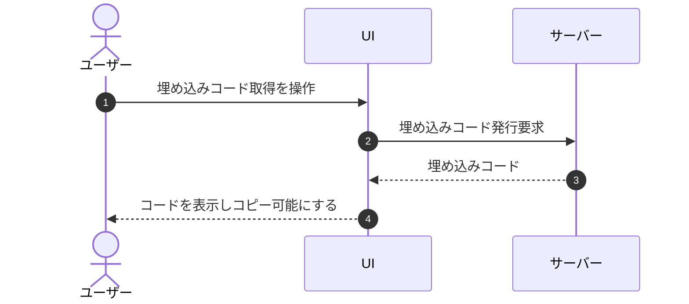

## FR-126: 許可ドメイン上での動作制限

> **この機能要件は「許可ドメイン上での動作制限」を定義します。**

*種別 機能要件 ・ 機能グループ ウィジェット ・ 優先度 P0 ・ ステータス ドラフト*

### 要件

ウィジェットは指定された許可ドメイン上でのみ動作すること

### シーケンス

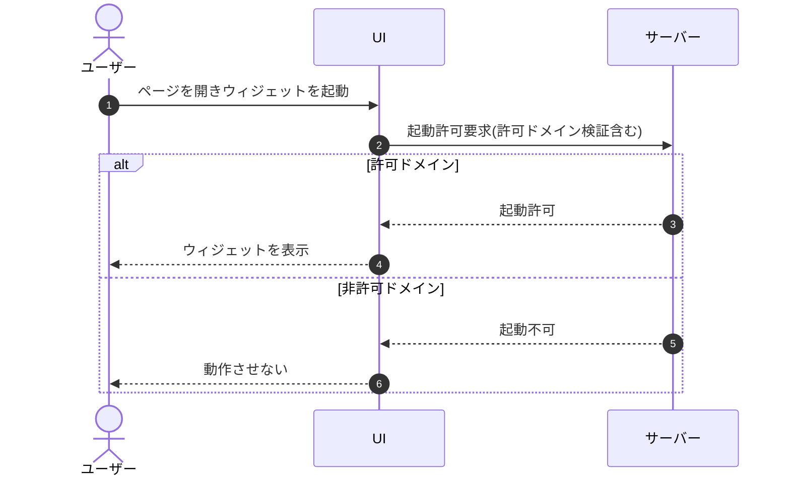

## FR-127: ウィジェット外観のプロジェクト別設定

> **この機能要件は「ウィジェット外観のプロジェクト別設定」を定義します。**

*種別 機能要件 ・ 機能グループ ウィジェット ・ 優先度 P1 ・ ステータス ドラフト*

### 要件

ウィジェットの基本的な見た目をプロジェクトごとに設定できること。
1. 設定可能項目は主色(プライマリカラー)とする
2. 配置・ランチャーバッジの形状・チャット UI の角丸などは固定とする(MVP では設定不可)
3. 本サービスの提供元ロゴを必須表示とする

### シーケンス

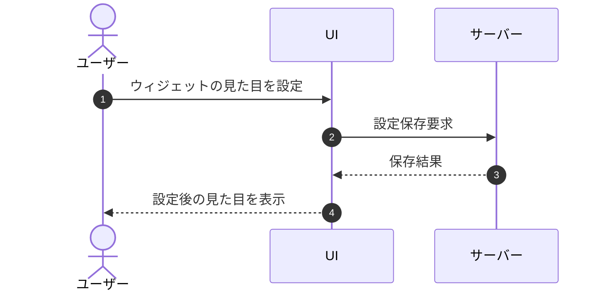

## FR-128: モバイル端末での利用対応

> **この機能要件は「モバイル端末での利用対応」を定義します。**

*種別 機能要件 ・ 機能グループ ウィジェット ・ 優先度 P0 ・ ステータス ドラフト*

> [!NOTE]
> 横断的品質要件。特定の業務ユースケースに帰属せず、非機能要件および各設計層の共通方針で担保する(トレーサビリティ一覧の業務UC×要件表には掲載しない)。

### 要件

ウィジェットはモバイル端末でも利用できること

### シーケンス

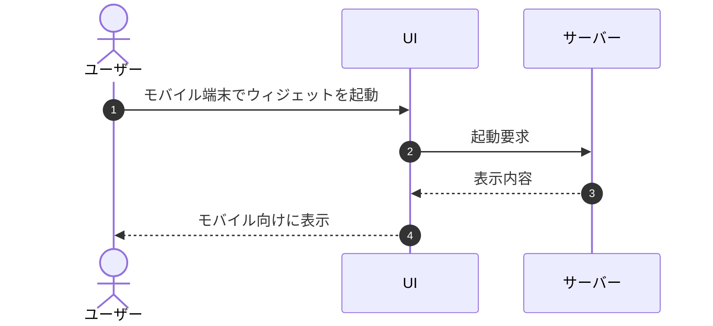

## FR-129: ウィジェットのアクセシビリティ対応

> **この機能要件は「ウィジェットのアクセシビリティ対応」を定義します。**

*種別 機能要件 ・ 機能グループ ウィジェット ・ 優先度 P1 ・ ステータス ドラフト*

> [!NOTE]
> 横断的品質要件。特定の業務ユースケースに帰属せず、非機能要件および各設計層の共通方針で担保する(トレーサビリティ一覧の業務UC×要件表には掲載しない)。

### 要件

ウィジェットがアクセシビリティ要件(キーボード操作、スクリーンリーダー、コントラスト等)に配慮していること

### シーケンス

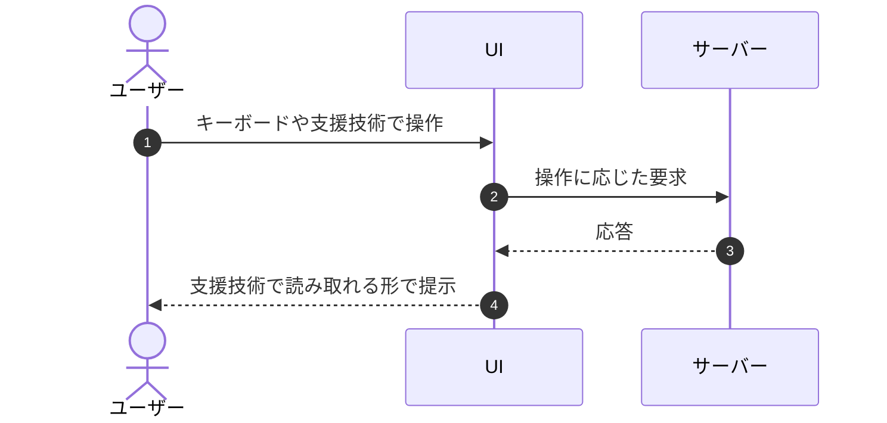

## FR-130: サポート対象ブラウザでの動作

> **この機能要件は「サポート対象ブラウザでの動作」を定義します。**

*種別 機能要件 ・ 機能グループ ウィジェット ・ 優先度 P0 ・ ステータス ドラフト*

> [!NOTE]
> 横断的品質要件。特定の業務ユースケースに帰属せず、非機能要件および各設計層の共通方針で担保する(トレーサビリティ一覧の業務UC×要件表には掲載しない)。

### 要件

ウィジェットはサポート対象ブラウザで動作すること

### シーケンス

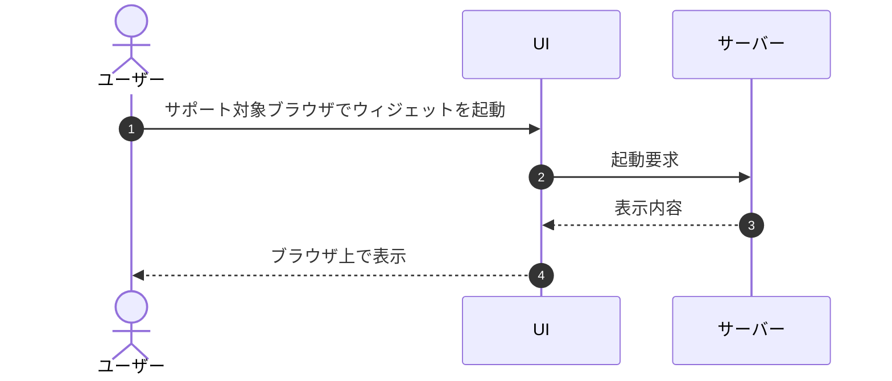

## FR-131: ウィジェット配信の高速化

> **この機能要件は「ウィジェット配信の高速化」を定義します。**

*種別 機能要件 ・ 機能グループ ウィジェット ・ 優先度 P1 ・ ステータス ドラフト*

> [!NOTE]
> 横断的品質要件。特定の業務ユースケースに帰属せず、非機能要件および各設計層の共通方針で担保する(トレーサビリティ一覧の業務UC×要件表には掲載しない)。

### 要件

ウィジェット配信は高速化(CDN / キャッシュ)できること

### シーケンス

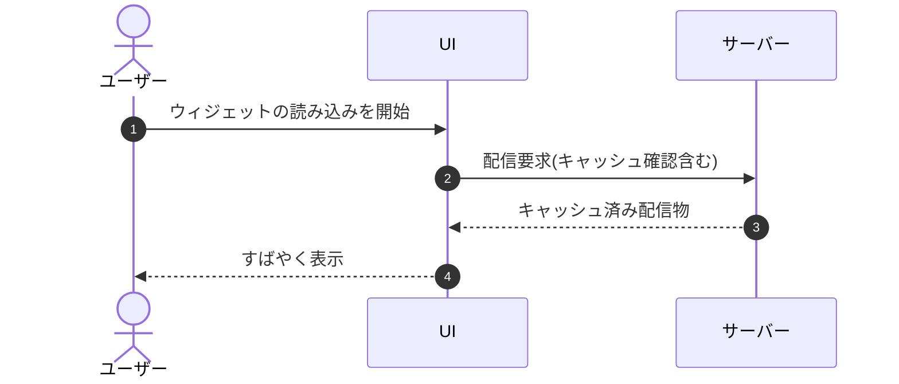

## FR-132: ランチャーバッジとチャット UI の展開

> **この機能要件は「ランチャーバッジとチャット UI の展開」を定義します。**

*種別 機能要件 ・ 機能グループ ウィジェット ・ 優先度 P0 ・ ステータス ドラフト*

### 要件

ウィジェットは初期状態で丸型のランチャーバッジ(メッセージアイコン)として表示し、クリックまたはキーボード操作でチャット UI を展開すること。
1. チャット UI は質問と回答の履歴・質問入力欄・送信操作を備える
2. 閉じる操作ではランチャーバッジ表示へ戻る
3. 同一ページ内では会話履歴と受付状態を保持する

### シーケンス

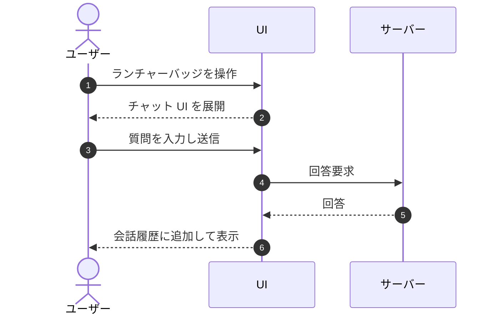

## FR-133: チャット UI ヘッダーの表示要素

> **この機能要件は「チャット UI ヘッダーの表示要素」を定義します。**

*種別 機能要件 ・ 機能グループ ウィジェット ・ 優先度 P0 ・ ステータス ドラフト*

### 要件

チャット UI のヘッダーはウィジェットタイトル、現在状態、チャット UI を閉じるボタンのみを表示すること。ハンバーガーメニューその他の操作メニュー、および「利用規約」「プライバシーポリシー」への導線は表示しない

### シーケンス

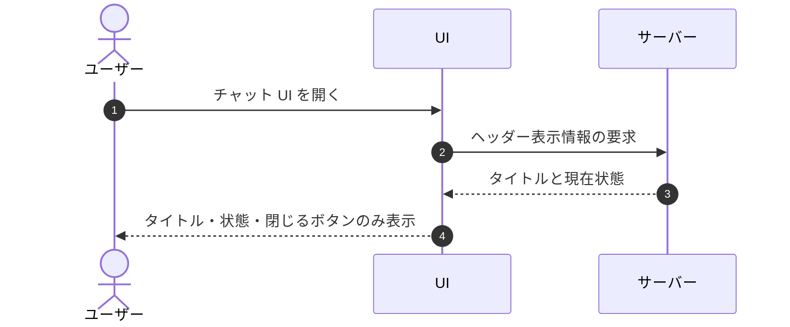

## FR-134: 受付制限中の案内表示

> **この機能要件は「受付制限中の案内表示」を定義します。**

*種別 機能要件 ・ 機能グループ ウィジェット ・ 優先度 P0 ・ ステータス ドラフト*

### 要件

質問数の月次上限到達または支払方法ゲートにより新規質問を受け付けない場合、ウィジェットは受付制限中の案内を行うこと。
1. 新規質問を受け付けられない旨をチャット内のシステム返信として表示する
2. 確認済みプロジェクト連絡先メールがある場合はそのメールアドレスを案内する
3. 制限中は質問入力と送信を無効化する

### シーケンス

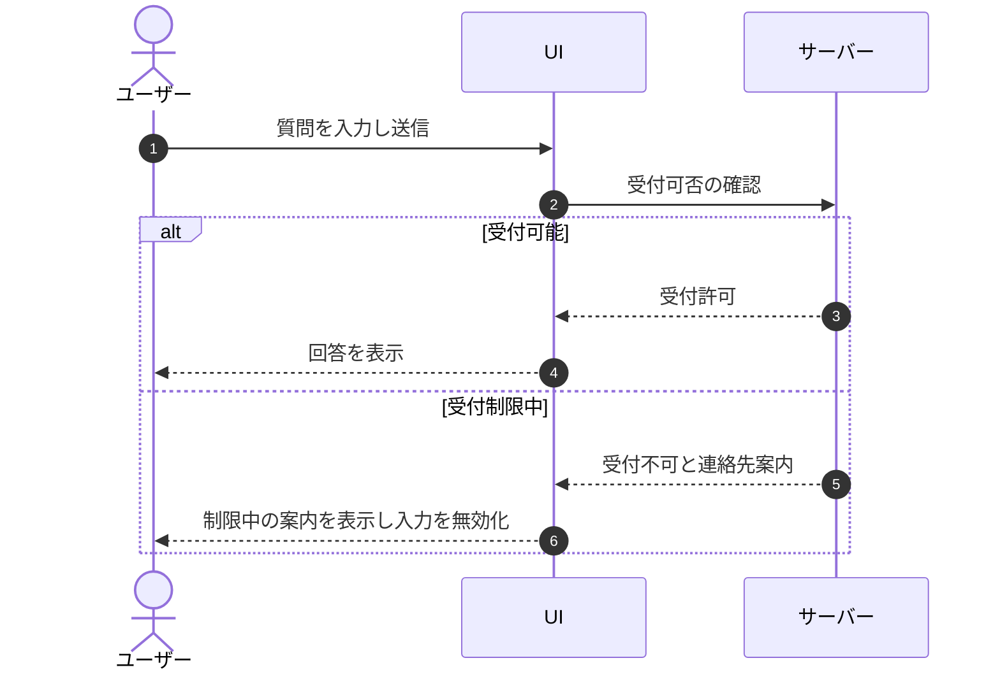

## FR-135: 未解決質問の登録と案内表示

> **この機能要件は「未解決質問の登録と案内表示」を定義します。**

*種別 機能要件 ・ 機能グループ ウィジェット ・ 優先度 P0 ・ ステータス ドラフト*

### 要件

AI が質問を解決できなかった場合、未解決質問として登録しつつウィジェット利用者へ案内を行うこと。
1. 管理用の問い合わせ ID を付与して未解決質問を登録するが、問い合わせ ID はウィジェットに表示しない
2. 同じチャット UI の会話履歴を保持したまま、回答できなかった旨と確認済みプロジェクト連絡先メール(設定済みの場合)をシステム返信として表示する
3. 別の FAQ 質問は引き続き入力・送信できる

### シーケンス

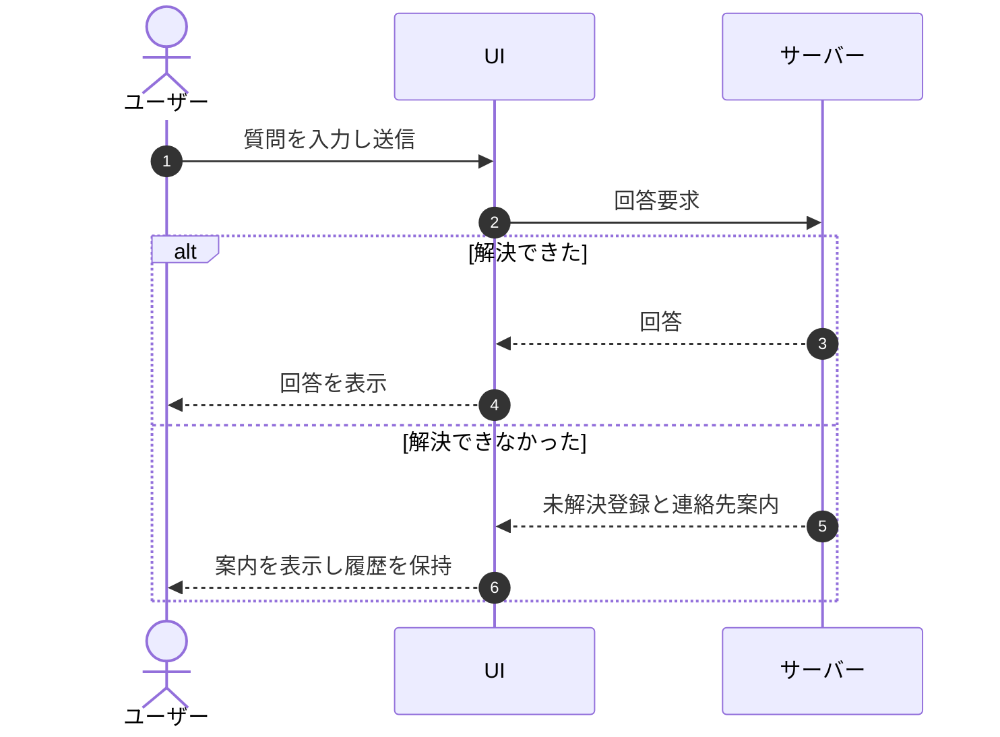

## FR-164: FAQ 検索と質問ログ検索

> **この機能要件は「FAQ 検索と質問ログ検索」を定義します。**

*種別 機能要件 ・ 機能グループ 検索・全文検索 ・ 優先度 P0 ・ ステータス ドラフト*

### 要件

アカウント利用者が FAQ 検索および質問ログ検索を行えること。
1. FAQ はキーワードによる全文検索ができる
2. 質問ログはキーワードおよび期間による検索ができる
3. 検索結果は並び替えとページングで参照できる
4. 検索対象は現在開いているプロジェクトに属するデータに限る

### シーケンス

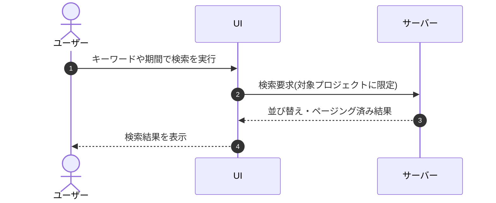

## FR-165: FAQ の CSV 一括取り込み

> **この機能要件は「FAQ の CSV 一括取り込み」を定義します。**

*種別 機能要件 ・ 機能グループ インポート・エクスポート ・ 優先度 P1 ・ ステータス ドラフト*

### 要件

FAQ を CSV 形式(UTF-8、BOM 許容)で一括取り込みできること。
1. 各行が新規登録か既存の上書きかは、行に含まれる FAQ 識別子の有無で判定する。
    1. 識別子なし = 新規登録
    2. 既存と一致 = 上書き
    3. 当該プロジェクトに存在しない識別子 = 当該行を失敗扱い
2. 取り込み用テンプレートをダウンロードできる
3. 部分失敗時は成功分を反映し、失敗分の理由をアカウント利用者が確認できる

### シーケンス

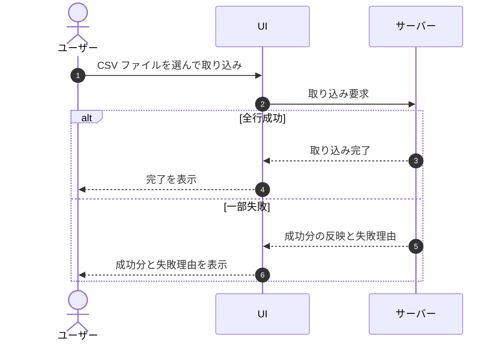

## FR-166: FAQ の CSV 書き出し

> **この機能要件は「FAQ の CSV 書き出し」を定義します。**

*種別 機能要件 ・ 機能グループ インポート・エクスポート ・ 優先度 P1 ・ ステータス ドラフト*

### 要件

FAQ を CSV 形式(UTF-8)で書き出し(エクスポート)できること

### シーケンス

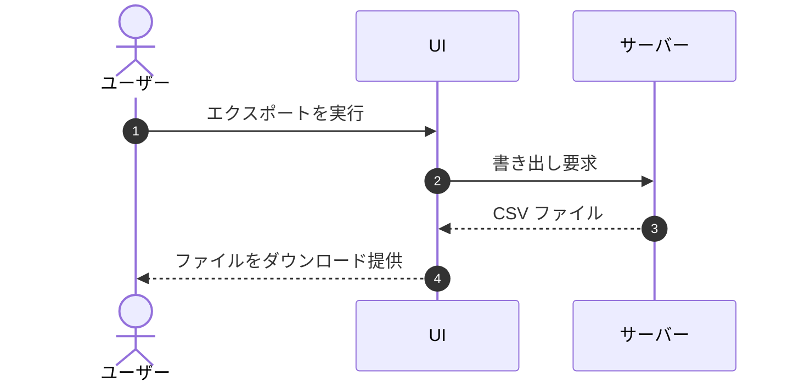
