# 通知・お知らせ(機能要件)

> **このページは、通知・お知らせ に関する機能要件を定義します。**

*複数の個別要件を統合したカテゴリ別ページ。各要件の優先度・トレースは各節を参照。 ステータス ドラフト*

## FR-113: 契機に応じた通知配信

> **この機能要件は「契機に応じた通知配信」を定義します。**

*種別 機能要件 ・ 機能グループ 通知 ・ 優先度 P0 ・ ステータス ドラフト*

### 要件

次の契機で、対象となるアカウント利用者へメールまたは受信箱通知できること。配信契機は次の各種別を網羅する。
1. 請求確定(請求確定のオーナー宛メール通知、[FR-121](#FR-121))
2. 運営からのお知らせ(運営お知らせの配信、[FR-122](#FR-122))
3. 運用イベント(利用上限への接近・到達、通知失敗の急増、サスペンション、復元、規約改定、価格改定 等。運用イベントのシステム通知自動生成、[FR-123](#FR-123))
4. メンバーのプロジェクト別役割割当の変更(役割割当変更時のメンバー通知、[FR-125](#FR-125))
5. アカウント認証関連通知(パスワード再設定 等。認証関連通知のオプトアウト不可、[FR-116](#FR-116))

### シーケンス

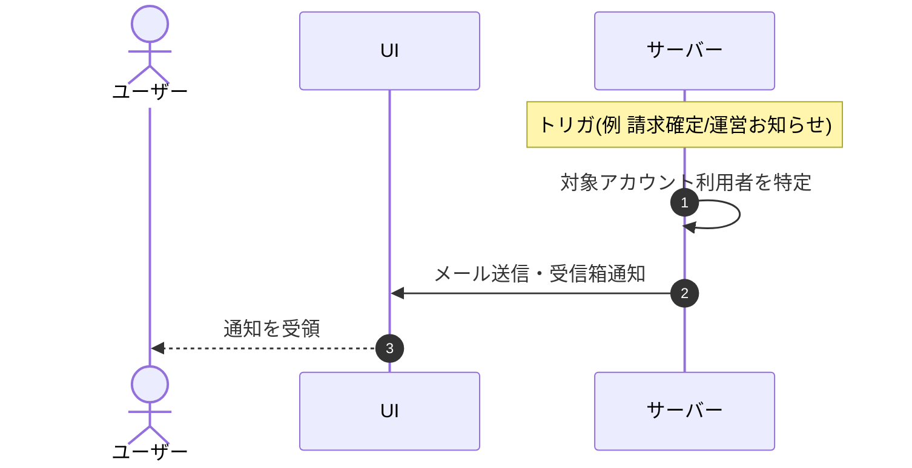
```mermaid
sequenceDiagram
  autonumber
  actor U as ユーザー
  participant UI as UI
  participant S as サーバー
  Note over S: トリガ(例 請求確定/運営お知らせ)
  S->>S: 対象アカウント利用者を特定
  S->>UI: メール送信・受信箱通知
  UI-->>U: 通知を受領
```

## FR-114: 通知の送信失敗時に再送

> **この機能要件は「通知の送信失敗時に再送」を定義します。**

*種別 機能要件 ・ 機能グループ 通知 ・ 優先度 P0 ・ ステータス ドラフト*

### 要件

通知の送信失敗時に再送できること

### シーケンス

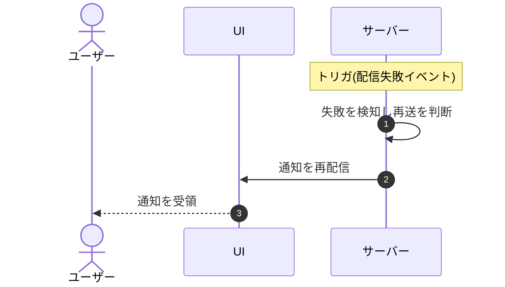
```mermaid
sequenceDiagram
  autonumber
  actor U as ユーザー
  participant UI as UI
  participant S as サーバー
  Note over S: トリガ(配信失敗イベント)
  S->>S: 失敗を検知し再送を判断
  S->>UI: 通知を再配信
  UI-->>U: 通知を受領
```

## FR-115: バウンス検知時の通知停止と管理者通知

> **この機能要件は「バウンス検知時の通知停止と管理者通知」を定義します。**

*種別 機能要件 ・ 機能グループ 通知 ・ 優先度 P0 ・ ステータス ドラフト*

### 要件

バウンスや無効アドレスを検知し、通知停止と管理者通知ができること

### シーケンス

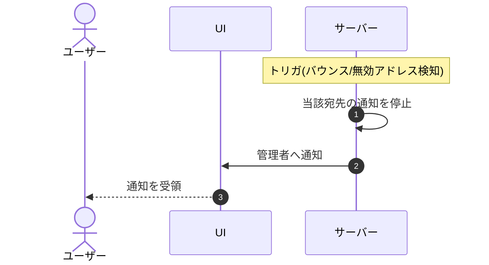
```mermaid
sequenceDiagram
  autonumber
  actor U as ユーザー
  participant UI as UI
  participant S as サーバー
  Note over S: トリガ(バウンス/無効アドレス検知)
  S->>S: 当該宛先の通知を停止
  S->>UI: 管理者へ通知
  UI-->>U: 通知を受領
```

## FR-116: 認証関連通知のオプトアウト不可

> **この機能要件は「認証関連通知のオプトアウト不可」を定義します。**

*種別 機能要件 ・ 機能グループ 通知 ・ 優先度 P1 ・ ステータス ドラフト*

### 要件

アカウント利用者のアカウント認証関連通知(パスワード再設定等)はオプトアウト不可とすること

### シーケンス

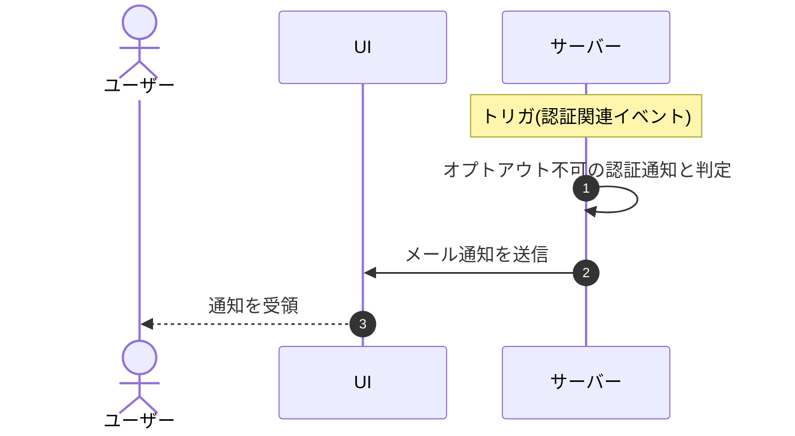
```mermaid
sequenceDiagram
  autonumber
  actor U as ユーザー
  participant UI as UI
  participant S as サーバー
  Note over S: トリガ(認証関連イベント)
  S->>S: オプトアウト不可の認証通知と判定
  S->>UI: メール通知を送信
  UI-->>U: 通知を受領
```

## FR-117: 送信品質の監視と送信抑制

> **この機能要件は「送信品質の監視と送信抑制」を定義します。**

*種別 機能要件 ・ 機能グループ 通知 ・ 優先度 P0 ・ ステータス ドラフト*

### 要件

契約 / プロジェクト単位で送信レート制限・バウンス率・苦情率を監視し、しきい値超過時に送信抑制ができること

### シーケンス

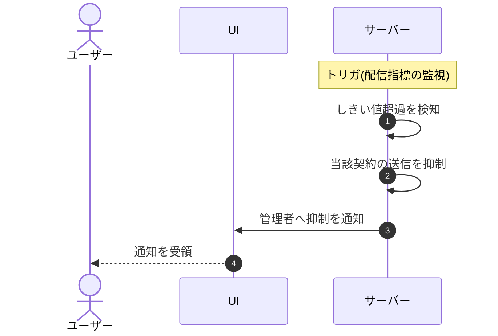
```mermaid
sequenceDiagram
  autonumber
  actor U as ユーザー
  participant UI as UI
  participant S as サーバー
  Note over S: トリガ(配信指標の監視)
  S->>S: しきい値超過を検知
  S->>S: 当該契約の送信を抑制
  S->>UI: 管理者へ抑制を通知
  UI-->>U: 通知を受領
```

## FR-118: 外部露出箇所の入力文字列の無害化

> **この機能要件は「外部露出箇所の入力文字列の無害化」を定義します。**

*種別 機能要件 ・ 機能グループ 通知 ・ 優先度 P0 ・ ステータス ドラフト*

### 要件

ウィジェット利用者が入力した文字列を、メール件名・送信元情報など外部に露出する箇所にそのまま使わないこと(スパム埋め込み・なりすまし対策)

### シーケンス

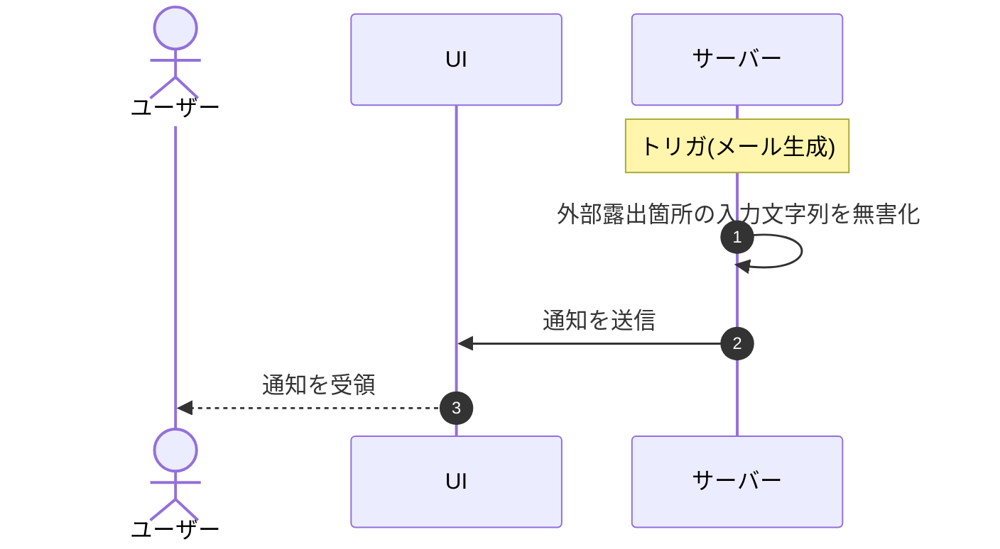
```mermaid
sequenceDiagram
  autonumber
  actor U as ユーザー
  participant UI as UI
  participant S as サーバー
  Note over S: トリガ(メール生成)
  S->>S: 外部露出箇所の入力文字列を無害化
  S->>UI: 通知を送信
  UI-->>U: 通知を受領
```

## FR-119: 通知配信状態の可視化

> **この機能要件は「通知配信状態の可視化」を定義します。**

*種別 機能要件 ・ 機能グループ 通知 ・ 優先度 P0 ・ ステータス ドラフト*

### 要件

通知配信状態(送信待ち / 送信済み / 配信済み / 失敗 / バウンス / 苦情 / 停止)を可視化できること

### シーケンス

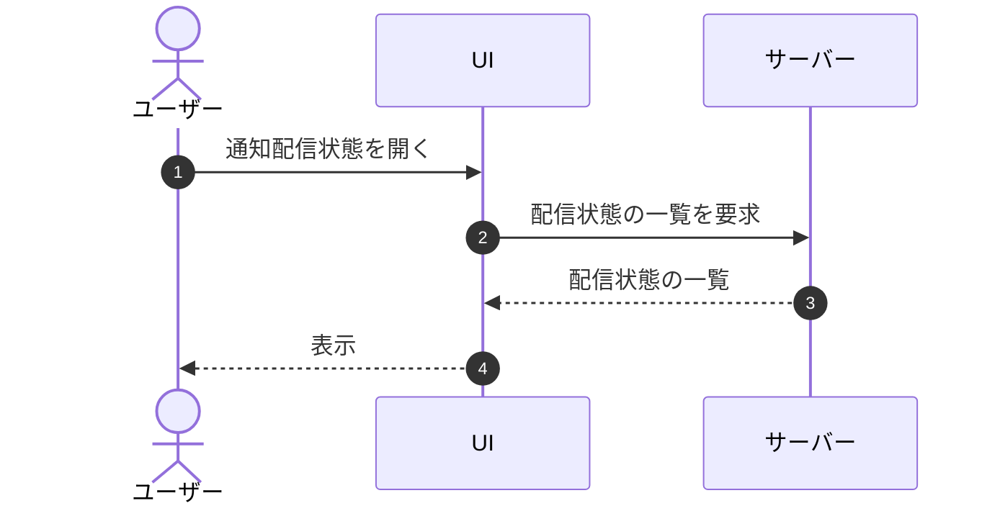
```mermaid
sequenceDiagram
  autonumber
  actor U as ユーザー
  participant UI as UI
  participant S as サーバー
  U->>UI: 通知配信状態を開く
  UI->>S: 配信状態の一覧を要求
  S-->>UI: 配信状態の一覧
  UI-->>U: 表示
```

## FR-120: 通知再送回数の上限を設ける

> **この機能要件は「通知再送回数の上限を設ける」を定義します。**

*種別 機能要件 ・ 機能グループ 通知 ・ 優先度 P0 ・ ステータス ドラフト*

### 要件

通知再送回数の上限を設けること

### シーケンス

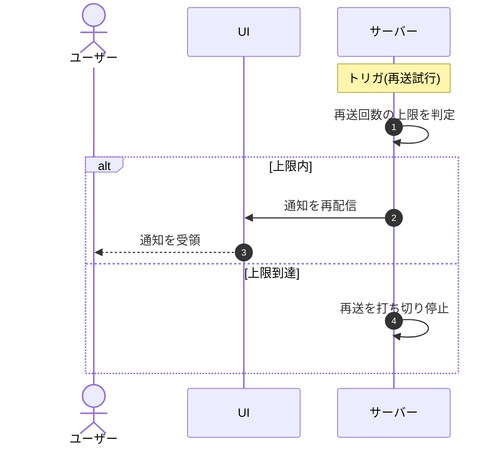
```mermaid
sequenceDiagram
  autonumber
  actor U as ユーザー
  participant UI as UI
  participant S as サーバー
  Note over S: トリガ(再送試行)
  S->>S: 再送回数の上限を判定
  alt 上限内
    S->>UI: 通知を再配信
    UI-->>U: 通知を受領
  else 上限到達
    S->>S: 再送を打ち切り停止
  end
```

## FR-121: 請求確定のオーナー宛メール通知

> **この機能要件は「請求確定のオーナー宛メール通知」を定義します。**

*種別 機能要件 ・ 機能グループ 通知 ・ 優先度 P0 ・ ステータス ドラフト*

### 要件

月次の請求が確定したタイミングで、オーナーにメール通知できること。
1. 通知には請求対象期間、請求金額、内訳(質問数・各種上限の超過分など)、請求書 / 明細の確認導線を含める
2. 同タイミングで対象オーナーのお知らせ受信箱に「請求確定」のお知らせを生成する
3. 同一契約・同一請求月での重複請求を行わない

### シーケンス

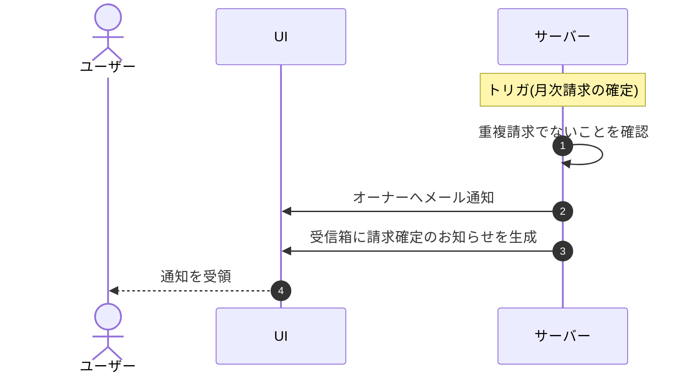
```mermaid
sequenceDiagram
  autonumber
  actor U as ユーザー
  participant UI as UI
  participant S as サーバー
  Note over S: トリガ(月次請求の確定)
  S->>S: 重複請求でないことを確認
  S->>UI: オーナーへメール通知
  S->>UI: 受信箱に請求確定のお知らせを生成
  UI-->>U: 通知を受領
```

## FR-122: 運営お知らせの配信

> **この機能要件は「運営お知らせの配信」を定義します。**

*種別 機能要件 ・ 機能グループ 通知 ・ 優先度 P0 ・ ステータス ドラフト*

### 要件

特定契約または全契約に対して任意のお知らせ(メンテナンス予告、機能追加、規約改定、価格改定など)をメール通知できること。
1. 宛先範囲(全契約 / 特定契約 / 特定ユーザー種別)、件名、本文、送信予定日時を指定できる
2. 受信者はアカウント利用者を対象とし、種別ごとにオプトアウトの可否を設定できる(規約改定・重要セキュリティ通知などは強制送信としオプトアウト不可)
3. 同タイミングで対象契約のアカウント利用者のお知らせ受信箱に「お知らせ」を生成する

### シーケンス

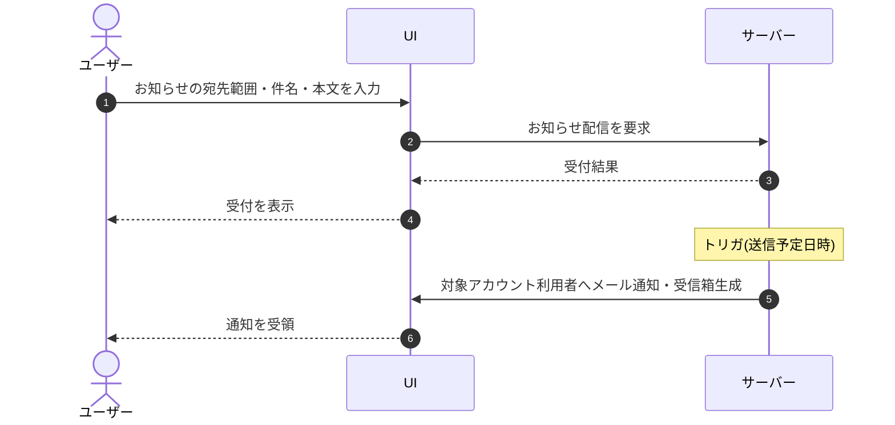
```mermaid
sequenceDiagram
  autonumber
  actor U as ユーザー
  participant UI as UI
  participant S as サーバー
  U->>UI: お知らせの宛先範囲・件名・本文を入力
  UI->>S: お知らせ配信を要求
  S-->>UI: 受付結果
  UI-->>U: 受付を表示
  Note over S: トリガ(送信予定日時)
  S->>UI: 対象アカウント利用者へメール通知・受信箱生成
  UI-->>U: 通知を受領
```

## FR-123: 運用イベントのシステム通知自動生成

> **この機能要件は「運用イベントのシステム通知自動生成」を定義します。**

*種別 機能要件 ・ 機能グループ 通知 ・ 優先度 P1 ・ ステータス ドラフト*

### 要件

運用イベント(FAQ 利用上限 80% / 100% 接近、AI 利用上限到達、通知失敗急増、サスペンション、復元、規約改定、価格改定 等)を契機に「システム通知」のお知らせを自動生成できること

### シーケンス

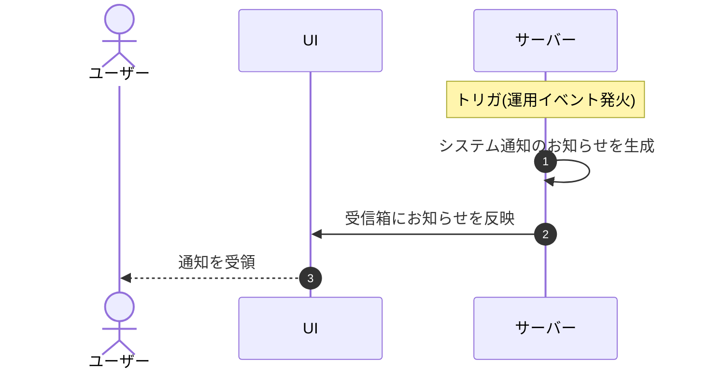
```mermaid
sequenceDiagram
  autonumber
  actor U as ユーザー
  participant UI as UI
  participant S as サーバー
  Note over S: トリガ(運用イベント発火)
  S->>S: システム通知のお知らせを生成
  S->>UI: 受信箱にお知らせを反映
  UI-->>U: 通知を受領
```

## FR-124: 配信停止リストの全契約横断共有

> **この機能要件は「配信停止リストの全契約横断共有」を定義します。**

*種別 機能要件 ・ 機能グループ 通知 ・ 優先度 P0 ・ ステータス ドラフト*

### 要件

バウンス・苦情検知時のメール配信停止リストは全契約横断で共有し、宛先別に再送停止すること(共通ドメイン使用に伴う対策)

### シーケンス

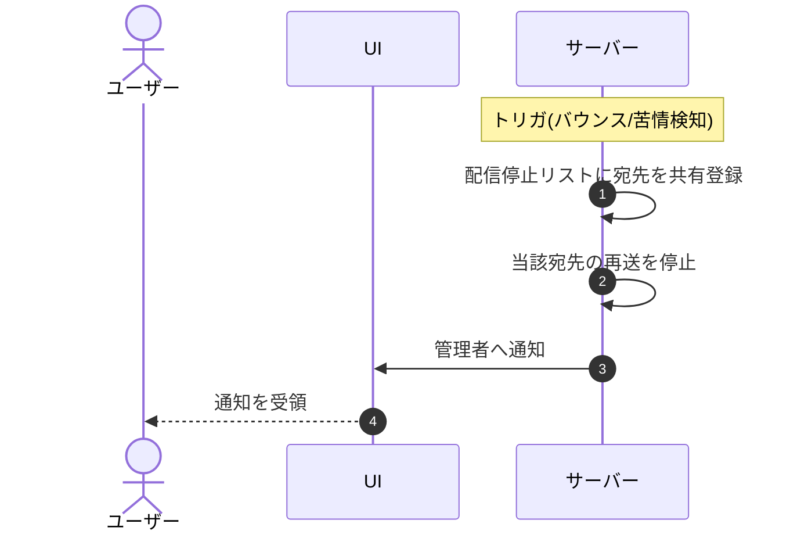
```mermaid
sequenceDiagram
  autonumber
  actor U as ユーザー
  participant UI as UI
  participant S as サーバー
  Note over S: トリガ(バウンス/苦情検知)
  S->>S: 配信停止リストに宛先を共有登録
  S->>S: 当該宛先の再送を停止
  S->>UI: 管理者へ通知
  UI-->>U: 通知を受領
```

## FR-125: 役割割当変更時のメンバー通知

> **この機能要件は「役割割当変更時のメンバー通知」を定義します。**

*種別 機能要件 ・ 機能グループ 通知 ・ 優先度 P0 ・ ステータス ドラフト*

### 要件

メンバーのプロジェクト別の役割割当が追加・変更・剥奪された場合、当該メンバーへお知らせ受信箱(「運営お知らせ」種別・「通常」重要度)とメールで通知できること

### シーケンス

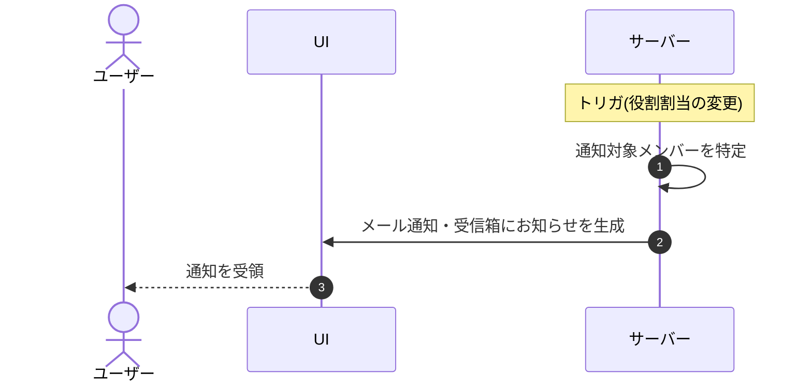
```mermaid
sequenceDiagram
  autonumber
  actor U as ユーザー
  participant UI as UI
  participant S as サーバー
  Note over S: トリガ(役割割当の変更)
  S->>S: 通知対象メンバーを特定
  S->>UI: メール通知・受信箱にお知らせを生成
  UI-->>U: 通知を受領
```

## FR-155: お知らせ一覧の取得・表示

> **この機能要件は「お知らせ一覧の取得・表示」を定義します。**

*種別 機能要件 ・ 機能グループ お知らせ ・ 優先度 P0 ・ ステータス ドラフト*

### 要件

アカウント利用者は自契約宛のお知らせ一覧を取得・表示できること

### シーケンス

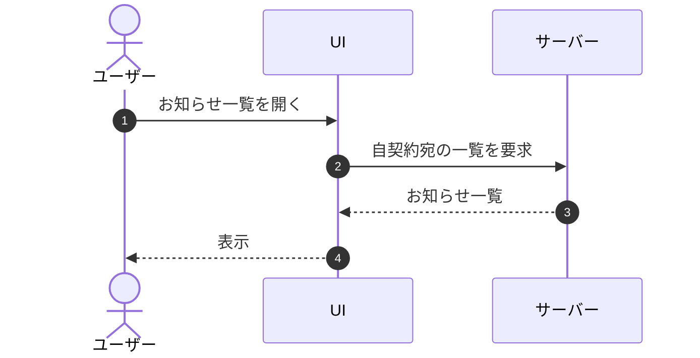
```mermaid
sequenceDiagram
  autonumber
  actor U as ユーザー
  participant UI as UI
  participant S as サーバー
  U->>UI: お知らせ一覧を開く
  UI->>S: 自契約宛の一覧を要求
  S-->>UI: お知らせ一覧
  UI-->>U: 表示
```

## FR-156: お知らせ詳細の表示

> **この機能要件は「お知らせ詳細の表示」を定義します。**

*種別 機能要件 ・ 機能グループ お知らせ ・ 優先度 P0 ・ ステータス ドラフト*

### 要件

アカウント利用者はお知らせの詳細(本文・種別・重要度・配信日時)を表示できること。
1. 重要度は「低 / 通常 / 重要 / 最重要」の 4 段階とする
2. 「最重要」は規約改定・重大セキュリティ通知・サスペンション確定時に限定して使用する

### シーケンス

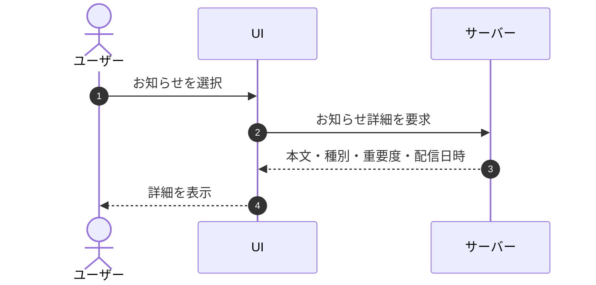
```mermaid
sequenceDiagram
  autonumber
  actor U as ユーザー
  participant UI as UI
  participant S as サーバー
  U->>UI: お知らせを選択
  UI->>S: お知らせ詳細を要求
  S-->>UI: 本文・種別・重要度・配信日時
  UI-->>U: 詳細を表示
```

## FR-157: お知らせの個別・一括既読化

> **この機能要件は「お知らせの個別・一括既読化」を定義します。**

*種別 機能要件 ・ 機能グループ お知らせ ・ 優先度 P0 ・ ステータス ドラフト*

### 要件

アカウント利用者はお知らせを個別および一括で既読化できること

### シーケンス

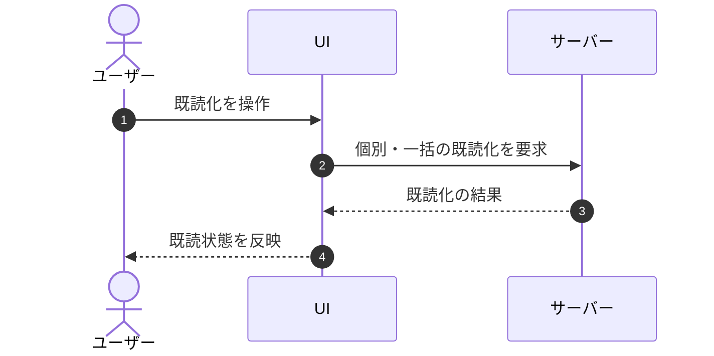
```mermaid
sequenceDiagram
  autonumber
  actor U as ユーザー
  participant UI as UI
  participant S as サーバー
  U->>UI: 既読化を操作
  UI->>S: 個別・一括の既読化を要求
  S-->>UI: 既読化の結果
  UI-->>U: 既読状態を反映
```

## FR-158: お知らせの絞り込み

> **この機能要件は「お知らせの絞り込み」を定義します。**

*種別 機能要件 ・ 機能グループ お知らせ ・ 優先度 P1 ・ ステータス ドラフト*

### 要件

アカウント利用者はお知らせを種別(請求確定 / 運営お知らせ / システム通知)、既読状態、期間で絞り込みできること

### シーケンス

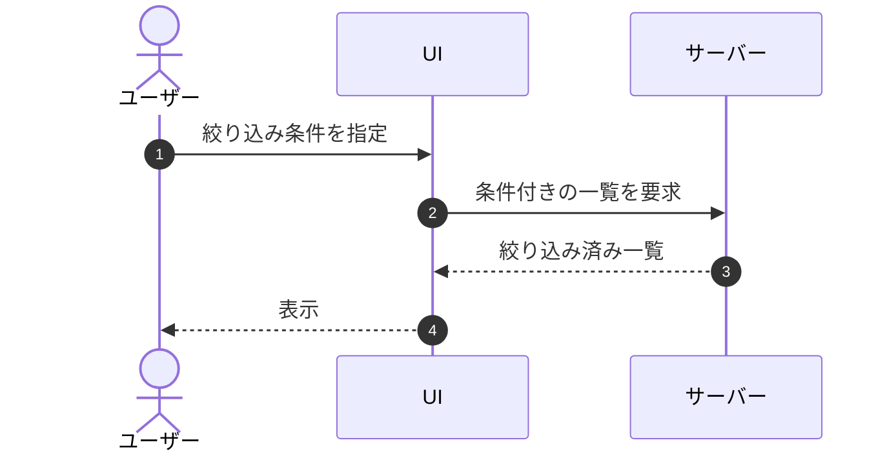
```mermaid
sequenceDiagram
  autonumber
  actor U as ユーザー
  participant UI as UI
  participant S as サーバー
  U->>UI: 絞り込み条件を指定
  UI->>S: 条件付きの一覧を要求
  S-->>UI: 絞り込み済み一覧
  UI-->>U: 表示
```

## FR-159: 通知ベルの未読件数バッジ表示

> **この機能要件は「通知ベルの未読件数バッジ表示」を定義します。**

*種別 機能要件 ・ 機能グループ お知らせ ・ 優先度 P0 ・ ステータス ドラフト*

### 要件

管理画面ヘッダの通知ベルに、未読件数のバッジを表示できること(0 件時は非表示)

### シーケンス

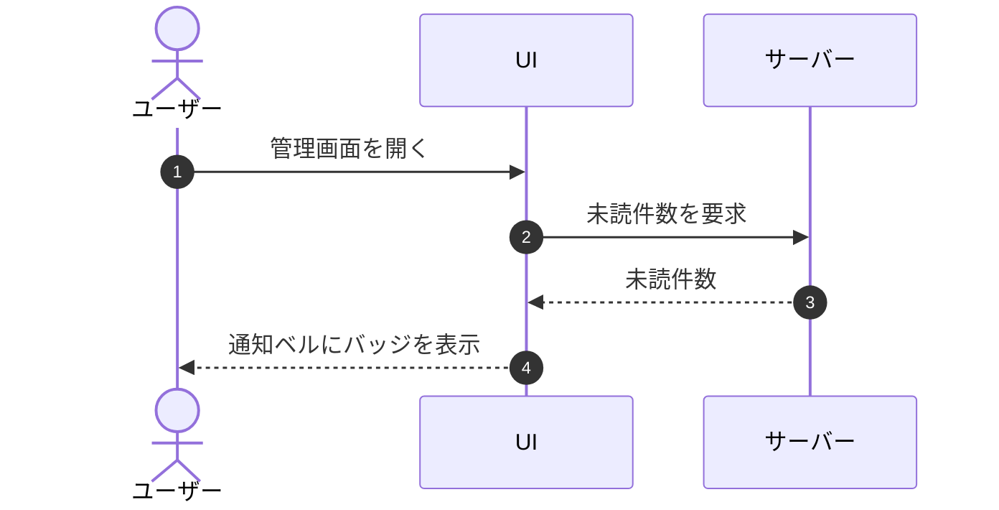
```mermaid
sequenceDiagram
  autonumber
  actor U as ユーザー
  participant UI as UI
  participant S as サーバー
  U->>UI: 管理画面を開く
  UI->>S: 未読件数を要求
  S-->>UI: 未読件数
  UI-->>U: 通知ベルにバッジを表示
```

## FR-160: 通知ベルの直近お知らせ表示

> **この機能要件は「通知ベルの直近お知らせ表示」を定義します。**

*種別 機能要件 ・ 機能グループ お知らせ ・ 優先度 P1 ・ ステータス ドラフト*

### 要件

管理画面ヘッダの通知ベルから、直近 10 件のお知らせをドロップダウンで表示できること

### シーケンス

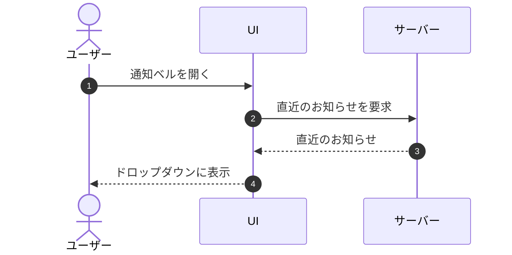
```mermaid
sequenceDiagram
  autonumber
  actor U as ユーザー
  participant UI as UI
  participant S as サーバー
  U->>UI: 通知ベルを開く
  UI->>S: 直近のお知らせを要求
  S-->>UI: 直近のお知らせ
  UI-->>U: ドロップダウンに表示
```

## FR-161: お知らせ閲覧範囲の限定

> **この機能要件は「お知らせ閲覧範囲の限定」を定義します。**

*種別 機能要件 ・ 機能グループ お知らせ ・ 優先度 P0 ・ ステータス ドラフト*

### 要件

お知らせはアカウント利用者のみ閲覧可能とし、ウィジェット利用者は閲覧できないこと

### シーケンス

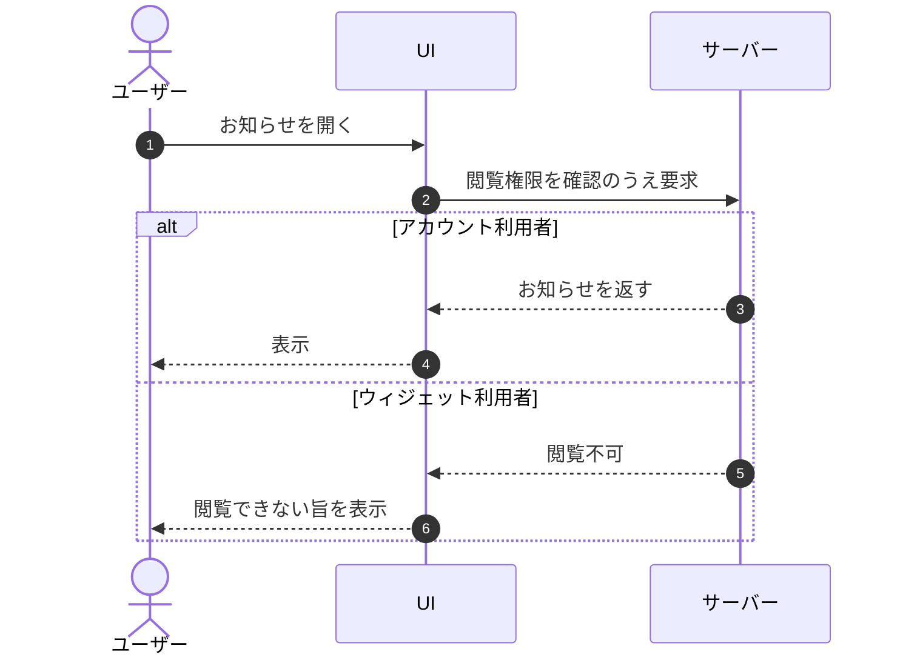
```mermaid
sequenceDiagram
  autonumber
  actor U as ユーザー
  participant UI as UI
  participant S as サーバー
  U->>UI: お知らせを開く
  UI->>S: 閲覧権限を確認のうえ要求
  alt アカウント利用者
    S-->>UI: お知らせを返す
    UI-->>U: 表示
  else ウィジェット利用者
    S-->>UI: 閲覧不可
    UI-->>U: 閲覧できない旨を表示
  end
```

## FR-162: 受信箱への請求確定お知らせ生成

> **この機能要件は「受信箱への請求確定お知らせ生成」を定義します。**

*種別 機能要件 ・ 機能グループ お知らせ ・ 優先度 P0 ・ ステータス ドラフト*

### 要件

月次請求の確定タイミングで、アカウント利用者の受信箱に請求確定のお知らせを生成できること。請求確定メール通知と同期して実施する

### シーケンス

```mermaid
sequenceDiagram
  autonumber
  actor U as ユーザー
  participant UI as UI
  participant S as サーバー
  Note over S: トリガ(月次請求の確定)
  S->>S: 受信箱に請求確定のお知らせを生成
  S->>UI: 請求確定メールと同期して反映
  UI-->>U: 通知を受領
```

## FR-163: 受信箱への運営お知らせ生成

> **この機能要件は「受信箱への運営お知らせ生成」を定義します。**

*種別 機能要件 ・ 機能グループ お知らせ ・ 優先度 P0 ・ ステータス ドラフト*

### 要件

お知らせを配信したタイミングで、対象アカウント利用者の受信箱にお知らせを生成できること。お知らせメール通知と同期して実施する

### シーケンス

```mermaid
sequenceDiagram
  autonumber
  actor U as ユーザー
  participant UI as UI
  participant S as サーバー
  Note over S: トリガ(お知らせの配信)
  S->>S: 対象アカウント利用者の受信箱にお知らせを生成
  S->>UI: お知らせメールと同期して反映
  UI-->>U: 通知を受領
```

## FR-164: 運用イベントをシステム通知として受信箱に生成

> **この機能要件は「運用イベントをシステム通知として受信箱に生成」を定義します。**

*種別 機能要件 ・ 機能グループ お知らせ ・ 優先度 P1 ・ ステータス ドラフト*

### 要件

運用イベントをシステム通知として受信箱に生成できること。
1. 対象とする運用イベントは次のとおり。
    1. 上限接近(80%)・上限超過
    2. 通知配信失敗の急増
    3. AI 利用上限到達
2. 同一契約・同一イベント種別で 60 分以内に連続発火した場合は 1 件に集約する

### シーケンス

```mermaid
sequenceDiagram
  autonumber
  actor U as ユーザー
  participant UI as UI
  participant S as サーバー
  Note over S: トリガ(運用イベント発火)
  S->>S: 連続発火を集約判定
  S->>S: システム通知を受信箱に生成
  S->>UI: 受信箱に反映
  UI-->>U: 通知を受領
```

## FR-165: 受信箱の保持と退会時削除

> **この機能要件は「受信箱の保持と退会時削除」を定義します。**

*種別 機能要件 ・ 機能グループ お知らせ ・ 優先度 P0 ・ ステータス ドラフト*

### 要件

お知らせ受信箱はアカウント利用者ごとに保持し、アカウント無効化・退会時に削除されること

### シーケンス

```mermaid
sequenceDiagram
  autonumber
  actor U as ユーザー
  participant UI as UI
  participant S as サーバー
  Note over S: トリガ(アカウント無効化・退会)
  S->>S: 当該利用者の受信箱を削除
  S->>UI: 処理結果を反映
  UI-->>U: 完了を確認
```

## FR-166: 未読件数の取得と更新

> **この機能要件は「未読件数の取得と更新」を定義します。**

*種別 機能要件 ・ 機能グループ お知らせ ・ 優先度 P1 ・ ステータス ドラフト*

### 要件

お知らせの未読件数は管理画面遷移時に取得し、画面滞在中も過大な負荷を生まない範囲で更新できること

### シーケンス

```mermaid
sequenceDiagram
  autonumber
  actor U as ユーザー
  participant UI as UI
  participant S as サーバー
  U->>UI: 管理画面へ遷移
  UI->>S: 未読件数を要求
  S-->>UI: 未読件数
  UI-->>U: 未読件数を更新表示
```

## FR-167: 一括既読操作の監査ログ記録

> **この機能要件は「一括既読操作の監査ログ記録」を定義します。**

*種別 機能要件 ・ 機能グループ お知らせ ・ 優先度 P0 ・ ステータス ドラフト*

### 要件

一括既読操作は監査ログに記録できること(操作者・対象件数・実行日時)

### シーケンス

```mermaid
sequenceDiagram
  autonumber
  actor U as ユーザー
  participant UI as UI
  participant S as サーバー
  U->>UI: 一括既読を操作
  UI->>S: 一括既読化を要求
  S->>S: 操作者・対象件数・実行日時を監査ログに記録
  S-->>UI: 処理結果
  UI-->>U: 既読状態を反映
```
