# セキュリティ・プライバシー(機能要件)

> **このページは、セキュリティ・プライバシー に関する機能要件を定義します。**

*複数の個別要件を統合したカテゴリ別ページ。各要件の優先度・トレースは各節を参照。 ステータス ドラフト*

## FR-137: 退会の即時実行と厳格な確認

> **この機能要件は「退会の即時実行と厳格な確認」を定義します。**

*種別 機能要件 ・ 機能グループ プライバシー・データ管理 ・ 優先度 P0 ・ ステータス ドラフト*

### 要件

オーナーによる退会は即時に実行し、猶予期間は設けないこと。実行前に厳格な確認を必須とする。
1. 退会の影響(サービスの即時停止・運用データの削除・以後は請求情報の閲覧のみ可能になること)を明示する
2. 取り消しできない操作である旨を警告し、氏名(プロフィール名)の入力一致と本人確認(再認証)を必須とする
3. 確認の完了をもってアカウントを即時に退会済みへ移行する(申請を保留する猶予状態は持たない)

### シーケンス

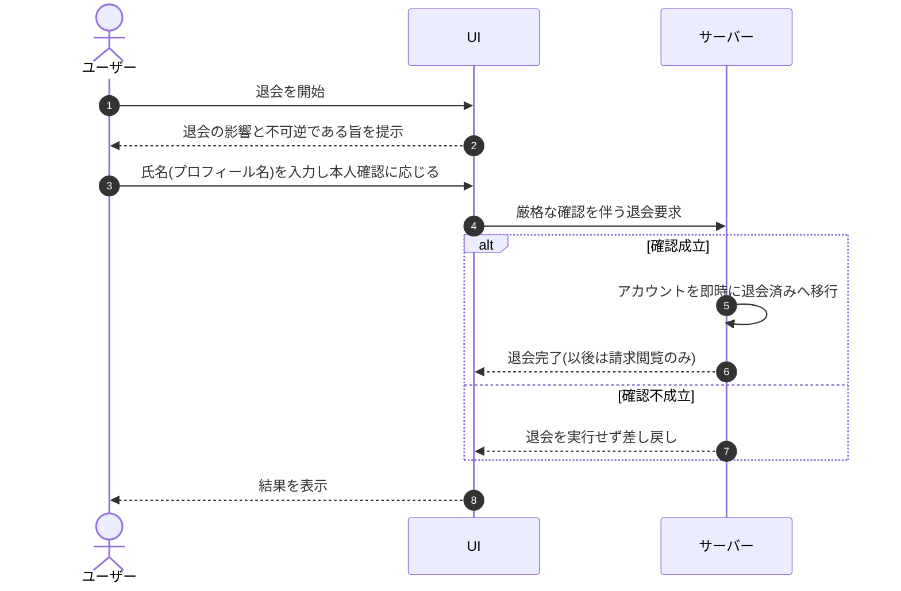
```mermaid
sequenceDiagram
  autonumber
  actor U as ユーザー
  participant UI as UI
  participant S as サーバー
  U->>UI: 退会を開始
  UI-->>U: 退会の影響と不可逆である旨を提示
  U->>UI: 氏名(プロフィール名)を入力し本人確認に応じる
  UI->>S: 厳格な確認を伴う退会要求
  alt 確認成立
    S->>S: アカウントを即時に退会済みへ移行
    S-->>UI: 退会完了(以後は請求閲覧のみ)
  else 確認不成立
    S-->>UI: 退会を実行せず差し戻し
  end
  UI-->>U: 結果を表示
```

## FR-138: 退会時のデータ削除と請求データの保持

> **この機能要件は「退会時のデータ削除と請求データの保持」を定義します。**

*種別 機能要件 ・ 機能グループ プライバシー・データ管理 ・ 優先度 P0 ・ ステータス ドラフト*

### 要件

退会時に運用データを速やかに削除し、アカウント・請求データは法定保持期間にわたり保持すること。
1. 退会と同時に、FAQ・プロジェクト・許可ドメイン・質問ログ・未解決質問・利用量・通知・お知らせ受信箱などの運用データを速やかに削除する
2. アカウント・請求関連データ(アカウント・請求書・サブスクリプション・支払方法・監査記録)は法定保持期間(7 年、[RULE-022](../01_business_requirement/08_rule.md#RULE-022))にわたり保持し、保持期間の経過後に削除する
3. 削除は不可逆とし、削除内容を監査記録として残す

### シーケンス

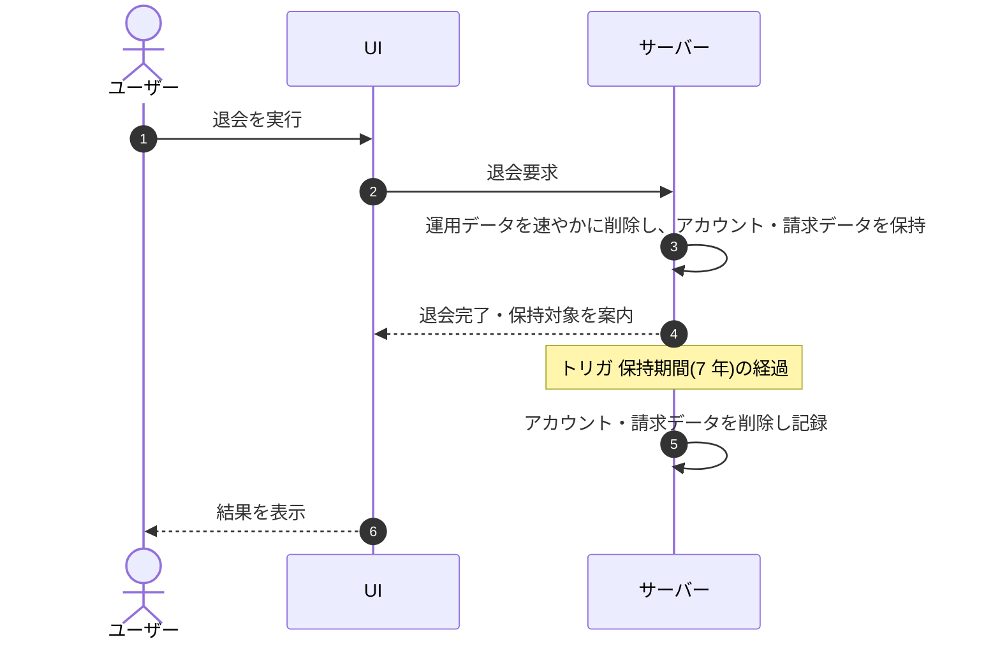
```mermaid
sequenceDiagram
  autonumber
  actor U as ユーザー
  participant UI as UI
  participant S as サーバー
  U->>UI: 退会を実行
  UI->>S: 退会要求
  S->>S: 運用データを速やかに削除し、アカウント・請求データを保持
  S-->>UI: 退会完了・保持対象を案内
  Note over S: トリガ 保持期間(7 年)の経過
  S->>S: アカウント・請求データを削除し記録
  UI-->>U: 結果を表示
```

## FR-139: 利用規約・プライバシーポリシー改定時に再同意を取得

> **この機能要件は「利用規約・プライバシーポリシー改定時に再同意を取得」を定義します。**

*種別 機能要件 ・ 機能グループ プライバシー・データ管理 ・ 優先度 P0 ・ ステータス ドラフト*

### 要件

利用規約・プライバシーポリシー改定時に再同意を取得できること。
1. 利用規約とプライバシーポリシーは個別の文書として版管理し、それぞれ同意を取得する
2. 改定された文書のみを再同意の対象とする
3. 閲覧画面も文書ごとに分離する

### シーケンス

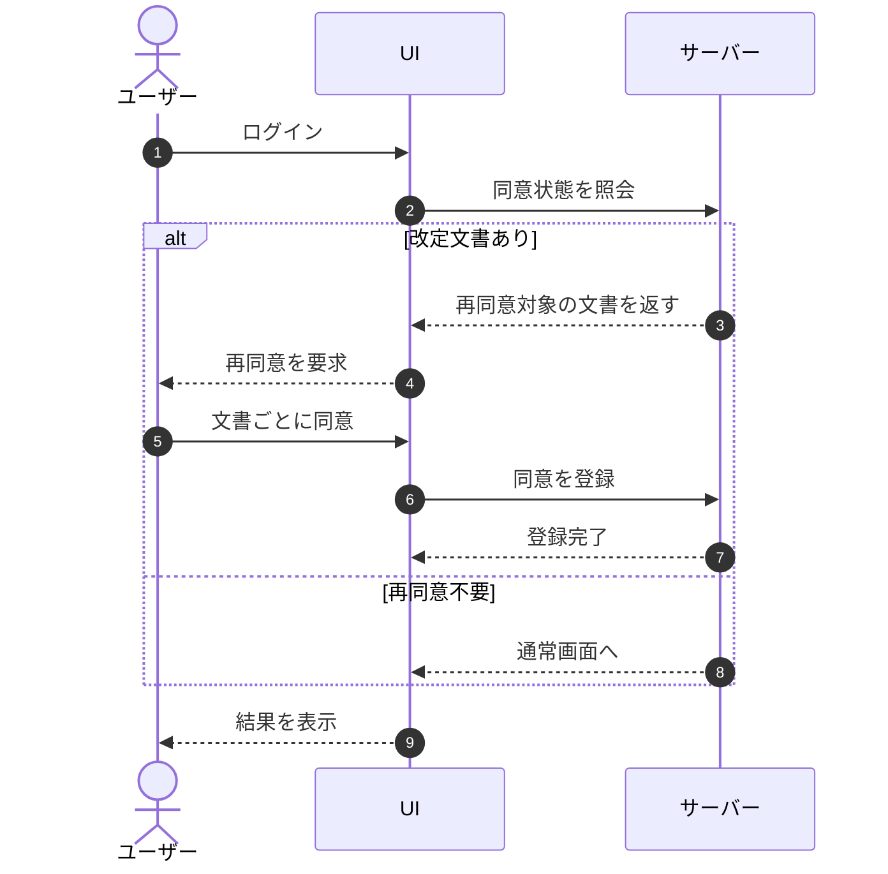
```mermaid
sequenceDiagram
  autonumber
  actor U as ユーザー
  participant UI as UI
  participant S as サーバー
  U->>UI: ログイン
  UI->>S: 同意状態を照会
  alt 改定文書あり
    S-->>UI: 再同意対象の文書を返す
    UI-->>U: 再同意を要求
    U->>UI: 文書ごとに同意
    UI->>S: 同意を登録
    S-->>UI: 登録完了
  else 再同意不要
    S-->>UI: 通常画面へ
  end
  UI-->>U: 結果を表示
```

## FR-140: 退会後の請求限定アクセス

> **この機能要件は「退会後の請求限定アクセス」を定義します。**

*種別 機能要件 ・ 機能グループ プライバシー・データ管理 ・ 優先度 P0 ・ ステータス ドラフト*

### 要件

退会後も、アカウント・請求データの保持期間(7 年)中はオーナーがログインでき、請求情報の閲覧のみ行えること。
1. ログインと請求情報(請求履歴・請求書・請求状態等)の閲覧のみを許可する
2. FAQ・プロジェクト・ウィジェット・メンバー管理・設定変更などの操作および新規書込みはすべて不可とする(機能停止の旨を示す応答に切り替える)
3. アカウント・請求データの保持期間の経過後はログインできない

### シーケンス

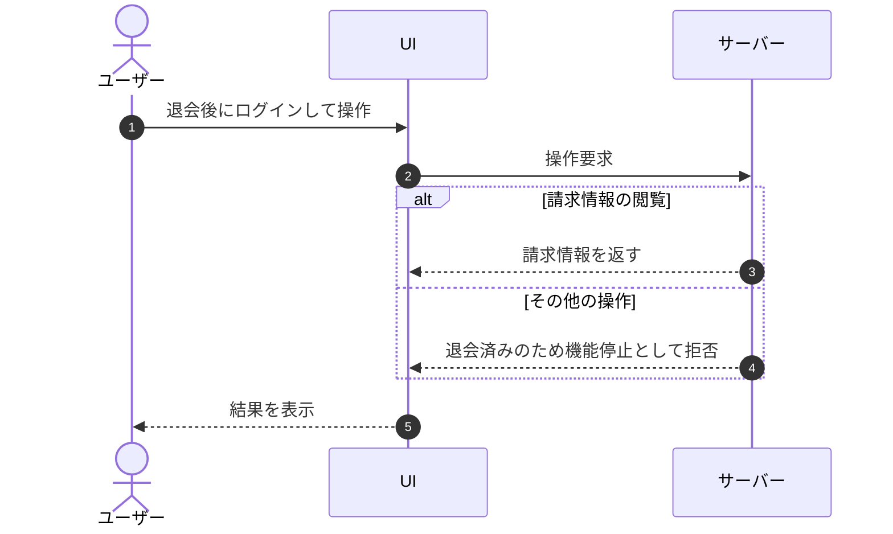
```mermaid
sequenceDiagram
  autonumber
  actor U as ユーザー
  participant UI as UI
  participant S as サーバー
  U->>UI: 退会後にログインして操作
  UI->>S: 操作要求
  alt 請求情報の閲覧
    S-->>UI: 請求情報を返す
  else その他の操作
    S-->>UI: 退会済みのため機能停止として拒否
  end
  UI-->>U: 結果を表示
```

## FR-141: 通信の暗号化(HTTPS)

> **この機能要件は「通信の暗号化(HTTPS)」を定義します。**

*種別 機能要件 ・ 機能グループ セキュリティ ・ 優先度 P0 ・ ステータス ドラフト*

> [!NOTE]
> 横断的品質要件。特定の業務ユースケースに帰属せず、非機能要件および各設計層の共通方針で担保する(トレーサビリティ一覧の業務UC×要件表には掲載しない)。

### 要件

通信は暗号化されること(HTTPS)

### シーケンス

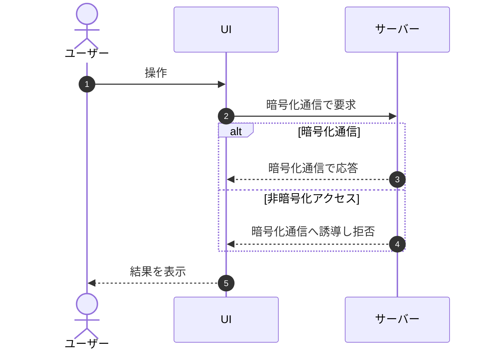
```mermaid
sequenceDiagram
  autonumber
  actor U as ユーザー
  participant UI as UI
  participant S as サーバー
  U->>UI: 操作
  UI->>S: 暗号化通信で要求
  alt 暗号化通信
    S-->>UI: 暗号化通信で応答
  else 非暗号化アクセス
    S-->>UI: 暗号化通信へ誘導し拒否
  end
  UI-->>U: 結果を表示
```

## FR-142: 機密項目の暗号化・ハッシュ保存

> **この機能要件は「機密項目の暗号化・ハッシュ保存」を定義します。**

*種別 機能要件 ・ 機能グループ セキュリティ ・ 優先度 P0 ・ ステータス ドラフト*

### 要件

保存データのうち機密度の高い項目(パスワード、トークン、課金情報等)は暗号化または安全なハッシュで保存されること

### シーケンス

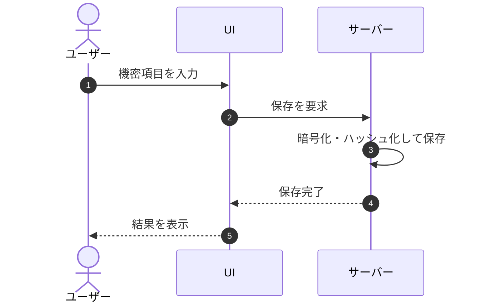
```mermaid
sequenceDiagram
  autonumber
  actor U as ユーザー
  participant UI as UI
  participant S as サーバー
  U->>UI: 機密項目を入力
  UI->>S: 保存を要求
  S->>S: 暗号化・ハッシュ化して保存
  S-->>UI: 保存完了
  UI-->>U: 結果を表示
```

## FR-143: API・ウィジェットのレート制限

> **この機能要件は「API・ウィジェットのレート制限」を定義します。**

*種別 機能要件 ・ 機能グループ セキュリティ ・ 優先度 P0 ・ ステータス ドラフト*

### 要件

API・ウィジェットに対してレート制限ができること

### シーケンス

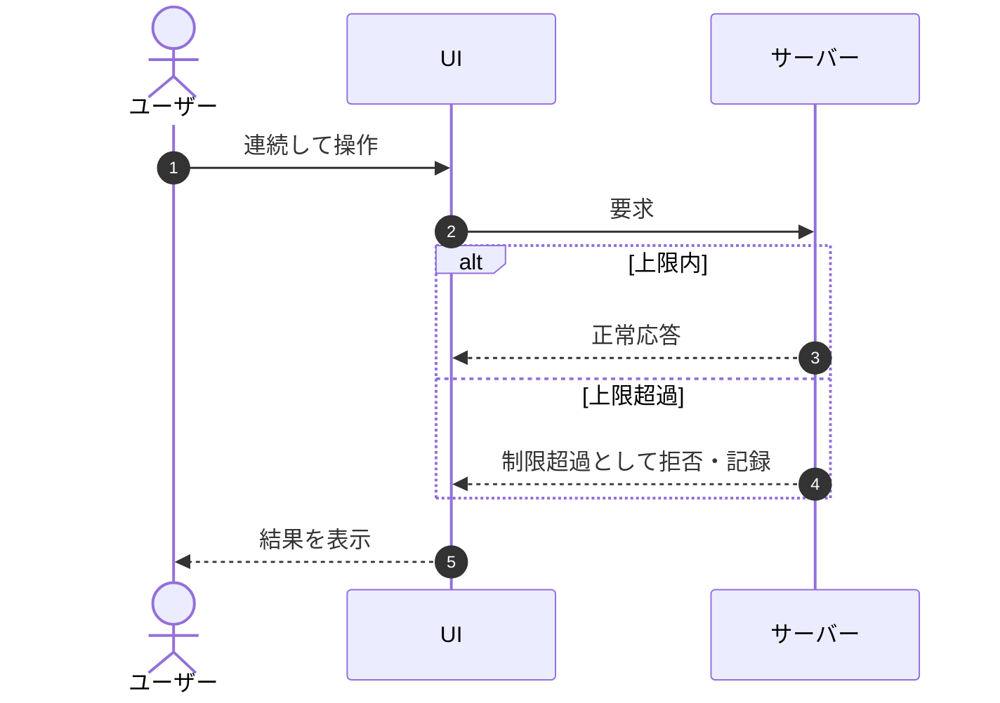
```mermaid
sequenceDiagram
  autonumber
  actor U as ユーザー
  participant UI as UI
  participant S as サーバー
  U->>UI: 連続して操作
  UI->>S: 要求
  alt 上限内
    S-->>UI: 正常応答
  else 上限超過
    S-->>UI: 制限超過として拒否・記録
  end
  UI-->>U: 結果を表示
```

## FR-144: 埋め込み元ドメインの検証・制限

> **この機能要件は「埋め込み元ドメインの検証・制限」を定義します。**

*種別 機能要件 ・ 機能グループ セキュリティ ・ 優先度 P0 ・ ステータス ドラフト*

### 要件

ウィジェットの埋め込み元ドメインを検証できること(許可ドメイン以外からの読み込み拒否)

### シーケンス

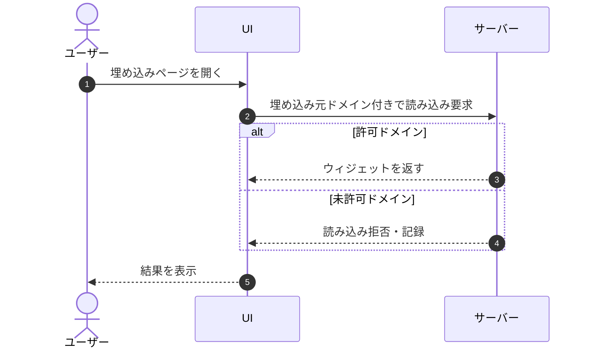
```mermaid
sequenceDiagram
  autonumber
  actor U as ユーザー
  participant UI as UI
  participant S as サーバー
  U->>UI: 埋め込みページを開く
  UI->>S: 埋め込み元ドメイン付きで読み込み要求
  alt 許可ドメイン
    S-->>UI: ウィジェットを返す
  else 未許可ドメイン
    S-->>UI: 読み込み拒否・記録
  end
  UI-->>U: 結果を表示
```

## FR-145: 利用者の操作ログを監査用に保持

> **この機能要件は「利用者の操作ログを監査用に保持」を定義します。**

*種別 機能要件 ・ 機能グループ セキュリティ ・ 優先度 P0 ・ ステータス ドラフト*

### 要件

利用者の操作ログを監査用に保持できること

### シーケンス

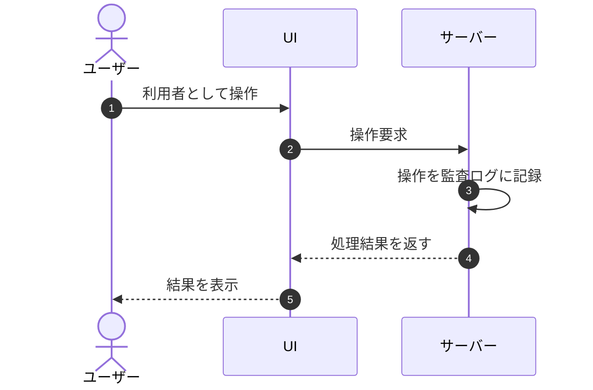
```mermaid
sequenceDiagram
  autonumber
  actor U as ユーザー
  participant UI as UI
  participant S as サーバー
  U->>UI: 利用者として操作
  UI->>S: 操作要求
  S->>S: 操作を監査ログに記録
  S-->>UI: 処理結果を返す
  UI-->>U: 結果を表示
```

## FR-146: 最小権限によるアクセス制御・データ分離

> **この機能要件は「最小権限によるアクセス制御・データ分離」を定義します。**

*種別 機能要件 ・ 機能グループ セキュリティ ・ 優先度 P0 ・ ステータス ドラフト*

> [!NOTE]
> 横断的品質要件。特定の業務ユースケースに帰属せず、非機能要件および各設計層の共通方針で担保する(トレーサビリティ一覧の業務UC×要件表には掲載しない)。

### 要件

アクセス制御は最小権限の原則に従うこと(オーナー境界によるデータ分離、ユーザー種別別認可)

### シーケンス

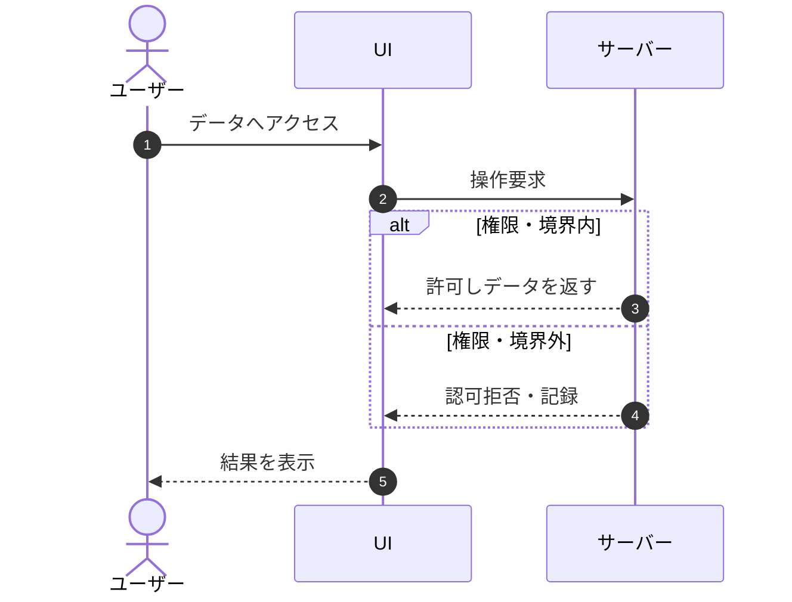
```mermaid
sequenceDiagram
  autonumber
  actor U as ユーザー
  participant UI as UI
  participant S as サーバー
  U->>UI: データへアクセス
  UI->>S: 操作要求
  alt 権限・境界内
    S-->>UI: 許可しデータを返す
  else 権限・境界外
    S-->>UI: 認可拒否・記録
  end
  UI-->>U: 結果を表示
```

## FR-147: Bot 対策(レート制限・ロックアウト等)を必要に応じて実施

> **この機能要件は「Bot 対策(レート制限・ロックアウト等)を必要に応じて実施」を定義します。**

*種別 機能要件 ・ 機能グループ セキュリティ ・ 優先度 P1 ・ ステータス ドラフト*

### 要件

Bot・不正自動アクセス対策を、次の発火条件で実施できること。「必要に応じて」とは次の各契機をいう。
1. ログイン連続失敗時: 同一アカウントで連続してログインに失敗したとき、アカウントロックにより自動試行を抑止する(連続失敗のしきい値・ロックは [RULE-001](../01_business_requirement/08_rule.md#RULE-001))
2. 未認証の再送・送信時: 未認証状態で行われる送信操作(パスワード再設定メール・連絡先確認メールの再送、ウィジェットからの問い合わせ送信 等)で、レート制限により短時間の連続要求を抑止する
3. 不審なリクエスト検知時: 大量アクセス・未許可ドメイン等の不審なリクエスト(FR-148)を検知したとき、追加の制限・記録を行う

### シーケンス

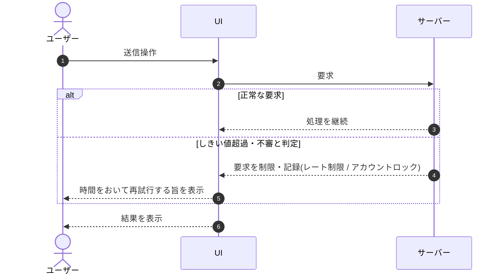
```mermaid
sequenceDiagram
  autonumber
  actor U as ユーザー
  participant UI as UI
  participant S as サーバー
  U->>UI: 送信操作
  UI->>S: 要求
  alt 正常な要求
    S-->>UI: 処理を継続
  else しきい値超過・不審と判定
    S-->>UI: 要求を制限・記録(レート制限 / アカウントロック)
    UI-->>U: 時間をおいて再試行する旨を表示
  end
  UI-->>U: 結果を表示
```

## FR-148: 不審なリクエスト(大量アクセス、未許可ドメイン等)を検知・記録

> **この機能要件は「不審なリクエスト(大量アクセス、未許可ドメイン等)を検知・記録」を定義します。**

*種別 機能要件 ・ 機能グループ セキュリティ ・ 優先度 P0 ・ ステータス ドラフト*

### 要件

不審なリクエスト(大量アクセス、未許可ドメイン等)を検知・記録できること

### シーケンス

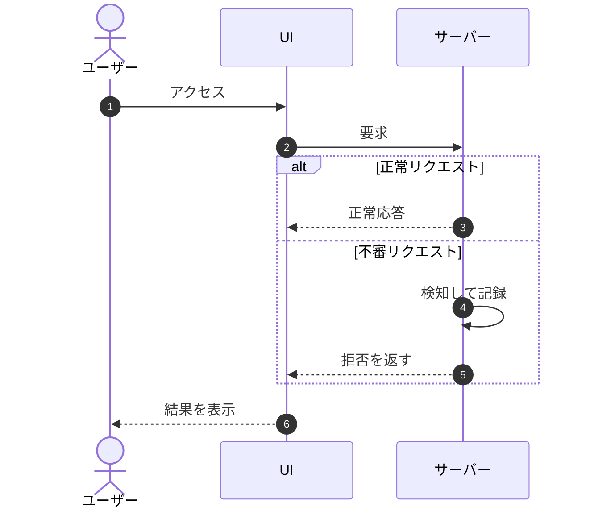
```mermaid
sequenceDiagram
  autonumber
  actor U as ユーザー
  participant UI as UI
  participant S as サーバー
  U->>UI: アクセス
  UI->>S: 要求
  alt 正常リクエスト
    S-->>UI: 正常応答
  else 不審リクエスト
    S->>S: 検知して記録
    S-->>UI: 拒否を返す
  end
  UI-->>U: 結果を表示
```

## FR-149: メンバー管理に関する操作を監査ログに記録

> **この機能要件は「メンバー管理に関する操作を監査ログに記録」を定義します。**

*種別 機能要件 ・ 機能グループ セキュリティ ・ 優先度 P0 ・ ステータス ドラフト*

### 要件

メンバー管理に関する操作を監査ログに記録できること。
1. 記録対象の操作は、メンバー招待・招待再送・プロジェクト割当の変更・プロジェクトからの離脱・メンバー削除とする
2. 記録項目は、操作者・対象メンバー・変更前後のプロジェクト割当差分(該当時)・対応理由(任意)・実行時刻を含む

### シーケンス

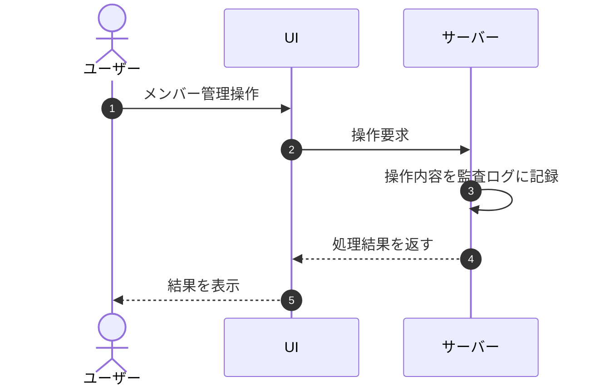
```mermaid
sequenceDiagram
  autonumber
  actor U as ユーザー
  participant UI as UI
  participant S as サーバー
  U->>UI: メンバー管理操作
  UI->>S: 操作要求
  S->>S: 操作内容を監査ログに記録
  S-->>UI: 処理結果を返す
  UI-->>U: 結果を表示
```

## FR-150: ウィジェット公開キーのローテーション機能を利用者操作で提供

> **この機能要件は「ウィジェット公開キーのローテーション機能を利用者操作で提供」を定義します。**

*種別 機能要件 ・ 機能グループ セキュリティ ・ 優先度 P0 ・ ステータス ドラフト*

### 要件

ウィジェット公開キーのローテーション機能を利用者操作で提供すること。
1. 新キー発行と同時に、旧キーを **24 時間の猶予期間** 付きの失効予告状態とする
2. 猶予中は新旧両キーで認証を許可し、アクセスログを両キーで記録する(どちらの利用率が高いかをメンバーが確認できる)
3. 猶予期間の経過後は、旧キーを完全失効とする

### シーケンス

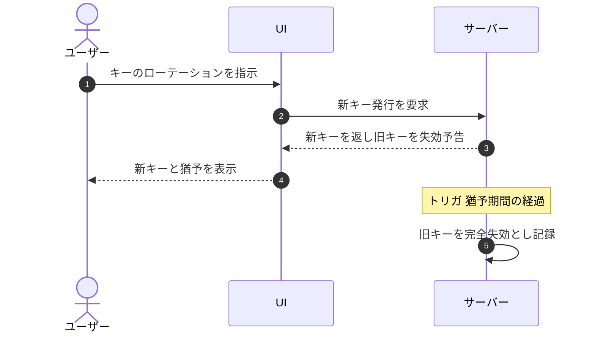
```mermaid
sequenceDiagram
  autonumber
  actor U as ユーザー
  participant UI as UI
  participant S as サーバー
  U->>UI: キーのローテーションを指示
  UI->>S: 新キー発行を要求
  S-->>UI: 新キーを返し旧キーを失効予告
  UI-->>U: 新キーと猶予を表示
  Note over S: トリガ 猶予期間の経過
  S->>S: 旧キーを完全失効とし記録
```

## FR-151: 公開キーの無期限運用

> **この機能要件は「公開キーの無期限運用」を定義します。**

*種別 機能要件 ・ 機能グループ セキュリティ ・ 優先度 P0 ・ ステータス ドラフト*

### 要件

ウィジェット公開キーには有効期限を設けないこと(無期限)。
1. キーの失効は再発行(ローテーション、[FR-150](#FR-150))によってのみ行う
2. 再発行時は旧キーを 24 時間猶予で失効させる

### シーケンス

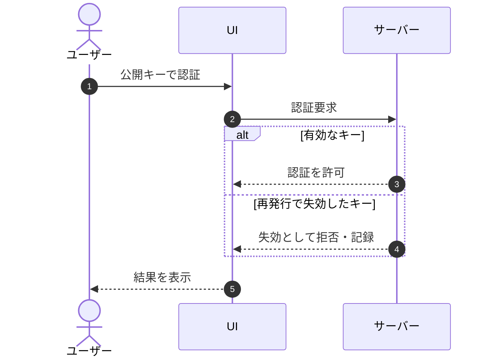
```mermaid
sequenceDiagram
  autonumber
  actor U as ユーザー
  participant UI as UI
  participant S as サーバー
  U->>UI: 公開キーで認証
  UI->>S: 認証要求
  alt 有効なキー
    S-->>UI: 認証を許可
  else 再発行で失効したキー
    S-->>UI: 失効として拒否・記録
  end
  UI-->>U: 結果を表示
```

## FR-192: 保持期間超過データの定期削除

> **この機能要件は「保持期間超過データの定期削除」を定義します。**

*種別 機能要件 ・ 機能グループ セキュリティ ・ 優先度 P0 ・ ステータス ドラフト*

### 要件

保持期間を超過した運用データを定期的に検出し、対象に応じた方式で削除すること。
1. 対象は質問ログ・未解決質問・通知ログ・お知らせ受信箱とする
2. 各データを定められた保持期間(1 年)の経過後に削除対象とする
3. 後から確定削除する仕組みを持つ対象(質問ログ・未解決質問)は削除予定として扱い、追記専用の対象(通知ログ・お知らせ受信箱)はその場で確定削除する
4. 削除を実行した結果を記録する

### シーケンス

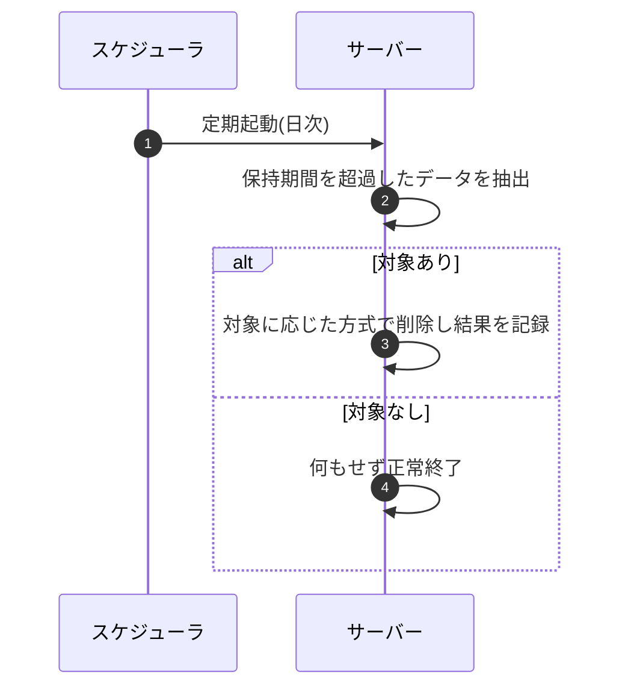
```mermaid
sequenceDiagram
  autonumber
  participant SCH as スケジューラ
  participant S as サーバー
  SCH->>S: 定期起動(日次)
  S->>S: 保持期間を超過したデータを抽出
  alt 対象あり
    S->>S: 対象に応じた方式で削除し結果を記録
  else 対象なし
    S->>S: 何もせず正常終了
  end
```

