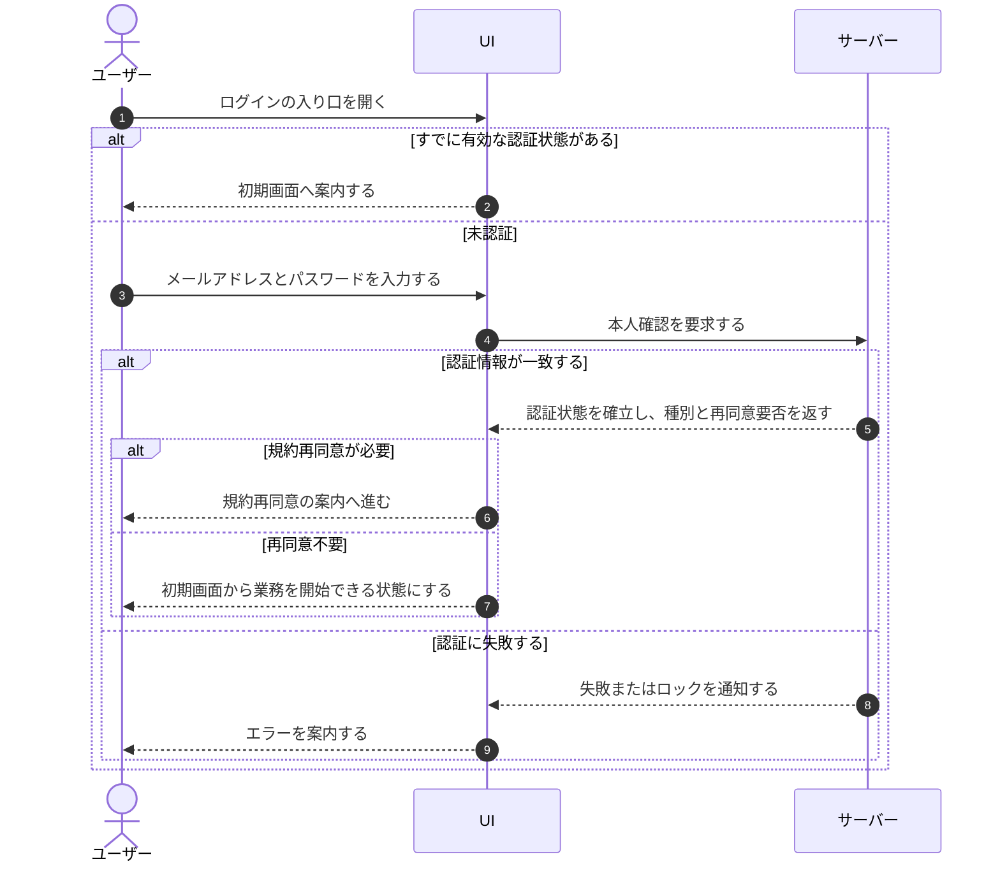

# UC-001: 未認証ユーザーがログインする

> **この業務ユースケースは「まだ認証されていない利用者が、メールアドレスとパスワードで本人確認を受けて管理画面の利用を開始する」ことを定義します。**

*主アクター 未認証ユーザー ・ ステータス ドラフト*

## 概要

まだ認証されていない利用者が、メールアドレスとパスワードを示して本人確認を受け、認証に成功すると自分の初期画面から管理業務を開始する。連続して認証に失敗した場合は一定時間ロックして不正アクセスを防ぐ。

## 主アクター

未認証ユーザー

## 目的

利用者が自分のアカウントの正当な利用者であることを示し、管理画面の業務を安全に開始できるようにする。あわせて、なりすましや総当たりによる不正アクセスからアカウントと顧客データを守る。

## 事前条件

- 利用者が有効なアカウントを保有している。
- 利用者がまだ認証されていない、または以前の認証が有効でない。

## 基本フロー

1. 未認証ユーザーがログインの入り口を開く。すでに有効な認証状態があれば、本人確認を省いて初期画面へ案内する。
2. 未認証ユーザーがメールアドレスとパスワードを示す。システムは入力内容の不足や形式の誤りをその場で利用者へ伝える。
3. システムが示された認証情報で本人確認を行う。
4. 本人確認に成功すると、システムは利用者の認証状態を確立し、利用者の種別と規約の再同意要否を判断する。
5. 再同意が必要な場合は、まず規約への再同意を求める案内へ進む。
6. 再同意が不要な場合は、利用者の種別によらず共通の初期画面から業務を開始できる状態にする。

## 代替フロー

- すでに有効な認証状態がある場合は、本人確認の手順を経ずに初期画面へ案内する。
- 規約改定への未同意がある場合は、初期画面の前に再同意を求める。

## 例外フロー

- メールアドレスまたはパスワードに不足・形式の誤りがある場合は、送信を中止して該当箇所の誤りを利用者へ伝える。
- 認証情報が一致しない場合は、メールアドレスの存在有無を区別しない共通の文言で失敗を伝え、失敗回数として数える。
- 短時間に認証失敗が一定回数続いた場合は、アカウントを一定時間ロックし、その旨を利用者へ伝える。一定時間の経過または運営による解除で再び試行できる。
- アカウントが停止されている場合は、認証状態を確立せず、停止中の利用制限に従う旨を伝える。

## 事後条件

- 本人確認に成功した場合、利用者の認証状態が確立され、初期画面(または規約再同意の案内)から業務を開始できる。
- 本人確認に失敗した場合、認証状態は確立されず、利用者には失敗またはロックの案内が示される。

## トレーサビリティ

関連する要件・基本設計の対応は [トレーサビリティ一覧](../../02_basic_design/00_traceability/index.md) で一元管理する。

## 備考

本ユースケースは、本人確認情報の入力受付・検証・ログイン実行・初期画面への移動という一連の処理を、ひとつの業務処理として統合したものである。
