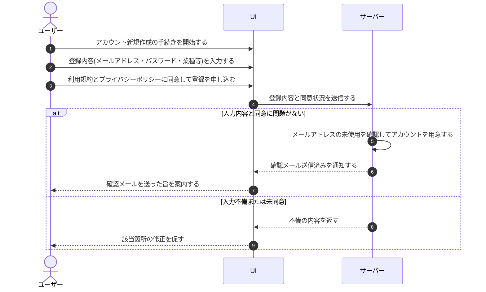

# UC-002: ユーザーがアカウントを新規作成する

> **このユースケースは「これから利用を始める人が、自分のメールアドレスとパスワードでアカウントを新規作成し、確認メールでの本人確認へ進む」業務を定義します。**

*主アクター 未認証ユーザー ・ ステータス ドラフト*

## 概要

これから利用を始める人が、メールアドレス・パスワード・業種などの登録内容を入力し、利用規約とプライバシーポリシーへの同意のうえでアカウントを新規作成する。登録が受け付けられると本人のアカウント(利用者情報)が新たに用意され、本人確認のための確認メールが送信される。アカウントを作成した時点では、まだオーナーでもメンバーでもない一般のユーザーであり、後で自らプロジェクトを作成したときにそのプロジェクトのオーナーになる。アカウントの新規作成は、招待を受けて参加する経路とは独立した経路(独立サインアップ)である。

## 主アクター

未認証ユーザー

## 目的

サービスの利用を始めたい人が、招待の有無にかかわらず自分でアカウントを開設し、本人確認を経て利用を開始できるようにする。

## 事前条件

- 登録対象者がまだアカウントを保有していない。
- 登録に必要なメールアドレスを利用できる。

## 基本フロー

1. 未認証ユーザーがアカウント新規作成の手続きを開始し、メールアドレス・パスワード・パスワード(確認)・業種などの登録内容を入力する。
2. 未認証ユーザーが、入力内容を確認しながら利用規約とプライバシーポリシーの内容を参照し、両方に同意する。
3. 未認証ユーザーが登録を申し込む。
4. システムが入力内容と同意状況を確認する。
5. システムが、同じメールアドレスが未使用であることを確認し、本人のアカウント(利用者情報)を新たに用意する。
6. システムが本人確認のための確認メールを送信し、未認証ユーザーへ確認メールを送った旨を案内する。

## 代替フロー

- 高規制業界(金融・医療など)を業種として選んだ場合、提供範囲外である旨の注意とサポート窓口の案内を示す。登録自体は引き続き行える。

## 例外フロー

- 入力内容に不備(必須未入力・メール形式不正・パスワード強度不足・パスワード不一致)がある場合、登録を受け付けず、該当箇所の不備を知らせて修正を促す。
- 利用規約またはプライバシーポリシーに同意していない場合、登録を受け付けず、同意を求める。
- 入力されたメールアドレスがすでに使われている場合、アカウントを作成せず、別のメールアドレスの利用を促す。
- その他の理由で登録を完了できない場合、登録を受け付けず、やり直しを促す。

## 事後条件

- 登録に成功した場合、本人のアカウント(利用者情報)が新たに用意され、本人確認のための確認メールが送信された状態になる。アカウント作成時点では、本人はまだどのプロジェクトのオーナーでもメンバーでもない。
- 登録に失敗した場合、アカウントは作成されず、未認証ユーザーは原因に応じた案内を受けて再入力できる状態になる。

## トレーサビリティ

トレーサビリティID [TR-002](../../02_basic_design/00_traceability/index.md#TR-002)。本ユースケースが対応する要件、および実現する設計(画面・システム・API・データベース・シーケンス)は当該 TR の行を参照する。

## 備考

本ユースケースは、登録情報の入力受付・各項目の検証・規約参照・登録申込という一連の処理を、1 つの新規作成業務として統合したものである。アカウントの新規作成は招待を受けて参加する経路とは独立しており、作成した本人は一般のユーザーとして開始する(オーナー・メンバーの立場はプロジェクトごとに後から決まる)。
