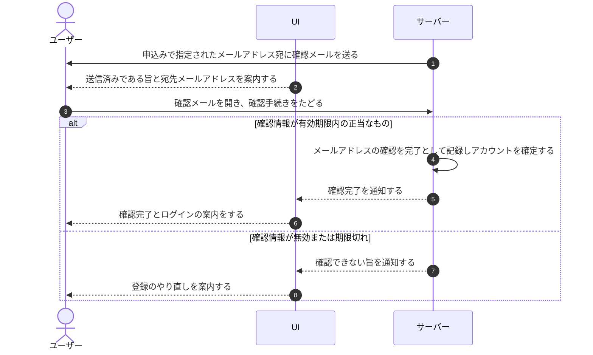

# UC-003: オーナーが登録確認メールを検証する

> **この業務ユースケースは「アカウント登録の申込者が、届いた確認メールのリンクからメールアドレスの所有を証明し、本登録を完了できること」を定義します。**

*主アクター 未認証ユーザー ・ ステータス ドラフト*

## 概要

アカウント登録を申し込んだ未認証ユーザーが、指定したメールアドレスに届く確認メールを受け取り、その案内に従ってメールアドレスの所有を証明する。確認が成立するとアカウントの登録が確定し、利用開始へ進める状態になる。確認が届かない場合は再送を依頼でき、宛先を誤っていた場合は登録をやり直せる。

## 主アクター

未認証ユーザー

## 目的

申込者本人が確かにそのメールアドレスを使えることを確かめ、第三者のメールアドレスによる不正な登録を防ぎつつ、本人が安心して利用を開始できるようにする。

## 事前条件

- アカウント登録の申込みが受け付けられ、確認メールの送信案内が表示されている。
- 申込時に指定したメールアドレスが確認メールの宛先として登録されている。
- メールアドレスの確認はまだ完了していない。

## 基本フロー

1. システムが、申込みで指定されたメールアドレス宛てに確認メールを送り、送信済みである旨と宛先メールアドレスを案内する。
2. 未認証ユーザーが、受信した確認メールを開き、本人確認のための案内に従って確認手続きを行う。
3. システムが、その確認が有効期限内の正当なものであることを検証する。
4. システムが、検証成立を受けてメールアドレスの確認を完了として記録し、アカウントの登録を確定する。
5. システムが、確認が完了した旨を伝え、未認証ユーザーが続けて利用を開始(ログイン)できるよう案内する。

## 代替フロー

- 確認メールが届かない場合、未認証ユーザーは再送を依頼でき、システムは確認メールを再送する。短時間に繰り返し依頼できないよう、一定時間は次の再送を待つ案内を行う。
- 宛先メールアドレスを誤っていた場合、未認証ユーザーはアカウント登録をやり直し、正しいメールアドレスで申し込み直す。

## 例外フロー

- 確認の有効期限が切れている、またはすでに使用済みの場合、システムは確認できない旨を伝え、最初から登録をやり直すよう案内する。
- 確認メールの再送に失敗した場合、システムはその旨を伝え、再度の依頼を促す。

## 事後条件

- 確認が成立した場合、メールアドレスの確認が完了し、アカウントの登録が確定して利用開始へ進める状態になる。
- 確認が成立しなかった場合、アカウントは未確認のままで、再送依頼または登録のやり直しが可能な状態が保たれる。

## トレーサビリティ

トレーサビリティID [TR-003](../../02_basic_design/00_traceability/index.md#TR-003)。本ユースケースが対応する要件、および実現する設計(画面・システム・API・データベース・シーケンス)は当該 TR の行を参照する。

## 備考

本業務ユースケースは、確認メールの検証・再送・宛先変更・確認成功後の利用開始案内という一連の操作を、メールアドレス所有確認という1つの業務処理として統合したものである。
