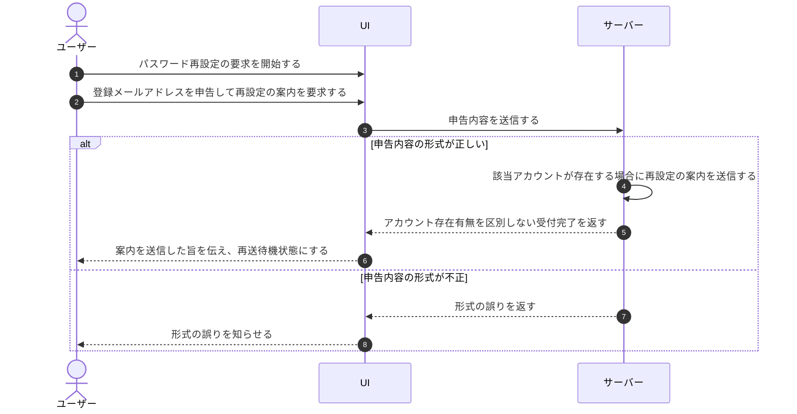

# UC-004: 未認証ユーザーがパスワードの再設定を要求する

> **このユースケースは「パスワードを忘れたアカウント利用者が、登録メールアドレス宛に再設定の案内を受け取れるよう要求する」業務を定義します。**

*主アクター 未認証ユーザー ・ ステータス ドラフト*

## 概要

パスワードを忘れて認証できないアカウント利用者が、自身のメールアドレスを申告してパスワード再設定を要求する業務である。システムは申告されたメールアドレスを受け付け、該当する利用者が存在する場合に再設定の案内を当該メールアドレス宛へ送信する。アカウントの存在有無は応答で区別せず、第三者によるアカウント探索を防ぐ。

## 主アクター

未認証ユーザー

## 目的

ログインできなくなったアカウント利用者が、安全な手順で自らパスワードを取り戻し、利用を再開できるようにすることが狙いである。

## 事前条件

- アクターはログインできない状態にある(未認証)。
- パスワード再設定の要求受付が利用できる状態にある。

## 基本フロー

1. アクターがパスワード再設定の要求を開始する。
2. アクターが自身の登録メールアドレスを申告して再設定の案内を要求する。
3. システムが申告内容の形式を確認し、再設定要求を受け付ける。
4. システムは、該当するアカウントが存在する場合に、当該メールアドレス宛へ再設定の案内を送信する。
5. システムは、アカウントの存在有無を区別しない一律の受付完了を返す。
6. アクターに「案内を送信した」旨が伝えられ、一定時間後に再送を要求できる状態となる。

## 代替フロー

- 一定の待機時間が経過した後、アクターが再設定の案内の再送を要求した場合、システムは同じ受付処理を再度行い、再送の待機状態へ戻す。
- アクターが要求を取りやめてログインの手続きに戻る。

## 例外フロー

- 申告されたメールアドレスの形式が不正な場合、システムは要求を受け付けず、形式が誤っている旨をアクターに知らせる。
- 受付処理に失敗した場合、システムは受付完了を案内せずエラーを知らせる。このとき対象アカウントの有無は明かさない。

## 事後条件

- 形式が正しい要求が受け付けられている。
- 該当アカウントが存在する場合、当該メールアドレス宛に再設定の案内が送信されている。
- アクターには、アカウントの存在有無を区別しない受付完了が案内され、再送の待機状態となっている。

## トレーサビリティ

関連する要件・基本設計の対応は [トレーサビリティ一覧](../../02_basic_design/00_traceability/index.md) で一元管理する。

## 備考

アカウントの存在有無を応答で区別しない方針は、列挙攻撃によるアカウント探索を防ぐための業務上の取り扱いである。
