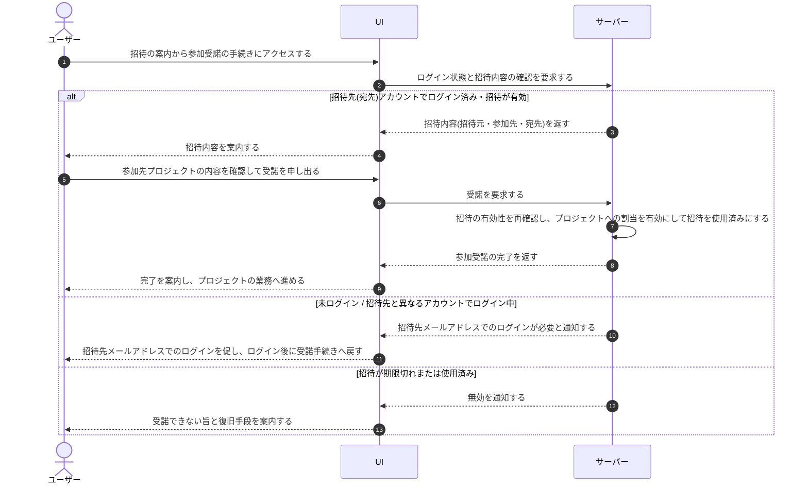

# UC-006: 招待されたユーザーがプロジェクト参加を受諾する

> **この業務ユースケースは「既にアカウントを持つユーザーが、招待の案内から参加を受諾し、当該プロジェクトの割当が有効になる」ことを定義します。**

*主アクター ユーザー(招待された既存ユーザー)・ ステータス ドラフト*

## 概要

既にアカウントを持つユーザーが、招待の案内から参加受諾の手続きにアクセスし、案内された招待内容を確認したうえで、参加を受諾する業務である。受諾の完了により、当該プロジェクトへの割当が有効になり、本人が当該プロジェクトのメンバーとして業務を行えるようになる。本ユースケースは招待は登録済みユーザー限定であることを前提とし、表示名・パスワードの設定や規約同意といったアカウント作成は伴わない(アカウント作成は独立したサインアップで行う)。

## 主アクター

ユーザー(招待された既存ユーザー)

## 目的

既にアカウントを持つユーザーが、招待された内容を確認したうえで参加を受諾することで、当該プロジェクトの割当を有効にし、メンバーとして当該プロジェクトの業務を開始できるようにする。

## 事前条件

- ユーザーがプロジェクトへの招待を受けており、招待の案内(参加受諾への入口)が本人宛に届いている。
- 招待が有効期限内であり、まだ受諾に使われていない。
- 受諾の確定には、招待の宛先メールアドレスのアカウントでログインしている必要がある(本人確認のため。未登録のメールアドレスは招待対象外)。

## 基本フロー

1. ユーザーが招待の案内から参加受諾の手続きにアクセスする。
2. システムがログイン状態を確認する。未ログイン、または招待の宛先と異なるアカウントでログイン中の場合は、招待先メールアドレスでのログインを促し、ログイン後に受諾手続きへ戻す。
3. 招待先アカウントでログイン済みであれば、システムが招待内容(招待元・参加先プロジェクト・宛先メールアドレス)を確認して案内する。
4. ユーザーが参加先プロジェクトの内容を確認する。
5. ユーザーが参加の受諾を申し出る。
6. システムが招待の有効性を改めて確認し、問題がなければ当該プロジェクトへの割当を有効にしたうえで、招待を使用済みとする。
7. システムが参加受諾の完了を案内し、ユーザーは当該プロジェクトの業務へ進める。

## 代替フロー

- ユーザーが参加を受諾する前に、招待の案内から参加先プロジェクトの内容を改めて確認する。

## 例外フロー

- 未ログイン、または招待の宛先と異なるアカウントでログイン中の場合は、招待先メールアドレスでのログインを促し、ログイン後に受諾手続きへ戻す(別アカウントのままでは受諾を確定しない)。
- 招待が期限切れ、または無効である場合は、受諾できない旨と復旧手段(招待元への再送依頼の案内)を提示し、手続きを中止する。
- 招待が既に受諾に使われている場合は、その旨と復旧手段を案内し、手続きを中止する。

## 事後条件

- 当該プロジェクトへの割当が有効になり、本人が当該プロジェクトのメンバーとして業務を行えるようになる。
- 使用された招待は再利用できない状態になる。
- 中止した場合は、割当は有効にならず、参加は開始されない。

## トレーサビリティ

関連する要件・基本設計の対応は [トレーサビリティ一覧](../../02_basic_design/00_traceability/index.md) で一元管理する。

## 備考

参加内容の確認、割当の有効化、招待の消費は一連の受諾として一括で確定し、いずれかが不成立の場合は内容を確定しない。本ユースケースはアカウント作成を含まない。未登録のメールアドレスは招待できず、アカウント作成は独立したサインアップで行う。
