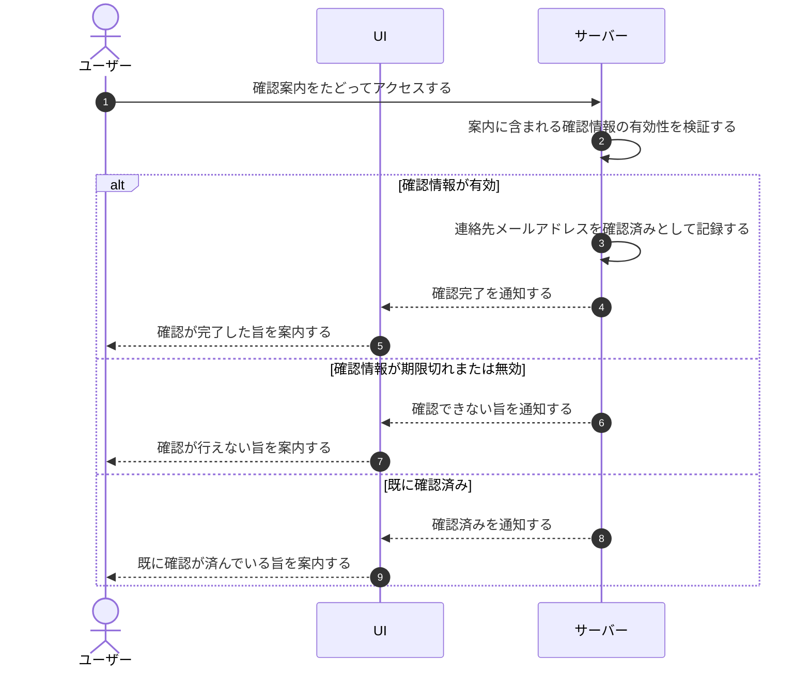

# UC-007: 対象ユーザーが連絡先メールアドレスを確認する

> **この業務ユースケースは「連絡先メールアドレスに届いた確認案内から、その所有者がアドレスの利用を確認・承認する」ことを定義します。**

*主アクター アカウント利用者 ・ ステータス ドラフト*

## 概要

プロジェクトの公開用連絡先メールアドレスに送られた確認案内から、その所有者がアドレスの利用を確認する業務である。確認案内には一定時間で失効する確認情報が含まれ、対象ユーザーがそれをたどると、システムが確認情報を検証して、確認の完了・失効・確認済みのいずれかの結果を案内する。

## 主アクター

アカウント利用者

## 目的

確認を経た正当な連絡先メールアドレスだけを公開・利用できるようにし、誤設定や他者アドレスの無断公開を防ぐ。

## 事前条件

- プロジェクトに連絡先メールアドレスが設定され、当該アドレス宛に確認案内が送られている。
- 対象ユーザーが、その連絡先メールアドレスに届いた確認案内をたどってアクセスしている。
- 確認案内に含まれる確認情報が、当該メールアドレスに到達したこと自体をもって所有者本人とみなす前提であり、確認の完了にアカウントへのログイン(本人認証)は必須としない(ログインしていない第三者でも、案内をたどれば確認を完了できる)。
- 確認案内に含まれる確認情報は 1 回限り有効かつ一定時間で失効し、再利用できない。これにより、誤送信時に第三者が案内をたどった場合でも繰り返しの濫用を防ぐ。

## 基本フロー

1. 対象ユーザーが、連絡先メールアドレスに届いた確認案内をたどってアクセスする。
2. システムが、案内に含まれる確認情報を受け付け、有効性を検証する。
3. システムが、確認情報が有効であれば当該連絡先メールアドレスを確認済みとして記録する。
4. システムが、確認が完了した旨を対象ユーザーに案内する。
5. 対象ユーザーが、案内を確認して作業を終える。

## 代替フロー

- 確認完了の案内を閉じられない状況(案内を直接開いた場合など)では、完了の案内をそのまま表示し続け、管理側への遷移は行わない。

## 例外フロー

- 確認案内が有効期限を過ぎている、または無効な場合は、確認が行えない旨を案内する。
- 当該連絡先メールアドレスが既に確認済みの場合は、確認が済んでいる旨を案内する。

## 事後条件

- 確認が完了した場合、当該プロジェクトの連絡先メールアドレスが確認済みとして記録される。
- 確認案内に含まれる確認情報は使用済みとなり、再利用できない。
- 期限切れ・無効・確認済みの場合は、連絡先メールアドレスの確認状態は変わらない。

## トレーサビリティ

トレーサビリティID [TR-007](../../02_basic_design/00_traceability/index.md#TR-007)。本ユースケースが対応する要件、および実現する設計(画面・システム・API・データベース・シーケンス)は当該 TR の行を参照する。

## 備考

連絡先メールアドレスの所有者であれば、アカウント利用者以外の第三者が確認案内をたどる場合もあり得る。
