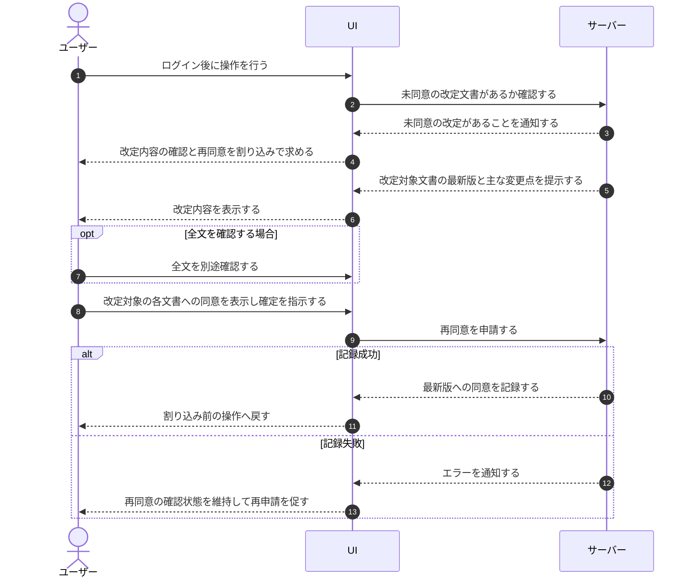

# UC-013: アカウント利用者が改定文書へ再同意する

> **この業務ユースケースは「利用規約やプライバシーポリシーが改定されたとき、アカウント利用者が改定内容を確認して再同意し、サービス利用を継続できる」ことを定義します。**

*主アクター アカウント利用者 ・ ステータス ドラフト*

## 概要

利用規約またはプライバシーポリシーが改定され、アカウント利用者がまだ最新版に同意していない場合、ログイン後の操作中に改定内容の確認と再同意が割り込みで求められる。アカウント利用者は改定対象となった文書の主な変更点を確認し、同意の意思表示を行うことで、改定後の最新版への同意が記録され、割り込み前の操作を継続できる。

## 主アクター

アカウント利用者

## 目的

改定された規約・プライバシーポリシーの内容をアカウント利用者に確実に提示し、最新版への明示的な同意を得ることで、合意に基づく適法なサービス利用を継続できるようにする。

## 事前条件

- アカウント利用者がログインしている。
- 利用規約またはプライバシーポリシーに、当該アカウント利用者がまだ同意していない改定版が存在する。

## 基本フロー

1. アカウント利用者がログイン後に操作を行うと、システムが未同意の改定があることを検知し、改定内容の確認と再同意を割り込みで求める。
2. システムが改定対象の文書(利用規約・プライバシーポリシーの一方または両方)の最新版と主な変更点を提示する。改定対象でない文書は提示・同意の対象としない。
3. アカウント利用者が必要に応じて利用規約またはプライバシーポリシーの全文を別途確認する。
4. アカウント利用者が改定対象の各文書に同意する意思を表示する。
5. アカウント利用者がすべての改定対象文書への同意を確定し、再同意を申請する。
6. システムが改定対象の文書について最新版への同意を記録する。
7. システムが割り込み前の操作へアカウント利用者を戻し、利用を継続できる状態にする。

## 代替フロー

- 改定対象が片方の文書のみの場合、その文書だけが確認・同意の対象となり、もう一方は対象としない。

## 例外フロー

- 同意の記録に失敗した場合、システムはエラーを通知し、再同意の確認状態を維持する。アカウント利用者は再度同意を申請できる。
- 改定内容の取得に失敗した場合、システムは変更点を表示せずエラーを通知し、確認状態を維持する。

## 事後条件

- アカウント利用者の改定対象文書に対する最新版への同意が記録されている。
- アカウント利用者は割り込み前の操作を継続できる。
- 同意の記録が失敗した場合、再同意は未完了のまま確認状態が維持される。

## トレーサビリティ

関連する要件・基本設計の対応は [トレーサビリティ一覧](../../02_basic_design/00_traceability/index.md) で一元管理する。

## 備考

改定対象が利用規約・プライバシーポリシーのいずれか一方の場合は、対象文書のみが再同意の対象となる。
