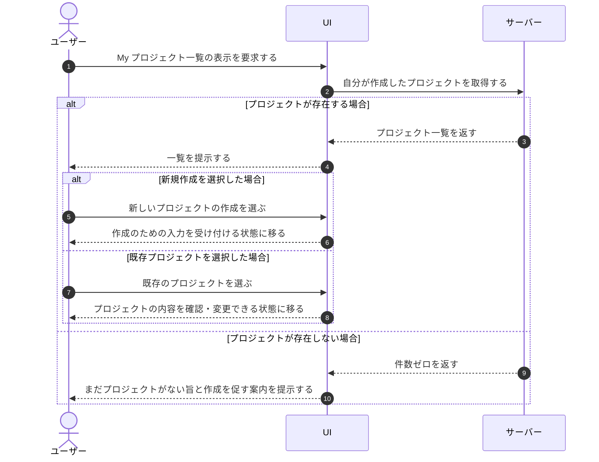

# UC-014: ユーザーが My プロジェクト一覧を閲覧する

> **この業務ユースケースは「ユーザーが自分の作成した(オーナーである)プロジェクトの一覧を一望し、運用や次の操作の起点とする」ことを定義します。**

*主アクター ユーザー(オーナー) ・ ステータス ドラフト*

## 概要

ユーザーが、自分が作成したプロジェクト(自分がオーナーであるプロジェクト)の一覧(My プロジェクト一覧)を表示して全体の状況を把握する。一覧からは、新しいプロジェクトの作成や既存プロジェクトの内容変更といった後続操作の起点に進める。自分が作成したプロジェクトがまだ 1 件もない場合は、その旨と最初の作成を促す案内が示される。

> [!NOTE]
> 本ユースケースは、ユーザーが自分で作成しオーナーとなっているプロジェクト(My プロジェクト)のみを対象とする。他者が作成したプロジェクトに招待されて参加している(メンバーである)プロジェクト(Join プロジェクト)の一覧は、別ユースケース [UC-090](UC-090.md#UC-090) で扱う。

## 主アクター

ユーザー(オーナー)

## 目的

ユーザーが、自分が作成して運用しているプロジェクトの全体像を一目で確認し、作成・編集などの運用操作に迷わず着手できるようにする。

## 事前条件

- ユーザーとしてログイン済みである。
- 当該機能は、表示対象のプロジェクトを作成しオーナーである本人に対して、自分が作成したプロジェクトの範囲で提供される。

## 基本フロー

1. ユーザーが My プロジェクト一覧の表示を要求する。
2. システムが、当該ユーザーが作成した(オーナーである)プロジェクトを集約し、一覧として提示する。
3. ユーザーが一覧を確認し、各プロジェクトの状況を把握する。
4. ユーザーが新しいプロジェクトの作成を選んだ場合、システムは作成のための入力を受け付ける状態に移る。
5. ユーザーが既存のプロジェクトを選んだ場合、システムは当該プロジェクトの内容を確認・変更できる状態に移る。

## 代替フロー

- 自分が作成したプロジェクトが 1 件も存在しない場合、システムは一覧の代わりに「まだプロジェクトがない」旨と最初の作成を促す案内を提示し、ユーザーはそこから新規作成へ進める。

## 例外フロー

- 一覧の取得に時間がかかる場合、システムは取得中であることをユーザーに示し、完了後に結果へ切り替える。

## 事後条件

- ユーザーが自分の作成したプロジェクトの一覧、または未作成である旨を把握している。
- ユーザーが、必要に応じて新規作成または既存プロジェクトの編集の起点へ進める状態にある。

## トレーサビリティ

トレーサビリティID [TR-014](../../02_basic_design/00_traceability/index.md#TR-014)。本ユースケースが対応する要件、および実現する設計(画面・システム・API・データベース・シーケンス)は当該 TR の行を参照する。

