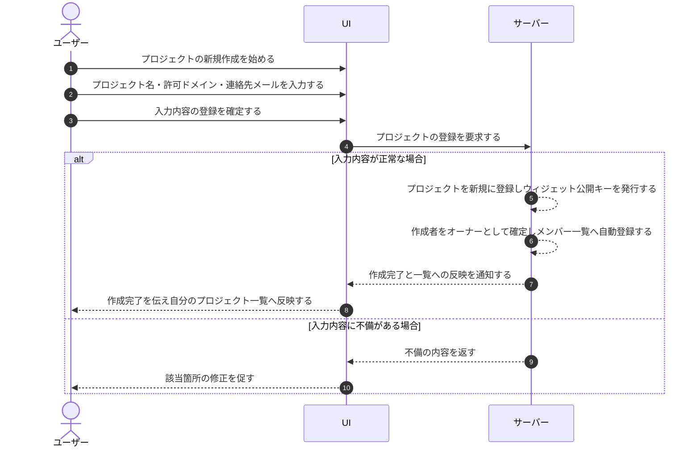

# UC-015: オーナーがプロジェクトを作成する

> **このユースケースは「オーナーが新しいプロジェクトを立ち上げ、運用に必要な初期設定を整える」業務を定義します。**

*主アクター オーナー ・ ステータス ドラフト*

## 概要

ユーザーが、FAQ・ウィジェット・ログを分けて運用する単位であるプロジェクトを新規に作成する。プロジェクトは既存のプロジェクト群の配下に作られるのではなく、作成者が独立して所有する新しいプロジェクトとして立ち上がり、作成したユーザーが当該プロジェクトのオーナー(管理責任と課金責任を持つ)になる。プロジェクト名・許可ドメイン・連絡先メールなどの初期設定を登録し、システムが当該プロジェクトのウィジェット公開キーを発行するとともに、作成者であるオーナーを当該プロジェクトのメンバー一覧へ自動登録する。

## 主アクター

オーナー

## 目的

業務の必要に応じて新しいプロジェクトを立ち上げ、データやウィジェットを分離した運用環境を素早く整える。作成によって作成者自身が当該プロジェクトのオーナーとなり全権を持つため、別途の権限付与なく即座に運用を開始できる。既に他者のプロジェクトにメンバーとして参加しているユーザーも、新たに自分が所有するプロジェクトを作成してオーナーになれる。

## 事前条件

- オーナーがログインしている。
- アカウントが利用可能な状態である。

## 基本フロー

1. オーナーがプロジェクトの新規作成を始める。
2. オーナーがプロジェクト名を入力する。
3. オーナーが許可ドメインを必要に応じて登録する。
4. オーナーがプロジェクト連絡先メールを必要に応じて入力する。
5. オーナーが入力内容の登録を確定する。
6. システムが入力内容を検証し、問題がなければプロジェクトを新規に登録する。
7. システムが当該プロジェクトのウィジェット公開キーを発行する。
8. システムが作成者を当該プロジェクトのオーナーとして確定し、あわせてメンバー一覧へ自動登録したうえで、作成完了をオーナーに通知して自分が作成したプロジェクトの一覧へ反映する。

## 代替フロー

- 許可ドメインや連絡先メールは任意であり、未入力のまま作成を完了できる。
- 作成後、オーナーはプロジェクト ID をコピーして他システムへの設定などに利用できる。

## 例外フロー

- 入力内容に不備(プロジェクト名の未入力・文字数超過、ドメインやメールの形式不正など)がある場合、システムは登録せず、該当箇所の修正を促す。
- 同じ条件のプロジェクトが既に存在するなど登録できない場合、システムは作成を行わずその旨を知らせる。
- 作成処理が途中で失敗した場合、システムはプロジェクト登録もメンバー自動登録も行わず、作成前の状態に戻す。

## 事後条件

- 新しいプロジェクトが登録され、初期設定(名称・許可ドメイン・連絡先メール)が保持される。
- 当該プロジェクトのウィジェット公開キーが発行されている。
- 作成者が当該プロジェクトのオーナーとして確定し、当該プロジェクトに対して全権(管理責任と課金責任を含む)を持ち、メンバー一覧にも自動登録されている。

## トレーサビリティ

トレーサビリティID [TR-015](../../02_basic_design/00_traceability/index.md#TR-015)。本ユースケースが対応する要件、および実現する設計(画面・システム・API・データベース・シーケンス)は当該 TR の行を参照する。

