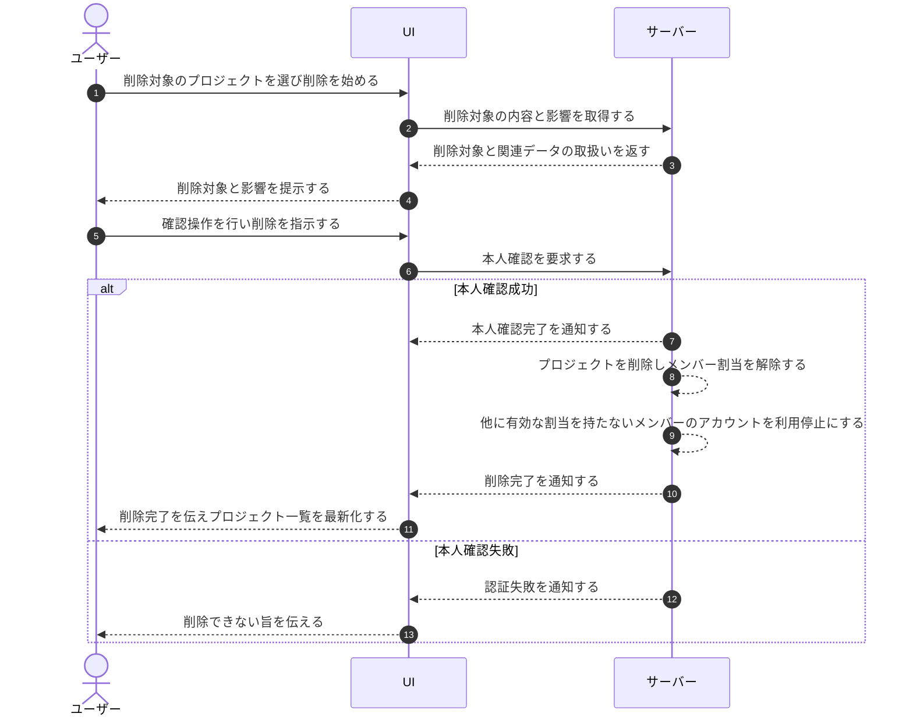

# UC-017: オーナーがプロジェクトを削除する

> **この業務ユースケースは「オーナーが不要になったプロジェクトを、削除内容を確認したうえで削除し、関連する割当やアカウントを整理する」ことを定義します。**

*主アクター オーナー ・ ステータス ドラフト*

## 概要

オーナーが不要になったプロジェクトを削除する。削除に先立ち本人が削除対象を確認し、本人確認を経たうえでプロジェクトを削除する。削除に伴い当該プロジェクトのメンバー割当を解除し、他に利用根拠を持たないメンバーのアカウントを整理する。

## 主アクター

オーナー

## 目的

不要になったプロジェクトと、それに紐づく割当・データを残さず整理し、運用対象を最新の体制に保つこと。

## 事前条件

- オーナーとしてログインしている。
- 削除対象のプロジェクトが存在する。
- プロジェクトの削除はオーナーに限って行える。

## 基本フロー

1. オーナーが削除対象のプロジェクトを選び、削除を始める。
2. システムが削除対象の内容と、削除に伴い影響する関連データの取扱いをオーナーに提示する。
3. オーナーが提示された内容を確認し、誤削除を防ぐための確認操作を行ったうえで削除を指示する。
4. システムが本人確認を求め、オーナーが本人確認を完了する。
5. システムが当該プロジェクトを削除する。
6. システムが当該プロジェクトに紐づくメンバーの割当を解除する。
7. システムが、他に有効な割当を持たないメンバーのアカウントを利用停止にし、利用根拠を失ったデータを整理対象とする。
8. システムが削除完了をオーナーに伝え、プロジェクト一覧を最新の状態に更新する。

## 代替フロー

- オーナーが確認操作の途中で削除を取りやめた場合、プロジェクトは削除されず元の状態のまま維持される。

## 例外フロー

- 本人確認に失敗した場合、プロジェクトは削除されず処理が中止される。

## 事後条件

- 対象プロジェクトが削除された状態になる。
- 当該プロジェクトのメンバー割当が解除されている。
- 他に有効な割当を持たないメンバーのアカウントが利用停止になっている。
- 他プロジェクトに割当が残るメンバーやオーナーは利用を維持している。
- プロジェクト一覧が最新の状態に更新されている。

## トレーサビリティ

トレーサビリティID [TR-017](../../02_basic_design/00_traceability/index.md#TR-017)。本ユースケースが対応する要件、および実現する設計(画面・システム・API・データベース・シーケンス)は当該 TR の行を参照する。

## 備考

削除確認名称の入力(誤削除防止のための確認操作)と削除実行は、本業務処理の一連の流れとして統合した。
