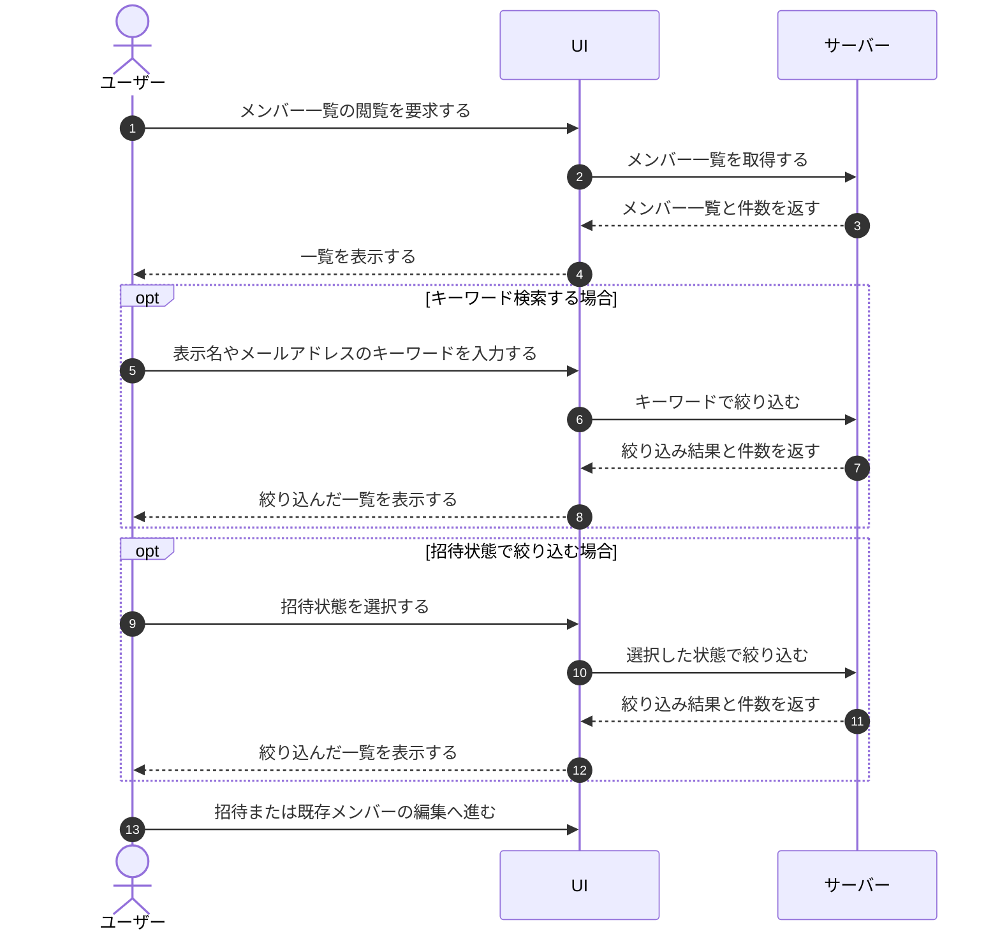

# UC-018: メンバーがメンバー一覧を閲覧する

> **この業務ユースケースは「オーナー / メンバーが、そのプロジェクトに割り当てられたメンバーの一覧を、検索や招待状態の絞り込みを使って確認する」ことを定義します。**

*主アクター オーナー / メンバー ・ ステータス ドラフト*

## 概要

オーナー / メンバーが、自分の管理するプロジェクトに割り当てられているメンバーの一覧を閲覧する業務である。一覧では表示名やメールアドレスによる検索、招待状態(招待中・有効化済みなど)による絞り込みができ、現在のメンバー構成と人数を把握できる。一覧からは、新しいメンバーの招待や既存メンバーの情報編集へ進むこともできる。

## 主アクター

オーナー / メンバー

## 目的

プロジェクトに誰が参加し、どのような招待状態にあるかを一目で把握し、体制の確認やメンバーの追加・見直しの起点とする。

## 事前条件

- 主アクターがログイン済みである
- 主アクターが対象プロジェクトに対する割当を持ち、そのメンバーを閲覧できる権限がある

## 基本フロー

1. 主アクターがメンバー一覧の閲覧を要求する。
2. システムが、当該プロジェクトに割り当てられたメンバーを件数とともに一覧で表示する。
3. 主アクターが必要に応じて、表示名やメールアドレスのキーワードで検索する。
4. システムが、キーワードに部分一致するメンバーに絞り込んで一覧と件数を更新する。
5. 主アクターが必要に応じて、招待状態(すべて・招待中・有効化済みなど)で絞り込む。
6. システムが、選択された招待状態に一致するメンバーで一覧と件数を更新する。
7. 主アクターは一覧から、メンバーの新規招待または既存メンバーの情報確認・編集へ進む。

## 代替フロー

- 検索条件や絞り込み条件に一致するメンバーが存在しない場合、システムは該当なしを示す空の状態を表示する。
- プロジェクトにメンバーがまだ1人もいない場合、システムは空の状態を表示し、そこからメンバー招待へ進める案内を示す。

## 例外フロー

- 主アクターが対象プロジェクトを閲覧する権限を持たない場合、システムは一覧を表示せず、操作を受け付けない。

## 事後条件

- 当該プロジェクトのメンバー一覧と件数が、指定した検索・絞り込み条件に従って表示されている。
- 条件に一致するメンバーがいない場合は、空の状態が表示されている。

## トレーサビリティ

トレーサビリティID [TR-018](../../02_basic_design/00_traceability/index.md#TR-018)。本ユースケースが対応する要件、および実現する設計(画面・システム・API・データベース・シーケンス)は当該 TR の行を参照する。

## 備考

本業務ユースケースは、メンバー一覧の初期表示・キーワード検索・招待状態フィルタ・招待/編集への導線という一連の操作粒度ユースケースを、1つの閲覧業務として統合したものである。
