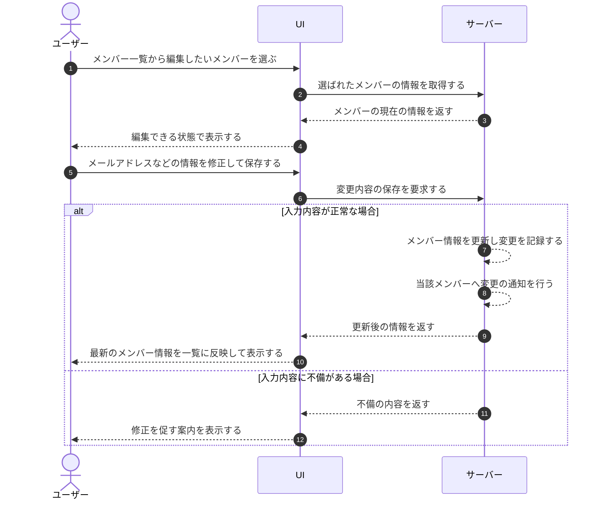

# UC-020: メンバーがメンバー情報を編集する

> **この業務ユースケースは「オーナー / メンバーが、割り当て済みメンバーの連絡先などの情報を確認・変更し、変更を当事者へ通知・記録する」業務を定義します。**

*主アクター オーナー / メンバー ・ ステータス ドラフト*

## 概要

オーナー / メンバーが、対象プロジェクトに割り当てられているメンバーの情報(連絡先メールアドレスなど)を確認し、必要に応じて変更する。変更内容は保存され、当該メンバーへ通知されるとともに記録される。

## 主アクター

オーナー / メンバー

## 目的

体制変更や連絡先の変わったメンバーについて情報を最新に保ち、変更の事実を当事者が把握できるようにすることで、正確な連絡と運用の継続性を確保する。

## 事前条件

- 主アクターがログイン済みで、対象プロジェクトを管理する権限を持つ。
- 編集対象のメンバーが、対象プロジェクトに割り当て済みである。

## 基本フロー

1. 主アクターが、対象プロジェクトのメンバー一覧から編集したいメンバーを選ぶ。
2. システムが、選ばれたメンバーの現在の情報(表示名・メールアドレス・招待状態など)を編集できる状態で表示する。
3. 主アクターが、メールアドレスなどの情報を修正して保存する。
4. システムが、入力内容を検証したうえで変更を受け付け、メンバー情報を更新する。
5. システムが、変更内容を記録し、当該メンバーへ変更の通知を行う。
6. システムが、更新後の最新のメンバー情報を一覧に反映して表示する。

## 代替フロー

- 編集を取りやめる場合、主アクターは変更を保存せずに編集を中止でき、システムは入力内容を破棄して元の一覧表示に戻す。未保存の入力がある場合は破棄してよいか確認する。
- 編集対象が主アクター自身である場合、システムは自己編集である旨を案内し、自分自身を割当から外す操作は行えないようにする。

## 例外フロー

- 入力されたメールアドレスの形式が妥当でない場合、システムは保存を受け付けず、修正を促す案内を表示する。
- 変更後のメールアドレスが他の利用者で既に使われている場合、システムは保存を受け付けず、重複である旨を案内する。
- 編集対象が招待中で未有効化の場合、主アクターは招待メールの再送を行える。

## 事後条件

- 対象メンバーの情報が、保存された内容に更新される。
- 変更の事実が記録される。
- 当該メンバーへ変更が通知される。
- 取りやめた場合は、メンバー情報は変更前のまま維持される。

## トレーサビリティ

トレーサビリティID [TR-020](../../02_basic_design/00_traceability/index.md#TR-020)。本ユースケースが対応する要件、および実現する設計(画面・システム・API・データベース・シーケンス)は当該 TR の行を参照する。

## 備考

本業務ユースケースは、メンバー情報の編集に関わる操作粒度の業務を、一つの「メンバー情報を編集する」業務処理として統合したものである。
