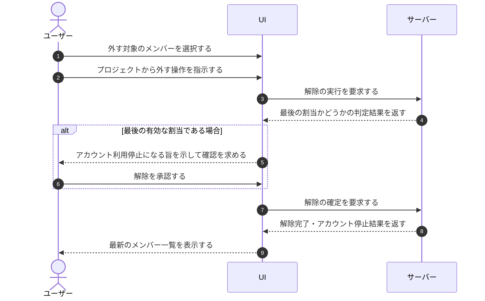

# UC-021: メンバーがメンバーをプロジェクトから外す

> **この業務ユースケースは「オーナー / メンバーが、不要になったメンバーの割当を解除して、そのプロジェクトの操作権限を取り上げること」を定義します。**

*主アクター オーナー / メンバー ・ ステータス ドラフト*

## 概要

体制変更などで担当を外れたメンバーを、オーナー / メンバーが当該プロジェクトから外す業務である。割当を解除すると、そのメンバーはプロジェクトを操作できなくなる。これが当該メンバーにとって最後の有効な割当であった場合は、利用根拠を失うためアカウント自体が利用停止となり、ログイン中のセッションや未使用の招待も無効化される。

## 主アクター

オーナー / メンバー

## 目的

体制変更に合わせて不要になったアクセス権を速やかに取り上げ、権限の取り残しや無関係な担当者によるプロジェクト操作を防ぐ。

## 事前条件

- オーナー / メンバーが当該プロジェクトのメンバーを管理する権限を持つ。
- 対象のメンバーが当該プロジェクトに割り当てられている。
- 外す対象が、オーナー / メンバー自身でもオーナーでもない。

## 基本フロー

1. オーナー / メンバーが、メンバー一覧から外す対象のメンバーを選ぶ。
2. オーナー / メンバーが、当該メンバーをプロジェクトから外す操作を指示する。
3. システムが、この解除が当該メンバーにとって最後の有効な割当かどうかを判定し、最後の割当である場合はアカウント自体も利用停止になる旨をオーナー / メンバーへ知らせて確認を求める。
4. オーナー / メンバーが、解除内容を確認して実行を承認する。
5. システムが、当該プロジェクトの割当を解除し、変更内容を記録したうえで当該メンバーへ通知する。
6. 最後の有効な割当だった場合は、システムが当該アカウントを利用停止とし、ログイン中のセッションと未使用の招待を無効化する。
7. システムが、解除の完了を知らせ、最新のメンバー一覧を表示する。

## 代替フロー

- 解除対象に他プロジェクトの有効な割当が残っている場合は、当該プロジェクトの割当のみを解除し、アカウントの利用は維持する。

## 例外フロー

- オーナー / メンバーが自分自身またはオーナーを外そうとした場合は、操作を受け付けず理由を知らせる。
- 確認段階でオーナー / メンバーが取りやめた場合は、解除を行わず元の状態を保つ。
- 処理が失敗した場合は、割当を解除せず失敗を知らせる。

## 事後条件

- 当該メンバーは当該プロジェクトを操作できなくなる。
- 解除の事実が記録され、当該メンバーへ通知される。
- 最後の有効な割当だった場合は、当該アカウントが利用停止となり、ログイン中のセッションと未使用の招待が無効化される。
- 他プロジェクトに割当が残る場合は、当該アカウントの利用が維持される。

## トレーサビリティ

トレーサビリティID [TR-021](../../02_basic_design/00_traceability/index.md#TR-021)。本ユースケースが対応する要件、および実現する設計(画面・システム・API・データベース・シーケンス)は当該 TR の行を参照する。

