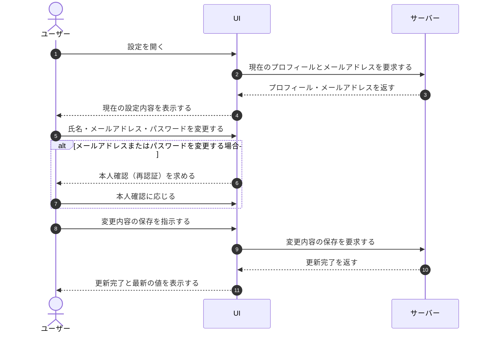

# UC-022: ユーザーが設定を編集する

> **この業務ユースケースは「ユーザーが自分のプロフィール(氏名)を変更し、セキュリティ情報(メールアドレス・パスワード)を本人確認のうえで変更する」ことを定義します。**

*主アクター ユーザー ・ ステータス ドラフト*

## 概要

ユーザーが設定を開き、現在のプロフィール(氏名)とセキュリティ情報(メールアドレス)を確認したうえで、氏名・メールアドレス・パスワードを必要に応じて変更して保存する業務である。メールアドレスとパスワードの変更は本人確認(再認証)を伴う。あわせて、退会手続きへ進む入口を備える。

## 主アクター

ユーザー

## 目的

ユーザー自身が、自分のプロフィール(氏名)を最新の状態に保ち、ログインや各種通知の宛先となるメールアドレス、ログインに用いるパスワードを安全に変更できるようにする。メールアドレスは請求や重要通知の宛先となるため、確実に正しい値へ更新できるようにする。

## 事前条件

- ユーザーとしてログインしている。
- 編集対象は自分自身のアカウントの設定である。

## 基本フロー

1. ユーザーが設定を開く。
2. システムが現在のプロフィール(氏名)とメールアドレスを取得して表示する。
3. ユーザーが氏名・メールアドレス・パスワードのうち、変更したい項目を変更する。
4. システムが入力内容の妥当性を確認する。
5. メールアドレスまたはパスワードを変更する場合、システムが本人確認(再認証)を求め、ユーザーが本人確認に応じる。
6. ユーザーが変更内容の保存を指示する。
7. システムが変更を受け付け、設定を更新する。
8. システムが更新完了をユーザーに知らせ、最新の値を表示する。

## 代替フロー

- ユーザーが変更を破棄した場合、入力内容は確認時点の値に戻り、保存は行われない。
- ユーザーが退会手続きへ進む場合、退会の業務へ移る。

## 例外フロー

- 氏名が妥当でない場合(文字数超過など)、保存できない旨を案内し、保存を行わない。
- メールアドレスが妥当でない場合(形式不正・既に使われているなど)、保存できない旨を案内し、保存を行わない。
- パスワードが妥当でない場合(要件を満たさないなど)、保存できない旨を案内し、保存を行わない。
- 本人確認(再認証)に失敗した場合、メールアドレス・パスワードの変更を受け付けず、その旨を案内する。
- 自分以外のアカウントの設定へアクセスした場合、権限がない旨を案内し、設定を表示しない。
- 保存に失敗した場合、入力内容を保持したままエラーを案内する。

## 事後条件

- 氏名の変更を保存した場合、プロフィールの氏名が新しい値に更新されている。
- メールアドレスの変更を保存した場合、アカウントのメールアドレスが新しい値に更新されている。
- パスワードの変更を保存した場合、ログインに用いるパスワードが新しい値に更新されている。
- 変更を破棄した場合、設定は変更前の状態のまま保たれている。

## トレーサビリティ

トレーサビリティID [TR-022](../../02_basic_design/00_traceability/index.md#TR-022)。本ユースケースが対応する要件、および実現する設計(画面・システム・API・データベース・シーケンス)は当該 TR の行を参照する。

## 備考

- 退会手続き自体は別の業務ユースケースで定義する。
- 支払い方法の登録・更新は本業務では扱わず、[UC-038](UC-038.md#UC-038) で定義する。
