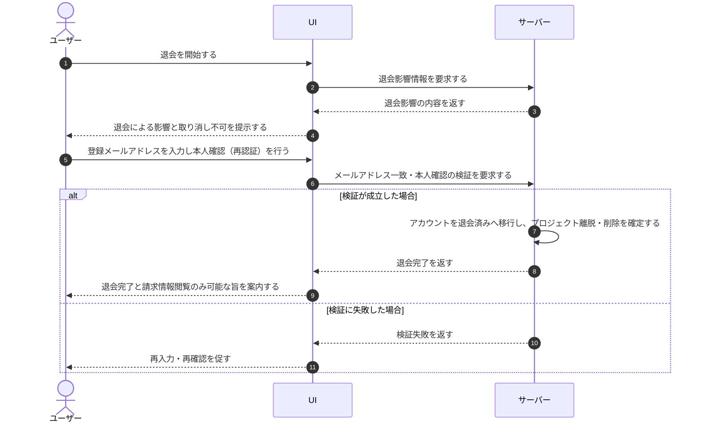

# UC-022: ユーザーがアカウントを退会する

> **この業務ユースケースは「ユーザーが自分のアカウントの退会を即時に実行し、参加プロジェクトからの離脱・作成プロジェクトの削除を確定する」流れを定義します。**

*主アクター アカウント利用者 ・ ステータス ドラフト*

## 概要

ユーザーが、自分のアカウントの退会を即時に実行する業務である。退会に伴う影響(参加しているプロジェクトからの離脱・自分が作成したプロジェクトの削除によるサービスの即時停止・以後は請求情報の閲覧のみ可能になること・取り消しできないこと)をシステムが提示し、ユーザーが登録メールアドレスの入力一致と本人確認を行ったうえで退会を確定する。確認が成立すると、システムはアカウントをただちに退会済みの状態へ移し、参加プロジェクトからの離脱と作成プロジェクトの削除によるサービス停止を確定する。退会に猶予期間は設けず、申請を保留する状態や撤回・取り消しの仕組みは持たない。

## 主アクター

アカウント利用者

## 目的

不要になったアカウントを即時に退会し、参加プロジェクトからの離脱と自分が作成したプロジェクトの停止・削除を確定して、サービスの利用と課金を終了させる。

## 事前条件

- ユーザー本人としてログイン済みである。
- 退会の実行はアカウント利用者本人に限定される。

## 基本フロー

1. ユーザーが退会を開始する。
2. システムが、退会によって生じる影響(参加しているプロジェクトからの離脱・自分が作成したプロジェクトの削除によるサービスの即時停止・以後は請求情報の閲覧のみ可能になること・取り消しできないこと)をまとめて提示する。
3. ユーザーが内容を確認し、退会を確定する意思を示すために登録メールアドレスを入力する。
4. ユーザーが本人確認(再認証)を行い、退会を確定する。
5. システムが、登録メールアドレスの一致と本人確認の成立を検証する。
6. システムが、アカウントをただちに退会済みの状態へ移す。
7. システムが、ユーザーが参加しているプロジェクトからの離脱と、ユーザーが作成したプロジェクトの削除によるサービス停止を確定する。
8. システムが、退会が完了し以後は請求情報の閲覧のみが可能である旨を案内する。

## 代替フロー

- 確認の途中でユーザーが操作を取りやめた場合は、退会を実行せず元の状態のままとする。

## 例外フロー

- 入力した登録メールアドレスが一致しない場合は、退会を実行せず、再入力を促す。
- 本人確認(再認証)に失敗した場合は、退会を実行せず、再確認を促す。

## 事後条件

- アカウントが退会済みの状態になる。
- ユーザーが参加していたプロジェクトからは離脱し、割当が外れる。
- ユーザーが作成したプロジェクトは削除され、サービスが停止する。
- 退会は取り消せず、以後ユーザーは請求情報の閲覧のみが可能になる。
- ユーザーには退会が完了した旨が案内される。

## トレーサビリティ

関連する要件・基本設計の対応は [トレーサビリティ一覧](../../02_basic_design/00_traceability/index.md) で一元管理する。

## 備考

退会は即時に成立し、猶予期間・撤回・申請保留の仕組みは持たない。退会後もアカウントと請求情報は物理削除せず、退会時刻を起点に一定期間(7年)保持し、ユーザーは請求情報の閲覧のみが可能である。退会後の請求情報の閲覧は別の業務ユースケースで、保持期間経過後の物理削除はシステム起点の業務ユースケースで扱う。
