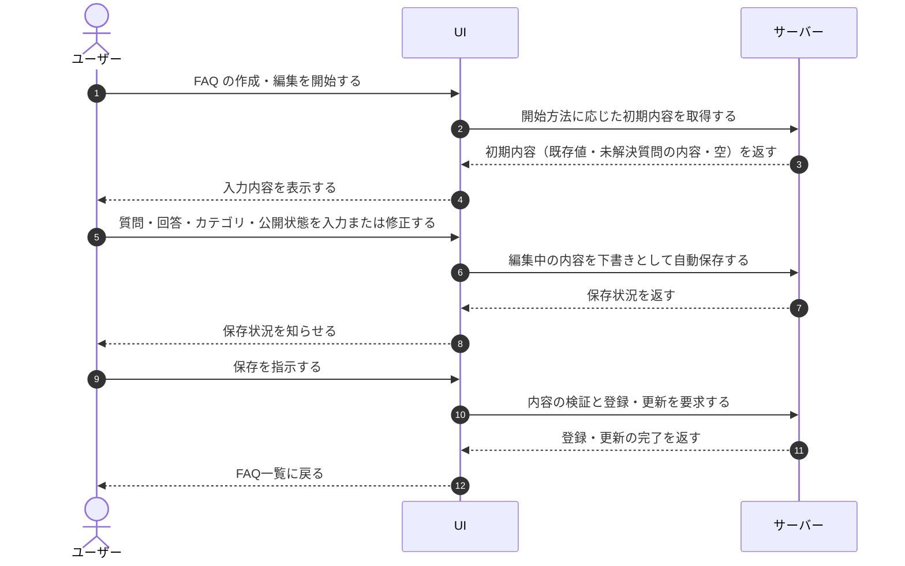

# UC-024: メンバーがFAQを作成・編集する

> **この業務ユースケースは「オーナー / メンバーが FAQ の質問・回答・カテゴリ・公開状態を新規作成または編集して保存する」ことを定義します。**

*主アクター オーナー / メンバー ・ ステータス ドラフト*

## 概要

オーナー / メンバーが、担当プロジェクトの FAQ を新規に作成し、または既存の FAQ を編集する。質問・回答・カテゴリ・公開状態(下書き / 公開中 / 非公開)を入力し、編集中は下書きを自動的に保存しながら、内容を確認したうえで保存する。新規作成は空の状態からのほか、解決できなかった質問を起点に始めることもできる。

## 主アクター

オーナー / メンバー

## 目的

公開中の FAQ が AI 回答の唯一の根拠となるため、メンバーが正確で最新の FAQ を整備し、未解決だった問い合わせを次の回答資産へつなげる。

## 事前条件

- 主アクターがログイン済みで、当該プロジェクトの FAQ を管理する権限を持つ。
- 編集の場合は対象の FAQ が存在する。未解決質問を起点とする場合は、起点となる質問が存在する。

## 基本フロー

1. 主アクターが、新規作成・既存編集・未解決質問起点のいずれかで FAQ の作成・編集を開始する。
2. システムが、開始方法に応じた入力内容を提示する(既存編集は現在の値、未解決質問起点は質問の内容を埋めた状態、新規は空)。
3. 主アクターが、質問・回答・カテゴリ・公開状態を入力または修正する。
4. システムが、編集中の内容を下書きとして自動的に保存し、保存状況を主アクターに知らせる。
5. 主アクターが、内容を確認して保存を指示する。
6. システムが、入力内容を検証し、問題がなければ FAQ を選択中の公開状態で新規登録または更新し、FAQ 一覧に戻る。

## 代替フロー

- 主アクターが保存せずに編集を取り消す場合、未保存の変更があれば破棄するか確認し、確認が取れた場合のみ編集内容を破棄して FAQ 一覧に戻る。未保存の変更がなければそのまま FAQ 一覧に戻る。
- 未解決質問を起点に作成した FAQ では、主アクターが登録元の質問の詳細を確認するために戻ることができる。

## 例外フロー

- 入力が文字数の上限を超えるなど不備がある場合、システムがエラーを示し、保存を受け付けない。
- 同じ FAQ を別の利用者が並行して更新しており内容が競合した場合、システムが上書きを避けて競合を知らせ、保存を完了しない。
- FAQ の件数がプロジェクト共通の上限に達している場合、システムが新規登録を受け付けない。

## 事後条件

- 保存が完了すると、FAQ が選択中の公開状態で新規登録または更新される。
- 未解決質問を起点に登録した場合、登録元の質問との対応関係が記録される。
- FAQ の保存・公開状態変更によって、未解決質問の対応状況は変化しない(FAQ 化・公開操作と対応状況は非連動)。
- 編集を取り消した場合、FAQ の内容は変更されない。

## トレーサビリティ

トレーサビリティID [TR-024](../../02_basic_design/00_traceability/index.md#TR-024)。本ユースケースが対応する要件、および実現する設計(画面・システム・API・データベース・シーケンス)は当該 TR の行を参照する。

