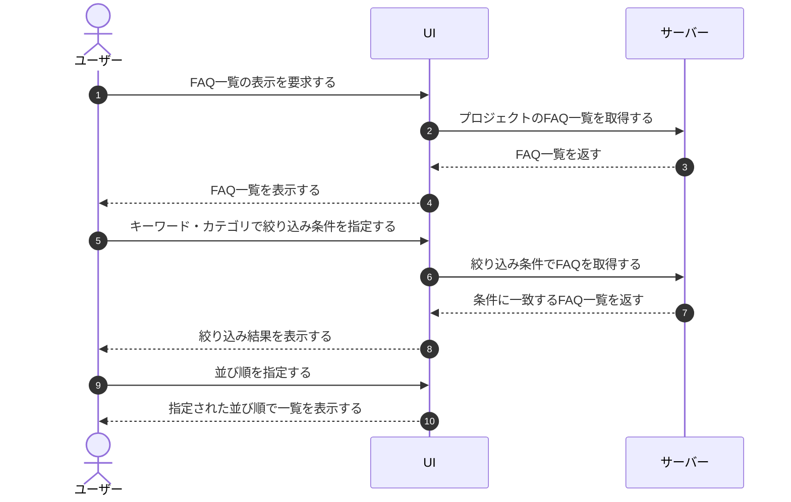

# UC-024: メンバーがFAQ一覧を閲覧する

> **この業務ユースケースは「オーナー / メンバーが担当プロジェクトのFAQを一覧で確認し、検索・絞り込み・並べ替えで目的のFAQに素早く到達する」ことを定義します。**

*主アクター オーナー / メンバー ・ ステータス ドラフト*

## 概要

オーナー / メンバーが担当プロジェクトに登録されたFAQの一覧を表示し、キーワードやカテゴリで絞り込み、並び順を変えながら目的のFAQを探す業務である。一覧上で複数のFAQを選択し、後続の一括操作の対象を準備することもできる。

## 主アクター

オーナー / メンバー

## 目的

FAQの全体像を把握し、件数が増えても目的のFAQに短時間で到達できるようにして、FAQの整備・保守を効率よく進める。

## 事前条件

- オーナー / メンバーがログイン済みである。
- 対象プロジェクトへの割当があり、FAQを閲覧する権限を持つ。

## 基本フロー

1. オーナー / メンバーがFAQ一覧の表示を要求する。
2. システムが対象プロジェクトのFAQを取得し、一覧として表示する。該当するFAQがない場合は、登録がない旨を案内する。
3. オーナー / メンバーがキーワードやカテゴリで絞り込み条件を指定する。
4. システムが条件に一致するFAQで一覧を更新する。
5. オーナー / メンバーが並び順を指定する。
6. システムが指定された並び順で一覧を並べ替えて表示する。
7. オーナー / メンバーが必要に応じて一覧上で対象FAQを選択し、選択中の件数を確認する。

## 代替フロー

- 選択を取りやめる場合、オーナー / メンバーが選択を解除し、システムが選択状態を初期化する。

## 例外フロー

- 一覧の取得に失敗した場合、システムが取得できなかった旨を案内する。

## 事後条件

- 条件に一致するFAQの一覧が、指定された並び順で表示されている。
- FAQを選択した場合、選択中の件数が把握でき、後続の一括操作の対象が準備されている。

## トレーサビリティ

トレーサビリティID [TR-024](../../02_basic_design/00_traceability/index.md#TR-024)。本ユースケースが対応する要件、および実現する設計(画面・システム・API・データベース・シーケンス)は当該 TR の行を参照する。

