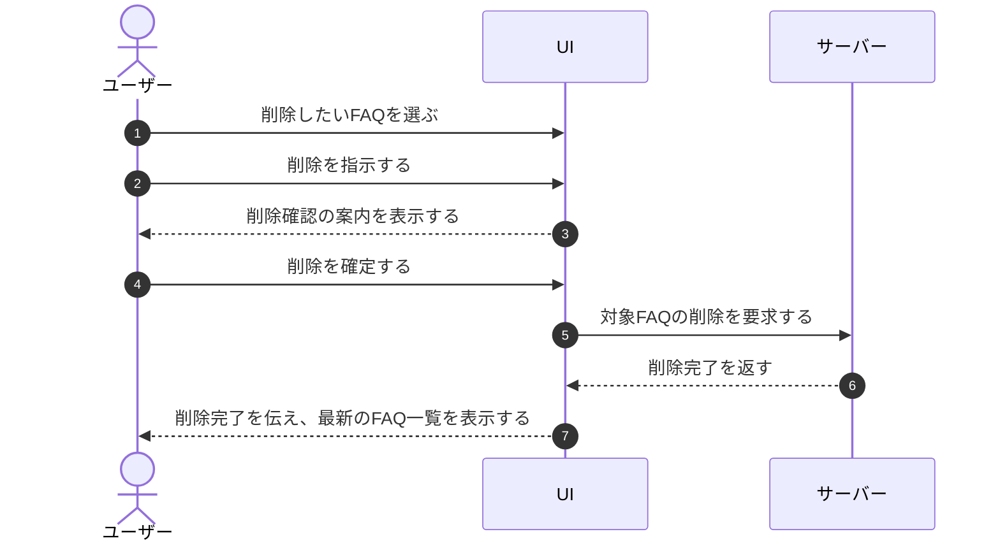

# UC-026: メンバーがFAQを削除する

> **この業務ユースケースは「オーナー / メンバーが不要になった FAQ を削除し、AI 回答の根拠から除外する」ことを定義します。**

*主アクター オーナー / メンバー ・ ステータス ドラフト*

## 概要

オーナー / メンバーが、不要になった FAQ や古くなった FAQ を削除する。削除は確認を経て実行し、削除された FAQ は AI 回答の根拠から外れる。誤削除を防ぐため確認を挟み、削除は取り消せない扱いとする。編集中の単一 FAQ の削除と、一覧での複数 FAQ のまとめ削除のいずれにも対応する。

## 主アクター

オーナー / メンバー

## 目的

不要・陳腐化した FAQ を取り除き、FAQ 群を AI 回答の正しい根拠として維持する。誤った情報源を残さず、回答品質と保守性を保つ。

## 事前条件

- オーナー / メンバーとして認証済みで、対象プロジェクトの FAQ を操作する権限を持つ
- 削除対象の FAQ が存在する(編集中の 1 件、または一覧で 1 件以上を選択している)

## 基本フロー

1. オーナー / メンバーが、削除したい FAQ を選ぶ(編集中の 1 件、または一覧で複数件を選択する)。
2. オーナー / メンバーが削除を指示する。
3. システムが削除確認の案内を表示する。
4. オーナー / メンバーが削除を確定する。
5. システムが対象の FAQ を削除し、AI 回答の根拠対象から外す。
6. システムが削除完了を伝え、最新の FAQ 一覧を表示する。

## 代替フロー

- 確認時にオーナー / メンバーが削除を取りやめた場合、削除は行われず元の状態のまま戻る。

## 例外フロー

- 削除対象の FAQ が既に他者により削除されていた場合、その旨を案内し、最新の状態を表示する。
- 権限がない場合、削除は実行されず、操作できない旨を案内する。
- 処理に失敗した場合、削除は行われず、失敗した旨を案内する。

## 事後条件

- 確定した場合、対象の FAQ が削除され、以後の AI 回答の根拠に含まれない。
- 削除は取り消せない(復旧はサポート窓口経由でのみ救済する)。
- 取りやめ・失敗した場合、FAQ の状態は変わらない。

## トレーサビリティ

トレーサビリティID [TR-026](../../02_basic_design/00_traceability/index.md#TR-026)。本ユースケースが対応する要件、および実現する設計(画面・システム・API・データベース・シーケンス)は当該 TR の行を参照する。

## 備考

本業務ユースケースは、編集中の単一 FAQ の削除と一覧での複数 FAQ のまとめ削除を 1 つの業務処理として統合したものである。
