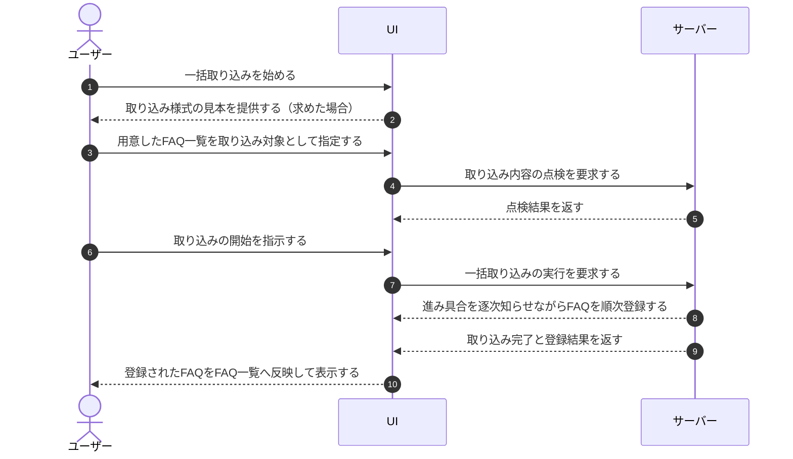

# UC-027: メンバーがFAQをCSVでインポートする

> **この業務ユースケースは「オーナー / メンバーが複数の FAQ をまとめて一括登録する」ことを定義します。**

*主アクター オーナー / メンバー ・ ステータス ドラフト*

## 概要

オーナー / メンバーが、所定の様式に沿って用意した FAQ の一覧を一括で取り込み、担当プロジェクトの FAQ をまとめて整備する。取り込み内容を事前に点検したうえで受け付け、取り込みの進み具合を確認しながら、成立した FAQ を一覧へ反映する。

## 主アクター

オーナー / メンバー

## 目的

FAQ を 1 件ずつ手入力する手間を省き、多数の FAQ を短時間でまとめて整備して、AI 回答の根拠となる FAQ を効率よく拡充する。

## 事前条件

- オーナー / メンバーが当該プロジェクトの FAQ を管理する権限を持つ。
- 取り込む FAQ の一覧を所定の様式で用意している。

## 基本フロー

1. オーナー / メンバーが一括取り込みを始める。
2. システムが、取り込み様式の見本を求められた場合は記入用の見本を提供する。
3. オーナー / メンバーが、用意した FAQ の一覧を取り込み対象として指定する。
4. システムが取り込み内容を点検し、様式が正しければ取り込みを始められる状態にする。
5. オーナー / メンバーが取り込みの開始を指示する。
6. システムが取り込みを受け付け、進み具合を逐次知らせながら FAQ を順次登録する。
7. システムが、すべて成立した場合は取り込みを終え、登録された FAQ を一覧へ反映する。

## 代替フロー

- 取り込み内容の一部に不備がある場合、システムは成立した分のみを登録し、不備のあった箇所を一覧で示す。
- オーナー / メンバーが取り込み前に取りやめた場合、システムは何も登録せず元の状態へ戻す。
- 取り込みの途中で中断が指示された場合、システムは確認のうえ処理を打ち切る。

## 例外フロー

- 取り込む一覧が所定の様式や文字の扱いに合わない場合、システムは取り込みを始められないことと不備の内容を知らせる。
- FAQ の件数・分量が定められた上限を超える場合、システムは上限を超える旨を知らせて取り込みを認めない。
- 取り込み中に処理上の不具合が生じた場合、システムは取り込みを中止し、何が起きたかを知らせる。

## 事後条件

- 成立した FAQ が担当プロジェクトに登録され、FAQ 一覧に反映される。
- 不備のあった箇所は登録されず、オーナー / メンバーが内容を確認できる。

## トレーサビリティ

関連する要件・基本設計の対応は [トレーサビリティ一覧](../../02_basic_design/00_traceability/index.md) で一元管理する。

