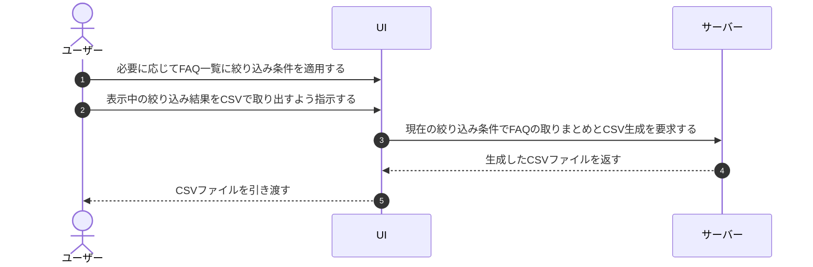

# UC-028: メンバーがFAQをCSVでエクスポートする

> **この業務ユースケースは「オーナー / メンバーが、登録済み FAQ を一覧表示の絞り込み結果のまま CSV ファイルとして取り出す」ことを定義します。**

*主アクター オーナー / メンバー ・ ステータス ドラフト*

## 概要

オーナー / メンバーが、担当プロジェクトに登録された FAQ を、画面で適用している絞り込み条件のまま CSV 形式のファイルとして取り出す業務である。取り出した CSV を、内容の点検・棚卸し・外部での共有や保管に活用できるようにする。

## 主アクター

オーナー / メンバー

## 目的

FAQ の内容を一括で外部に取り出して点検・棚卸し・共有できるようにし、FAQ 件数が増えても整備・保守をしやすくする。

## 事前条件

- 主アクターが対象プロジェクトの FAQ を取り扱う権限を持つ。
- 対象プロジェクトに FAQ が登録されている。
- 主アクターが対象プロジェクトの FAQ 一覧を表示している。

## 基本フロー

1. 主アクターが、必要に応じて FAQ 一覧に絞り込み条件を適用する。
2. 主アクターが、表示中の絞り込み結果を CSV で取り出すよう指示する。
3. システムが、現在の絞り込み条件に一致する FAQ を対象として取りまとめる。
4. システムが、対象 FAQ の内容を CSV ファイルとして生成する。
5. システムが、生成した CSV ファイルを主アクターに引き渡す。
6. 主アクターが、取り出した CSV ファイルを受け取る。

## 代替フロー

- 絞り込み条件を適用していない場合は、表示中の全 FAQ を対象として取り出す。

## 例外フロー

- 絞り込み結果に該当する FAQ が 1 件もない場合は、その旨が案内され、CSV は生成されない。

## 事後条件

- 絞り込み結果に一致する FAQ の内容が、CSV ファイルとして主アクターの手元に取り出されている。
- FAQ そのものの登録内容・状態は変化しない。

## トレーサビリティ

トレーサビリティID [TR-028](../../02_basic_design/00_traceability/index.md#TR-028)。本ユースケースが対応する要件、および実現する設計(画面・システム・API・データベース・シーケンス)は当該 TR の行を参照する。

