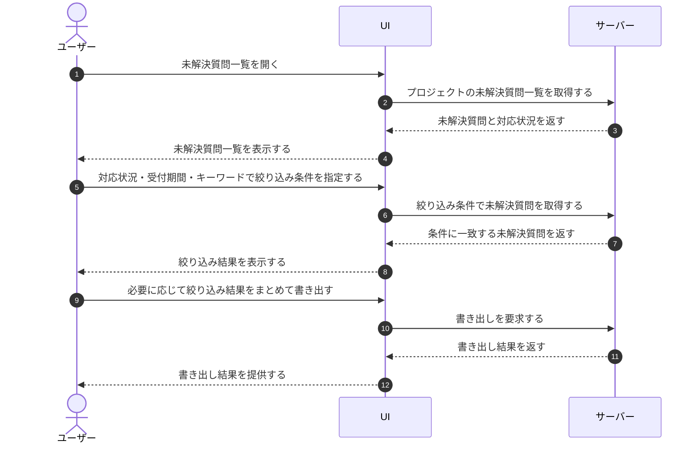

# UC-029: メンバーが未解決質問一覧を閲覧する

> **この業務ユースケースは「オーナー / メンバーが、AI で解決できなかった未解決質問の一覧を確認し、状況や期間で絞り込み・検索して対応状況を把握する」業務を定義します。**

*主アクター オーナー / メンバー ・ ステータス ドラフト*

## 概要

オーナー / メンバーが、担当プロジェクトで AI が回答できなかった未解決質問の一覧を閲覧する。対応状況や受付期間、キーワードで絞り込み、必要に応じて一覧を書き出して、FAQ 改善のための対応状況を把握する。

## 主アクター

オーナー / メンバー

## 目的

未解決質問を一望し、未対応の質問を見落とさずに対応状況を把握して、FAQ 改善運用につなげる。

## 事前条件

- ログイン済みで、当該プロジェクトへの割当・閲覧権限がある。

## 基本フロー

1. オーナー / メンバーが未解決質問一覧を開く。
2. システムが当該プロジェクトの未解決質問を、対応状況とともに一覧で表示する。質問が無い場合は該当が無い旨を案内する。
3. オーナー / メンバーが、対応状況・受付期間・キーワードなどの条件で一覧を絞り込む。
4. システムが条件に一致する未解決質問だけで一覧を更新する。
5. オーナー / メンバーが、件数が多い場合は表示範囲を切り替えながら内容を確認する。
6. オーナー / メンバーが必要に応じて、絞り込み結果の一覧をまとめて書き出す。
7. システムが書き出し結果を提供する。

## 代替フロー

- 絞り込み・検索条件に一致する未解決質問が無い場合、システムが該当が無い旨を案内する。
- 未解決質問が一度も発生していない場合、システムが空の案内を表示し、ウィジェット設定の確認導線を示す。

## 例外フロー

- 閲覧権限が無い場合、システムが操作を受け付けず権限が無い旨を案内する。

## 事後条件

- オーナー / メンバーが、条件に応じた未解決質問の対応状況を把握できている。
- 一覧の閲覧・絞り込みによって、未解決質問の対応状況は変化しない。

## トレーサビリティ

関連する要件・基本設計の対応は [トレーサビリティ一覧](../../02_basic_design/00_traceability/index.md) で一元管理する。

