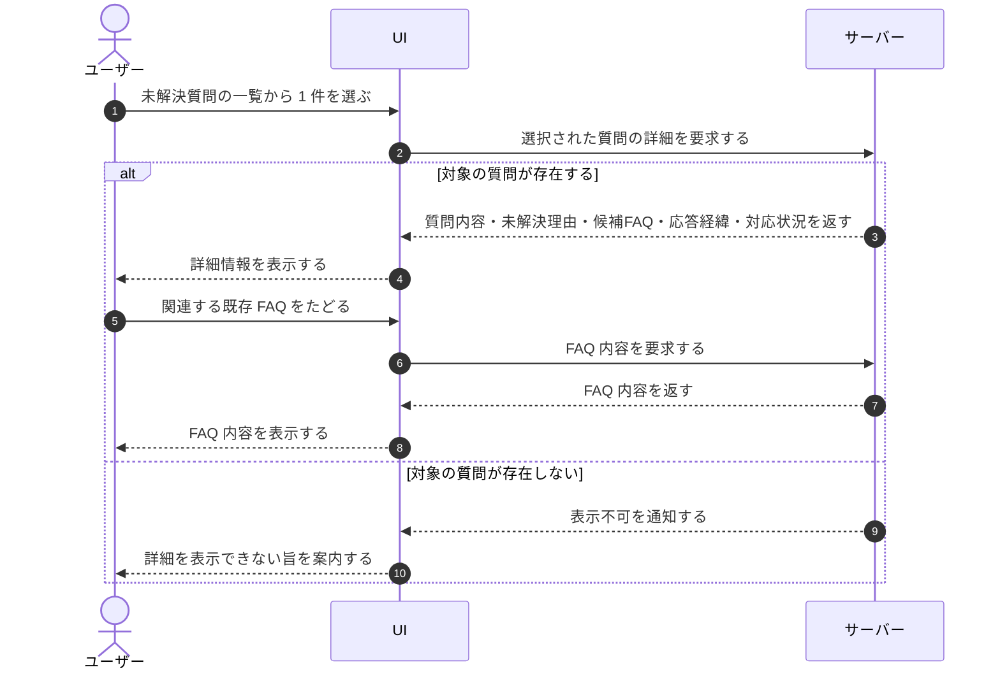

# UC-030: メンバーが未解決質問の詳細を確認する

> **この業務ユースケースは「オーナー / メンバーが未解決質問を 1 件開き、質問内容・未解決の理由・候補 FAQ・応答の経緯と対応状況をまとめて確認すること」を定義します。**

*主アクター オーナー / メンバー ・ ステータス ドラフト*

## 概要

オーナー / メンバーが、担当プロジェクトの未解決質問を 1 件選んで詳細を開く。詳細では、ウィジェット利用者の質問内容、未解決として扱われた理由、参考になる候補 FAQ、これまでの応答の経緯、現在の対応状況をまとめて確認できる。確認結果は FAQ 改善や問い合わせ対応の起点として用いる。

## 主アクター

オーナー / メンバー

## 目的

未解決質問の中身と経緯を 1 画面で把握し、FAQ 改善や個別対応の要否を判断できるようにする。取りこぼした問い合わせを見落とさず、次の改善行動につなげる。

## 事前条件

- オーナー / メンバーがログイン済みで、当該プロジェクトへの割当がある。
- 確認対象の未解決質問が記録されている。

## 基本フロー

1. オーナー / メンバーが、担当プロジェクトの未解決質問の一覧から確認したい質問を 1 件選ぶ。
2. システムが、選ばれた未解決質問の詳細情報を取り出して表示する。
3. オーナー / メンバーが、質問内容・未解決として扱われた理由・現在の対応状況を確認する。
4. オーナー / メンバーが、参考になる候補 FAQ やこれまでの応答の経緯を確認し、対応の要否を見極める。
5. オーナー / メンバーが、必要に応じて関連する既存 FAQ をたどり、内容を参照する。

## 代替フロー

- 既に FAQ 化の起点として登録先 FAQ が紐づいている場合は、その FAQ をたどって内容を確認できる。

## 例外フロー

- 対象の未解決質問が既に存在しない場合は、詳細を表示できない旨が案内される。

## 事後条件

- オーナー / メンバーが、対象の未解決質問の内容・経緯・対応状況を把握している。
- 未解決質問の対応状況は、この確認操作によって自動的には変化しない。

## トレーサビリティ

関連する要件・基本設計の対応は [トレーサビリティ一覧](../../02_basic_design/00_traceability/index.md) で一元管理する。

