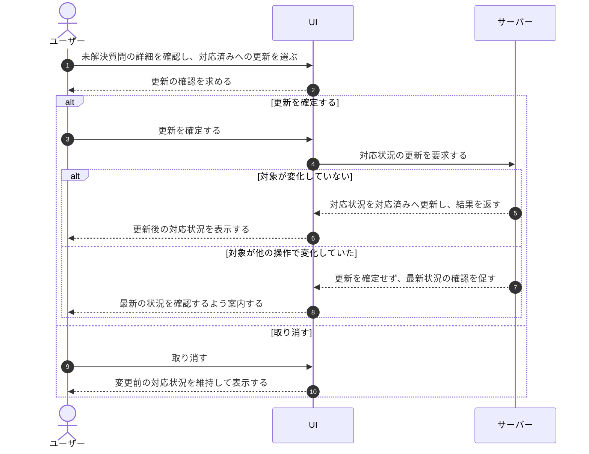

# UC-031: メンバーが未解決質問の対応状況を更新する

> **この業務ユースケースは「オーナー / メンバーが未解決質問の対応状況を手動で切り替え、対応の進捗を管理できること」を定義します。**

*主アクター オーナー / メンバー ・ ステータス ドラフト*

## 概要

オーナー / メンバーが、対象の未解決質問について対応状況を対応済みへ手動で切り替える。切り替える際は確認のうえ確定し、確定後はその質問の対応状況が更新される。対応状況は担当者の手動判断でのみ変わり、FAQ の作成・公開といった操作に連動して自動では変化しない。

## 主アクター

オーナー / メンバー

## 目的

未解決質問ごとの対応の進捗を可視化・管理し、取りこぼしのない FAQ 改善・問い合わせ対応運用を実現する。対応完了の判断を人に委ねることで、対応状況の表示を実態と一致させる。

## 事前条件

- オーナー / メンバーとして認証済みで、当該プロジェクトの未解決質問を操作する権限を持つ。
- 対象の未解決質問が存在し、その詳細を確認できる状態である。

## 基本フロー

1. オーナー / メンバーが対象の未解決質問の詳細を確認する。
2. オーナー / メンバーが対応状況を対応済みへ更新する操作を行う。
3. システムが確定前に確認を求める。
4. オーナー / メンバーが更新を確定する。
5. システムが対応状況の更新内容を受け付け、未解決質問の対応状況を保存する。
6. システムが更新後の対応状況を表示し、進捗が分かる状態にする。

## 代替フロー

- 確認を求められた段階でオーナー / メンバーが取り消した場合、対応状況は変更前のまま保たれる。

## 例外フロー

- 操作の途中で対象の未解決質問が他の操作によって変化していた場合、システムは更新を確定せず、最新の状況を確認するよう促す。

## 事後条件

- 対象の未解決質問の対応状況が「対応済み」へ更新される(取り消した場合は変更前のまま)。
- 対応状況は手動操作によってのみ更新され、FAQ 操作とは独立して保たれる。

## トレーサビリティ

トレーサビリティID [TR-031](../../02_basic_design/00_traceability/index.md#TR-031)。本ユースケースが対応する要件、および実現する設計(画面・システム・API・データベース・シーケンス)は当該 TR の行を参照する。

