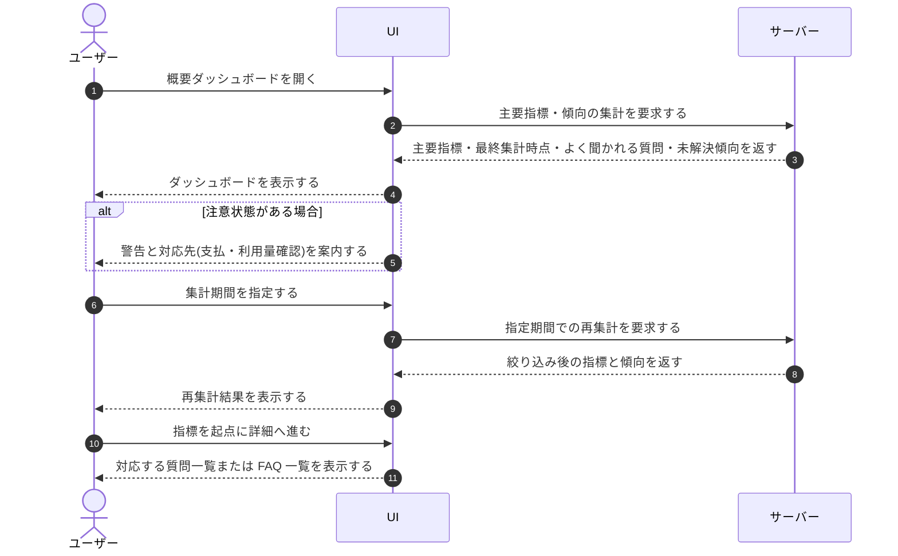

# UC-032: メンバーがプロジェクト概要ダッシュボードを閲覧する

> **この業務ユースケースは「オーナー / メンバーが概要ダッシュボードで主要指標と要対応状況を一目で把握し、必要な対応へ進める」ことを定義します。**

*主アクター オーナー / メンバー ・ ステータス ドラフト*

## 概要

オーナー / メンバーが概要ダッシュボードを開き、対象プロジェクトの主要指標(質問数・未解決数・公開 FAQ 件数など)と最終集計時点を一目で確認する。集計期間を切り替えて状況を絞り込み、よく聞かれる質問や未解決の傾向から FAQ 改善の起点を把握する。サスペンション(支払い不能)・無料枠超過・質問数上限到達などの注意状態がある場合は警告とともに対応先へ案内される。また、ウィジェットの利用準備(セットアップ)が未完了の間は、ダッシュボードは主要指標に代えて利用準備の進捗(プロジェクト作成・FAQ 登録・ウィジェット埋め込みの設定状況)を表示し、全完了後に主要指標の表示へ切り替わる。

## 主アクター

オーナー / メンバー

## 目的

日次運用の中で対象プロジェクトの状況を素早く俯瞰し、対応すべき案件や改善の起点に早く気づいて次の行動に移れるようにする。

## 事前条件

- アカウント利用者としてログイン済みである。
- 対象プロジェクトへの参加・閲覧権限がある。
- 利用量・質問ログ・FAQ などの集計対象データが蓄積されている。

## 基本フロー

1. オーナー / メンバーが概要ダッシュボードを開く。
2. システムが、当該プロジェクトでの立場(オーナー / メンバー)に応じた表示範囲で、対象プロジェクトの主要指標と最終集計時点を集計して表示する。
3. システムが、よく聞かれる質問と未解決の傾向を集計して表示する。
4. オーナー / メンバーが集計対象期間(当月・前月・任意期間など)を指定する。
5. システムが指定期間で各指標と傾向を再集計して表示する。
6. オーナー / メンバーが、対応したい指標(質問数・未解決数・公開 FAQ 件数など)を起点に、対応する質問一覧や FAQ 一覧などの詳細へ進む。

## 代替フロー

- 注意状態がある場合、システムはサスペンション(支払い不能)・無料枠超過・質問数上限到達などの警告を表示し、オーナーを支払方法の登録・更新や利用量と上限の確認へ案内する。
- オーナーは自分が作成したプロジェクト(Myプロジェクト)の概要を一覧から行き来でき、各プロジェクトの利用状況を確認できる。メンバーには参加プロジェクト(Joinプロジェクト)のみが表示され、他オーナーの全プロジェクト範囲は表示されない。

## 例外フロー

- 集計対象データが無い場合は、システムが 0 件状態として表示する。
- 不正な期間が指定された場合は、システムがエラーを表示し再指定を促す。

## 事後条件

- 対象プロジェクトの主要指標・最終集計時点・要対応状況が確認できる状態になる。
- 指定した期間で集計結果が表示された状態になる。
- 当該プロジェクトでの立場(オーナー / メンバー)に応じた表示範囲に切り替わっている。

## トレーサビリティ

関連する要件・基本設計の対応は [トレーサビリティ一覧](../../02_basic_design/00_traceability/index.md) で一元管理する。

## 備考

本業務ユースケースは、概要ダッシュボードの初期表示・期間選択・各主要指標を起点とした詳細確認への遷移・注意状態の案内・よく聞かれる質問と未解決傾向の把握・立場(オーナー / メンバー)別表示を 1 つの業務処理として統合したものである。
