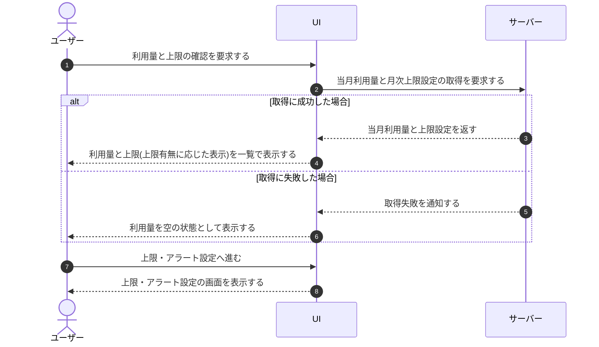

# UC-034: メンバーが利用量と上限を閲覧する

> **この業務ユースケースは「オーナー / メンバーが当月の利用量と質問数の月次上限を一画面で確認し、超過に備えて上限設定へ進めるようにする」ことを定義します。**

*主アクター オーナー / メンバー ・ ステータス ドラフト*

## 概要

オーナー / メンバーが、当該プロジェクトの当月利用量(質問数など)と質問数の月次上限設定を一覧で確認する。上限設定の有無に応じて利用量と上限の表示を切り替え、必要に応じて質問数上限・アラートの設定へ進める起点とする。

## 主アクター

オーナー / メンバー

## 目的

想定外の超過課金を避けながらプロジェクトを自律管理できるよう、当月の利用状況と上限の余裕を素早く把握する。

## 事前条件

- オーナー / メンバーとしてログイン済みである。
- 当該プロジェクトへの参加・閲覧権限を持つ。

## 基本フロー

1. オーナー / メンバーが、利用量と上限を確認する操作を行う。
2. システムが、当該プロジェクトの当月利用量と質問数の月次上限設定を集計・取得する。
3. システムが、当月利用量と月次上限を一覧で表示する。
4. システムが、上限設定の有無に応じて利用量と上限の表示を切り替える。
5. オーナー / メンバーが、表示された利用量と上限の余裕を確認する。
6. 必要に応じて、オーナー / メンバーが質問数上限・アラートの設定へ進む。

## 代替フロー

- 質問数上限が未設定(オフ)の場合、システムは利用量のみを表示し、上限に対する余裕は示さない。
- 当月の集計がまだ行われていない場合、システムは利用量を空の状態として表示する。

## 例外フロー

- 利用量の取得に失敗した場合、システムは利用量を空の状態として表示する。

## 事後条件

- 当月利用量と質問数の月次上限設定が、オーナー / メンバーに表示されている。
- オーナー / メンバーが、上限・アラート設定へ進める状態になっている。

## トレーサビリティ

トレーサビリティID [TR-034](../../02_basic_design/00_traceability/index.md#TR-034)。本ユースケースが対応する要件、および実現する設計(画面・システム・API・データベース・シーケンス)は当該 TR の行を参照する。

## 備考

本業務UCは、利用量と上限の初期表示と、質問数上限・アラート設定への導線を統合したものである。
