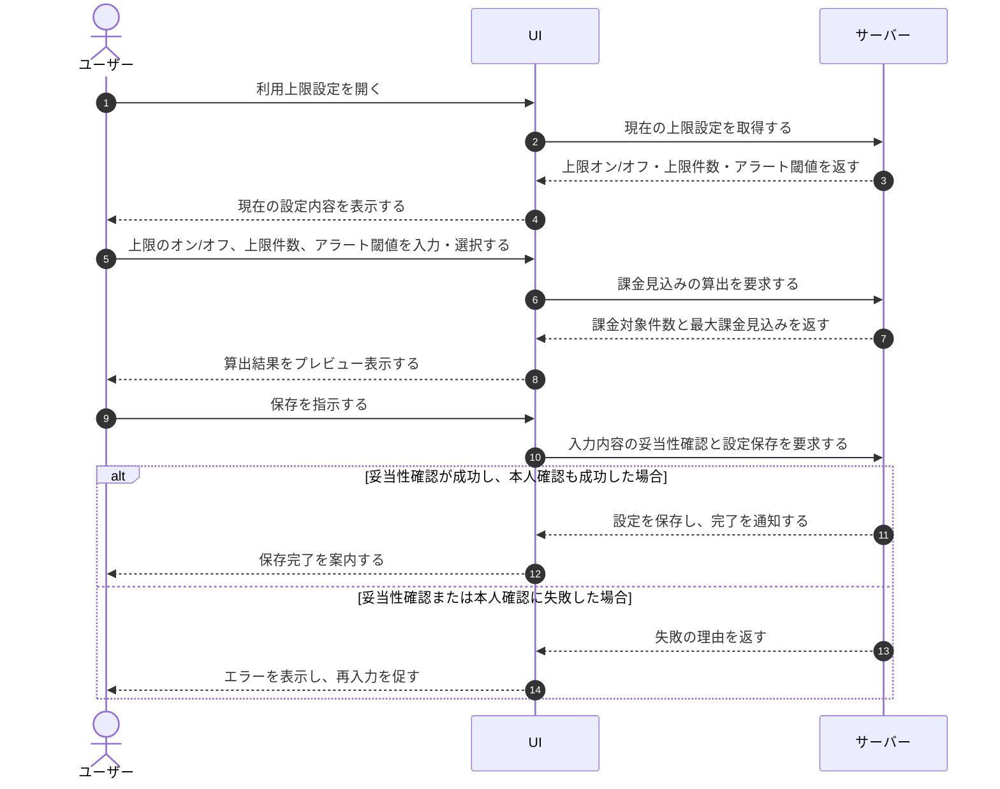

# UC-035: メンバーが利用上限とアラート閾値を設定する

> **この業務ユースケースは「オーナー / メンバーが質問数の月次上限件数とアラート閾値を設定し、超過課金の防止と利用量の自律管理を実現すること」を定義します。**

*主アクター オーナー / メンバー ・ ステータス ドラフト*

## 概要

オーナー / メンバーが、対象プロジェクトの質問数について月次上限のオン / オフ、上限件数、そしてアラート閾値を設定する業務である。設定内容はその場で課金見込みに反映され、メンバーが確認したうえで保存することで、想定外の超過課金の防止と利用量の自律管理を実現する。

## 主アクター

オーナー / メンバー

## 目的

質問数の月次上限とアラート閾値をプロジェクト単位で設定し、想定外の超過課金を防ぎながら利用量を自ら管理できるようにする。

## 事前条件

- 主アクターが対象プロジェクトの利用上限を設定する権限を持つ。
- 対象プロジェクトが特定されている。
- 現在の上限のオン / オフ・上限件数・アラート閾値の設定状況が参照できる。

## 基本フロー

1. 主アクターが対象プロジェクトの利用上限設定を開き、システムが現在の上限のオン / オフ・上限件数・アラート閾値を表示する。
2. 主アクターが質問数の月次上限を有効にするか無効にするかを選ぶ。
3. 上限を有効にした場合、主アクターが月次の上限件数を入力し、システムが課金対象件数と最大課金見込みを算出して提示する。
4. 主アクターが上限到達前に通知を受け取るアラート閾値を選ぶ(複数の割合から選択、または通知なしを選ぶ)。
5. システムが入力内容の妥当性を確認し、問題があれば指摘して保存できないようにする。
6. 主アクターが内容を確認して保存を指示する。
7. システムが本人確認のうえ設定を保存し、完了を主アクターに知らせる。

## 代替フロー

- 上限を無効に切り替えた場合、上限件数とアラート閾値の入力は対象外となり、アラート通知なしとして扱う。
- アラート閾値をひとつも選ばない場合、上限到達前のアラート通知は行わない設定として保存する。
- 主アクターが保存せずに取りやめた場合、変更は破棄され、元の設定が維持される。未保存の変更がある場合はシステムが破棄の確認を促す。

## 例外フロー

- 上限件数が許容範囲外、または整数でないなど妥当でない場合、システムはエラーを示し保存させない。
- 保存時の本人確認に失敗した場合、設定は保存されず、その旨が示される。

## 事後条件

- 対象プロジェクトの質問数の上限のオン / オフ・上限件数・アラート閾値が、保存した内容に更新される。
- 上限が有効な場合、以後の利用量がこの上限件数とアラート閾値を基準に管理される。
- 取りやめ・失敗時は、設定は変更前の状態のまま維持される。

## トレーサビリティ

トレーサビリティID [TR-035](../../02_basic_design/00_traceability/index.md#TR-035)。本ユースケースが対応する要件、および実現する設計(画面・システム・API・データベース・シーケンス)は当該 TR の行を参照する。

## 備考

本業務ユースケースは、利用上限とアラート閾値の設定に関わる操作粒度の業務を一つの業務処理へ統合したものである。
