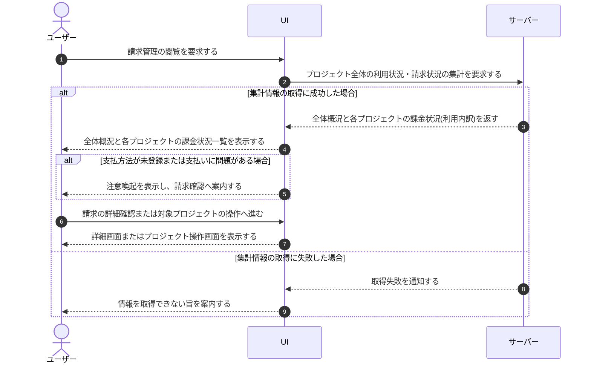

# UC-035: オーナーが請求管理(プロジェクト別の課金状況)を閲覧する

> **この業務ユースケースは「オーナーが自分の作成したプロジェクト全体の利用状況・請求状況とプロジェクト別の利用内訳を一覧で確認する」ことを定義します。**

*主アクター オーナー ・ ステータス ドラフト*

## 概要

オーナーが請求管理を開き、自分が作成したプロジェクト全体の利用状況・請求状況の概況と、各プロジェクトの課金状況(利用内訳)をまとめて確認する。請求は自分が作成した各プロジェクトの内訳でまとめて確認でき、支払方法が未登録または支払いに問題がある場合は注意喚起が示され、必要に応じて請求の確認やプロジェクトの作成へ進める。

## 主アクター

オーナー

## 目的

オーナーが自分の作成したプロジェクト全体の利用量と費用の状況を素早く俯瞰し、超過課金や未払いのリスクに早期に気づいて対処判断を下せるようにする。

## 事前条件

- オーナーとしてログインしている
- オーナーが作成したプロジェクトが存在する

## 基本フロー

1. オーナーが請求管理の閲覧を要求する。
2. システムが自分の作成したプロジェクト全体の利用状況と請求状況の概況を集計して提示する。
3. システムが各プロジェクトの課金状況(利用内訳)を一覧で提示する。
4. オーナーが提示された自分の作成したプロジェクト全体および各プロジェクトの課金状況を確認する。
5. 必要に応じて、オーナーが請求の詳細確認や対象プロジェクトの操作へ進む。

## 代替フロー

- 支払方法が未登録、または支払いに問題がある場合は、システムが注意喚起を提示し、オーナーは請求の確認へ進める。
- 作成したプロジェクトが 1 件もない場合は、システムが空状態の案内を提示し、プロジェクト別の利用内訳は表示しない。オーナーはプロジェクトの作成へ進める。

## 例外フロー

- 集計対象の情報を取得できない場合は、システムがその旨を案内し、請求管理の内容を表示しない。

## 事後条件

- オーナーが自分の作成したプロジェクト全体の利用状況・請求状況と各プロジェクトの課金状況を把握している。
- 支払いに関する注意喚起がある場合、オーナーがその存在を認識している。

## トレーサビリティ

トレーサビリティID [TR-035](../../02_basic_design/00_traceability/index.md#TR-035)。本ユースケースが対応する要件、および実現する設計(画面・システム・API・データベース・シーケンス)は当該 TR の行を参照する。

