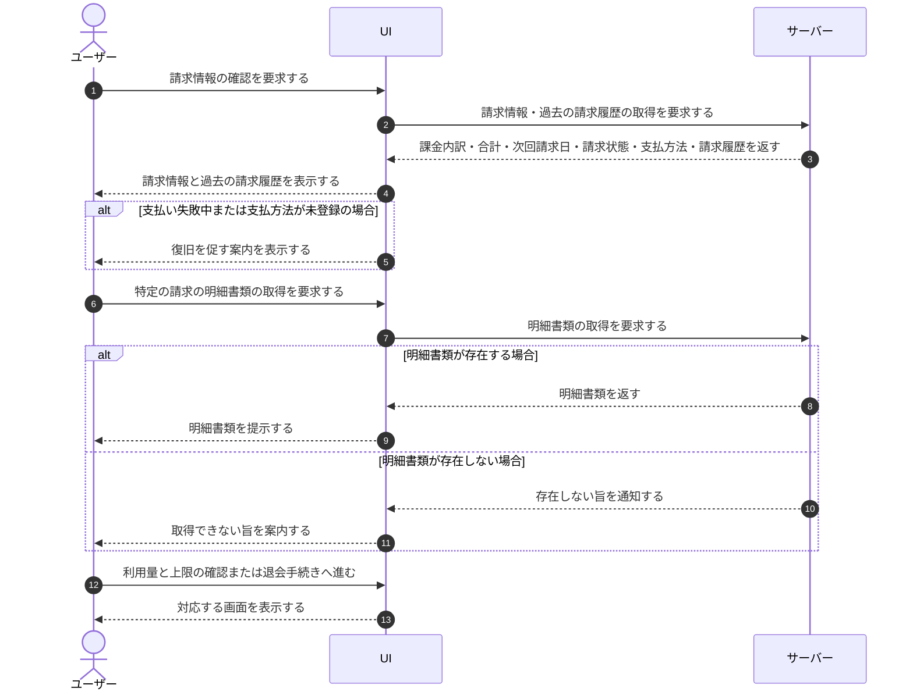

# UC-036: オーナーが請求情報を閲覧する

> **この業務ユースケースは「オーナーが、自分が作成した各プロジェクトの課金内訳と合計を、オーナー宛にまとめた 1 通の請求として確認する」ことを定義します。**

*主アクター オーナー ・ ステータス ドラフト*

## 概要

オーナーが、自分が作成した各プロジェクトの課金内訳と合計、次回請求日・請求状態・支払方法を、オーナー宛にまとめた 1 通の請求として確認する業務である。請求はオーナーが作成したプロジェクトを対象とし、明細にはプロジェクトごとの内訳と総額を含む。過去の請求履歴も一覧で確認でき、各請求の明細書類を取得したり、利用量と上限の詳細画面や退会手続きへ進む起点にもなる。支払方法はユーザー単位(アカウントに 1 つ)で登録され、オーナーが作成したすべてのプロジェクトの請求に共通して用いられる。

## 主アクター

オーナー

## 目的

オーナーが請求内容を正しく把握し、費用の見込みと内訳を踏まえて費用をコントロールできるようにする。

## 事前条件

- 利用者がログイン済みである。
- 利用者がオーナーの権限を持つ(請求情報の閲覧はオーナー専有である)。

## 基本フロー

1. オーナーが請求情報の確認を要求する。
2. システムが、オーナーが作成した各プロジェクトの課金内訳と合計、次回請求日・請求状態・支払方法を、オーナー宛にまとめた 1 通の請求として表示する。
3. システムが、過去の請求履歴を一覧で表示する。
4. オーナーが必要に応じて特定の請求の明細書類を要求し、システムがその明細を提示する。
5. オーナーは、利用量と上限の詳細確認、または退会手続きの開始へ進むことができる。

## 代替フロー

- 支払い失敗中または支払方法が未登録の場合、システムは復旧を促す案内を併せて表示する。
- オーナーが請求履歴の特定行から明細書類の取得のみを行い、他の操作を行わずに終える場合がある。

## 例外フロー

- 対象とする請求の明細書類が存在しない場合、システムは取得できない旨を案内する。

## 事後条件

- オーナーが、自分が作成した各プロジェクトの請求・利用量の状況と、それらをまとめた合計を把握した状態になる。
- 必要に応じて請求明細を取得した状態、または利用量と上限の確認・退会手続きへ遷移した状態になる。

## トレーサビリティ

関連する要件・基本設計の対応は [トレーサビリティ一覧](../../02_basic_design/00_traceability/index.md) で一元管理する。

## 備考

アカウント退会は本人(アカウント単位)の操作であり、オーナーか否かを問わず行える。請求情報の閲覧・プロジェクト削除はオーナー専有である。
