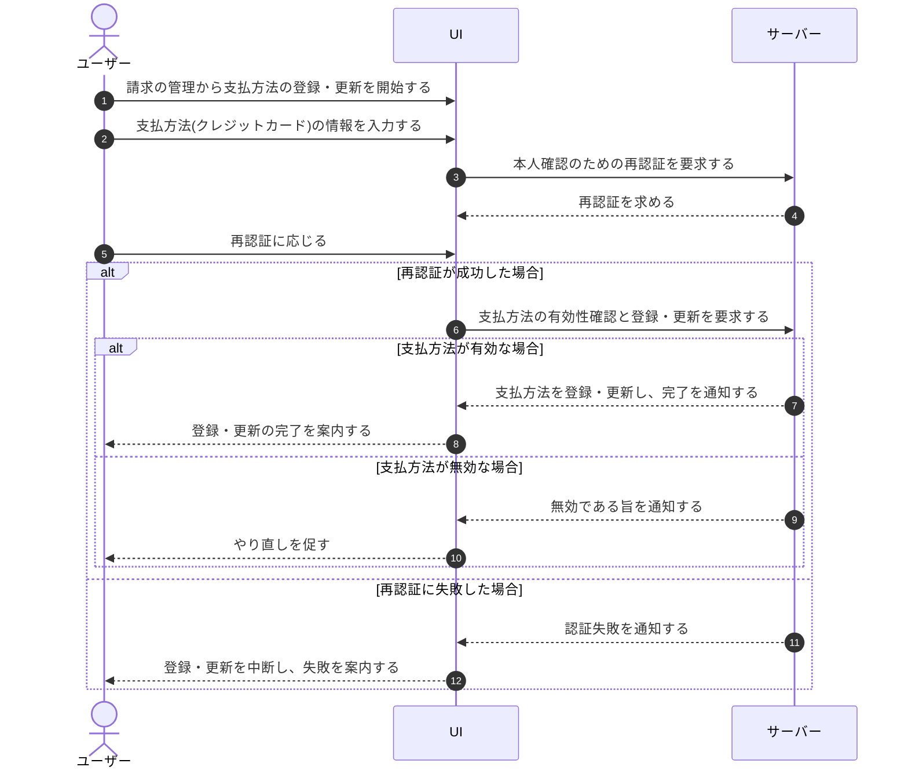

# UC-037: アカウント利用者が支払方法を登録・更新する

> **この業務ユースケースは「アカウント利用者が請求の管理から支払方法を新規に登録し、または既存の支払方法を別のものへ更新する」ことを定義します。**

*主アクター アカウント利用者 ・ ステータス ドラフト*

## 概要

アカウント利用者が請求の管理から支払方法(クレジットカード払い)を登録、または既存の支払方法を更新する業務である。支払方法の登録・更新はアカウント(本人)単位の操作であり、対象プロジェクトのオーナーか否かを問わず本人が行える。支払方法はアカウント(ユーザー)単位で 1 つ登録し、本人が作成した全プロジェクトの請求に用いられる。無料枠超過後の新規質問受付停止からの復旧や、支払い失敗からの回復のためにも用いられ、登録・更新が成立すると最新の支払方法がアカウントに反映される。

## 主アクター

アカウント利用者

## 目的

アカウント利用者が未払いによる利用停止を避け、継続的にサービスを利用できる状態を保つこと。支払方法を最新かつ有効な状態に維持し、課金を正常に進められるようにする。

## 事前条件

- 本人としてログイン済みである。

## 基本フロー

1. アカウント利用者が請求の管理から支払方法の登録・更新を開始する。
2. アカウント利用者が支払方法(クレジットカード)の情報を入力する。
3. システムが本人確認のための再認証を求め、アカウント利用者がこれに応じる。
4. システムが入力された支払方法を受け付け、有効性を確認する。
5. システムが支払方法をアカウントへ登録・更新し、本人が作成した全プロジェクトの請求に用いる最新の支払方法として反映する。
6. アカウント利用者へ登録・更新の完了が通知される。

## 代替フロー

- 支払方法未登録による新規質問受付の停止中に登録した場合は、登録の成立により当該プロジェクトの新規質問受付が再開し、復旧の案内表示が解除される。
- 支払い失敗による猶予期間中に支払方法を更新した場合は、再決済の成功により利用停止が解除される。

## 例外フロー

- 再認証に失敗した場合は、支払方法の登録・更新を中断する。
- 入力された支払方法が無効、または決済事業者で受け付けられない場合は、登録・更新を行わず、やり直しを促す。

## 事後条件

- アカウントの支払方法が最新の登録内容へ更新され、本人が作成した全プロジェクトの請求に反映されている。
- 復旧目的での登録・更新が成立した場合、対象プロジェクトの新規質問受付やプロジェクトの利用が再開している。
- 中断・失敗時は、従前の支払方法と利用状態が維持される。

## トレーサビリティ

関連する要件・基本設計の対応は [トレーサビリティ一覧](../../02_basic_design/00_traceability/index.md) で一元管理する。

## 備考

本業務ユースケースは、請求画面からの支払方法変更と、支払い失敗・未登録の復旧バナーからの支払方法登録という複数の操作起点を、一つの支払方法登録・更新の業務として統合している。
