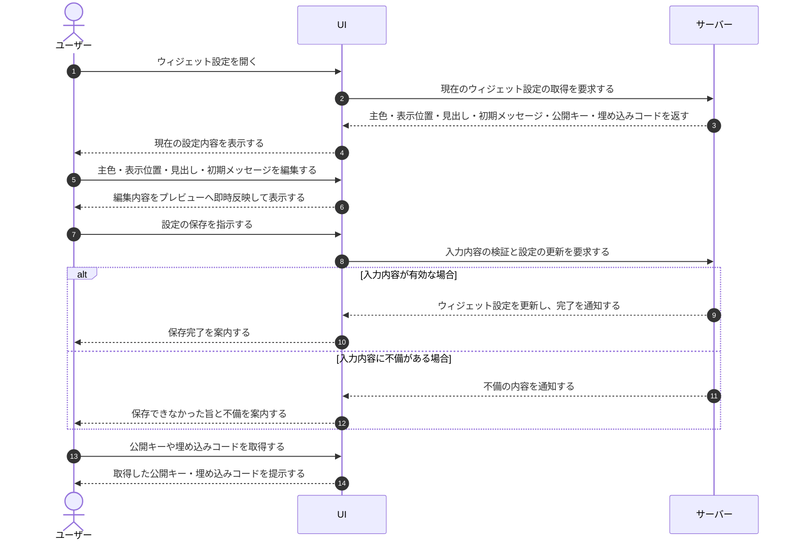

# UC-038: メンバーがウィジェット設定を編集する

> **この業務ユースケースは「オーナー / メンバーが自社サイトに設置する FAQ ウィジェットの外観や案内文を調整し、設定を保存する」ことを定義します。**

*主アクター オーナー / メンバー ・ ステータス ドラフト*

## 概要

オーナー / メンバーが、FAQ ウィジェットの外観(主色・表示位置)や見出し・初期メッセージといった案内文を編集し、プレビューで仕上がりを確認したうえで設定を保存する。設置に必要な公開キーや埋め込みコードもこの場で確認・コピーできる。

## 主アクター

オーナー / メンバー

## 目的

ウィジェットの見た目や案内文を自社サイトのブランドや運用方針に合わせて整え、ウィジェット利用者にとって分かりやすい FAQ 対応を提供する。

## 事前条件

- ログイン済みで、当該プロジェクトへの割当がある。
- 設定対象のプロジェクトが存在する。

## 基本フロー

1. オーナー / メンバーがウィジェット設定を開くと、システムが現在の主色・表示位置・見出し・初期メッセージ、および公開キー・埋め込みコードを表示する。
2. オーナー / メンバーが主色・表示位置・見出し・初期メッセージを必要に応じて編集する。
3. システムが編集内容をプレビューへ即時に反映し、仕上がりを確認できるようにする。
4. オーナー / メンバーが設定の保存を指示する。
5. システムが入力内容を検証し、問題がなければウィジェット設定を更新して、保存が完了したことを案内する。
6. オーナー / メンバーは、必要に応じて公開キーや埋め込みコードを取得し、自社サイトへの設置に利用する。

## 代替フロー

- オーナー / メンバーが編集せずに公開キーや埋め込みコードの確認・取得だけを行い、設定を保存せずに終了する。

## 例外フロー

- 入力内容に不備がある場合、システムは設定を保存せず、保存できなかったことを案内する。

## 事後条件

- 保存が成功した場合、ウィジェット設定が編集後の内容へ更新される。
- 保存しなかった場合、または保存に失敗した場合、ウィジェット設定は更新前のまま保持される。

## トレーサビリティ

トレーサビリティID [TR-038](../../02_basic_design/00_traceability/index.md#TR-038)。本ユースケースが対応する要件、および実現する設計(画面・システム・API・データベース・シーケンス)は当該 TR の行を参照する。

