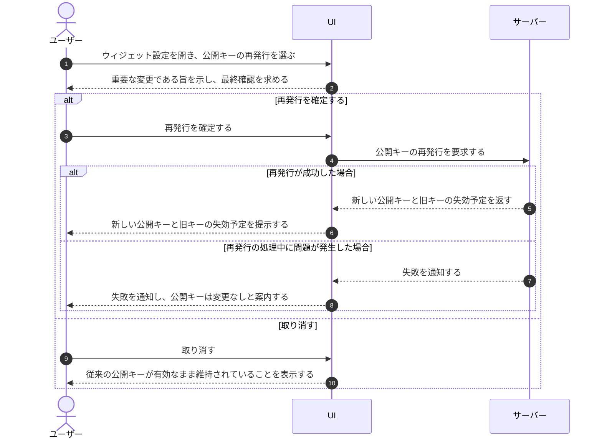

# UC-039: メンバーがウィジェット公開キーを再発行する

> **この業務ユースケースは「オーナー / メンバーが、ウィジェットの公開キーを新しいものに作り直し、旧キーを一定の猶予のうえで失効させること」を定義します。**

*主アクター オーナー / メンバー ・ ステータス ドラフト*

## 概要

オーナー / メンバーがウィジェットの公開キーを再発行する業務である。再発行を確定すると新しい公開キーが発行され、旧キーは一定の猶予期間ののち失効する。これにより、漏えいや不正利用が疑われる公開キーを差し替え、許可した設置先だけがウィジェットを利用できる状態を保つ。

## 主アクター

オーナー / メンバー

## 目的

公開キーの漏えいや不正利用の懸念に対処し、新しいキーへ切り替えることで、許可した設置先以外からのウィジェット利用や他プロジェクトのデータ参照を防ぎ、テナント間のデータ隔離を維持する。

## 事前条件

- オーナー / メンバーとして認証済みである。
- 対象プロジェクトのウィジェット設定を参照・変更できる権限を持つ。
- 対象プロジェクトに公開キーが発行済みである。

## 基本フロー

1. オーナー / メンバーが対象プロジェクトのウィジェット設定を開く。
2. オーナー / メンバーが公開キーの再発行を選び、再発行を実行する。
3. システムが、操作が重要な変更であることを示し、実行の最終確認を求める。
4. オーナー / メンバーが再発行を確定する。
5. システムが新しい公開キーを発行し、旧キーを一定の猶予期間後に失効させる予定として記録する。
6. システムが新しい公開キーと、旧キーの失効予定をオーナー / メンバーへ提示する。

## 代替フロー

- 最終確認でオーナー / メンバーが取り消した場合、公開キーは変更されず、従来のキーが有効なまま維持される。

## 例外フロー

- 再発行の処理中にシステムで問題が発生した場合、公開キーは変更されず、メンバーへ失敗が通知される。
- 対象プロジェクトのウィジェット設定を変更する権限がない場合、再発行は実行できない。

## 事後条件

- 新しい公開キーが発行され、有効になっている。
- 旧公開キーは失効予定として記録され、猶予期間の経過後に利用できなくなる。
- 取り消し時・失敗時は、公開キーは従来のまま変更されていない。

## トレーサビリティ

関連する要件・基本設計の対応は [トレーサビリティ一覧](../../02_basic_design/00_traceability/index.md) で一元管理する。

## 備考

旧キーには一定の猶予期間を設け、設置先の切り替え作業中もウィジェットが停止しないよう配慮する。
