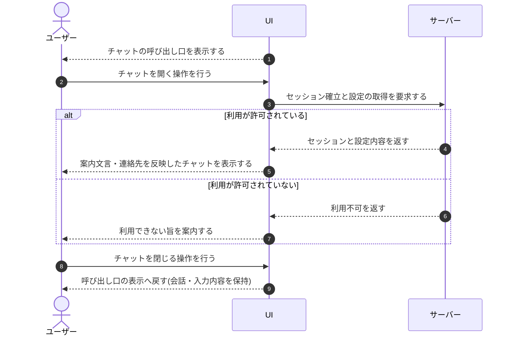

# UC-040: ウィジェット利用者がチャットを開く

> **この業務ユースケースは「ウィジェット利用者が設置サイト上でチャットを開き、AI へ質問できる状態にする」ことを定義します。**

*主アクター ウィジェット利用者 ・ ステータス ドラフト*

## 概要

設置サイトに表示されたウィジェットの呼び出し口から、ウィジェット利用者がチャットを開く業務である。チャットを開くと利用のためのセッションが確立され、案内文言や連絡先などの設定が反映された状態で質問を始められる。利用者はチャットを閉じても、同一ページ内では会話の続きから再開できる。

## 主アクター

ウィジェット利用者

## 目的

ウィジェット利用者が、設置サイトを離れることなくその場で質問できる状態をすぐに整え、疑問を自己解決へ進められるようにする。

## 事前条件

- 設置サイトにウィジェットが組み込まれ、利用者の画面に呼び出し口が表示されている。
- 当該サイトでのウィジェット利用が許可されている。

## 基本フロー

1. システムが、設置サイトの表示時にチャットの呼び出し口を利用者へ示す。
2. ウィジェット利用者が、チャットを開く操作を行う。
3. システムが、利用のためのセッションを確立し、案内文言・連絡先などの設定を反映してチャットを利用可能な状態にする。
4. ウィジェット利用者が、開いたチャットで質問を始められる状態になる。
5. ウィジェット利用者が、チャットを閉じる操作を行う。
6. システムが、チャットを閉じて呼び出し口の表示へ戻し、同一ページ内では会話の続きと入力途中の内容を保持する。

## 代替フロー

- ウィジェット利用者が、同一ページ内でチャットを再度開いた場合、システムは保持していた会話の続きから利用を再開させる。

## 例外フロー

- 当該サイトでのウィジェット利用が許可されていない場合、システムはチャットを利用可能な状態にせず、利用できない旨を案内する。
- 設定の取得に失敗した場合、システムは利用者を行き止まりにせず、状況を案内する。

## 事後条件

- チャットが利用可能な状態で開かれ、ウィジェット利用者が質問を始められる。
- チャットを閉じた後も、同一ページ内では会話・入力内容・受付状態が保持される。

## トレーサビリティ

関連する要件・基本設計の対応は [トレーサビリティ一覧](../../02_basic_design/00_traceability/index.md) で一元管理する。

## 備考

本業務UCは、初期表示・チャット展開・チャット終了の各操作を1つの「チャットを開く」業務処理として統合したものである。
