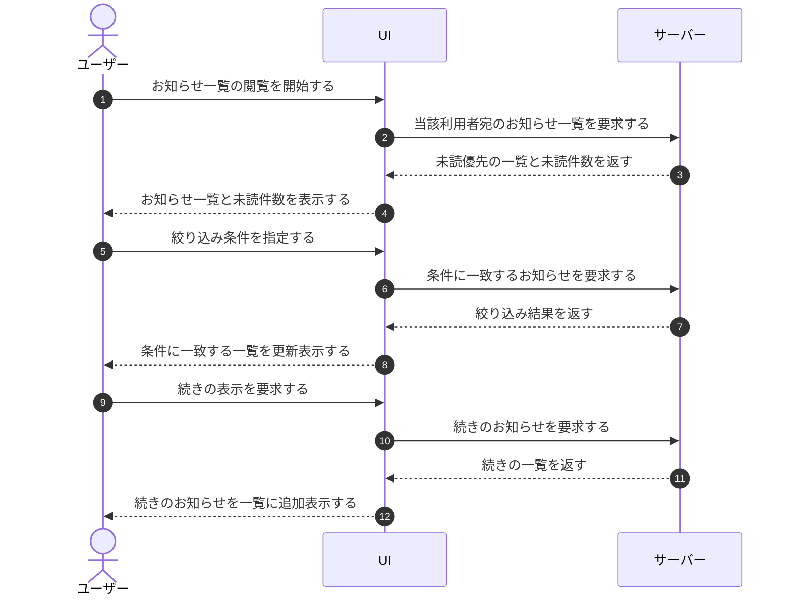

# UC-043: アカウント利用者がお知らせ一覧を閲覧する

> **この業務ユースケースは「アカウント利用者が自分が関与するプロジェクト宛のお知らせを一覧で確認し、条件で絞り込みながら見落としなく内容を把握する」ことを定義します。**

*主アクター アカウント利用者 ・ ステータス ドラフト*

## 概要

アカウント利用者が自分が関与するプロジェクト宛に届いたお知らせを一覧で閲覧する業務である。未読のお知らせを既定で優先表示し、未読件数を確認しながら、重要度・期間・キーワードなどの条件で対象を絞り込める。件数が多い場合は続きを順次読み込み、複数のお知らせを選んで後続のまとめ操作の対象にできる。

## 主アクター

アカウント利用者

## 目的

自分が関与するプロジェクト宛に届いたお知らせを見落とさず確認し、緊急度や関心に応じて必要なものへ素早く到達できるようにする。

## 事前条件

- アカウント利用者がログイン済みである。
- 当該お知らせの閲覧資格(自分が関与するプロジェクト宛の受信箱を閲覧できる権限)を持つ。

## 基本フロー

1. アカウント利用者がお知らせ一覧の閲覧を開始する。
2. システムが当該利用者宛のお知らせを未読を優先する既定条件で一覧表示し、あわせて未読件数を示す。該当がない場合は空であることを示す。
3. アカウント利用者が必要に応じて、重要度や既読状態などの簡易な絞り込み、または期間・キーワードによる詳細な絞り込みを指定する。
4. システムが指定された条件に一致するお知らせで一覧を更新する。一致がない場合は空であることを示す。
5. アカウント利用者が必要に応じて絞り込み条件をすべて解除し、システムが既定の一覧へ戻す。
6. 一覧が続く場合、アカウント利用者が続きの表示を要求し、システムが続きのお知らせを読み込んで一覧に加える。これ以上ない場合はその旨を示す。
7. アカウント利用者が必要に応じて複数のお知らせを選択し、システムがまとめ操作の対象として選択状態を保持する。選択をすべて解除すると対象なしの状態へ戻す。

## 代替フロー

- 絞り込み条件に一致するお知らせが存在しない場合、システムは空であることを示し、利用者は条件を変更できる。
- 表示できるお知らせがこれ以上ない場合、システムは続きがないことを示す。

## 例外フロー

- 閲覧資格を持たない場合、お知らせ一覧は表示されない。

## 事後条件

- アカウント利用者が自分が関与するプロジェクト宛のお知らせと未読件数を確認できた状態になる。
- 指定した絞り込み条件、または続きの読み込み結果が一覧へ反映されている。
- まとめ操作の対象として選択したお知らせがある場合、その選択状態が保持されている。

## トレーサビリティ

関連する要件・基本設計の対応は [トレーサビリティ一覧](../../02_basic_design/00_traceability/index.md) で一元管理する。

## 備考

本業務ユースケースは、お知らせ一覧の参照に関わる操作粒度の業務を 1 つの閲覧業務へ統合したものである。
