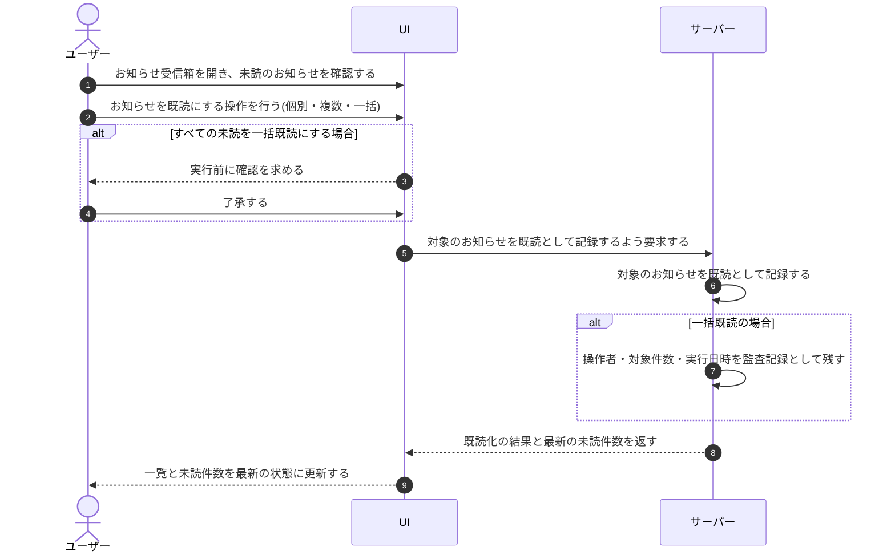

# UC-045: アカウント利用者がお知らせを既読化する

> **この業務ユースケースは「アカウント利用者が自分のプロジェクト宛のお知らせを、個別または一括で既読にできる」ことを定義します。**

*主アクター アカウント利用者 ・ ステータス ドラフト*

## 概要

アカウント利用者が、受信箱に届いた自分のプロジェクト宛のお知らせを既読にする業務である。1 件ずつの確認による既読化のほか、選択した複数件・表示中の未読・すべての未読を一括で既読化できる。広範囲に影響する一括既読は、後から誰がいつ行ったかを追跡できるよう監査記録を残す。

## 主アクター

アカウント利用者

## 目的

アカウント利用者が未対応のお知らせを管理しやすくし、確認済みのものを既読として整理することで、未読件数から本当に対応が必要なお知らせへ素早く到達できるようにする。

## 事前条件

- アカウント利用者がログインしている。
- 自分のプロジェクト宛のお知らせ受信箱に、対象となる未読のお知らせが存在する。

## 基本フロー

1. アカウント利用者がお知らせ受信箱を開き、未読のお知らせを確認する。
2. アカウント利用者が、確認したお知らせを既読にする操作を行う。個別の確認による既読化のほか、選択した複数件・表示中の未読・すべての未読をまとめて既読にする方法を選べる。
3. システムが対象のお知らせを既読として記録する。
4. システムが一覧と未読件数を最新の状態に更新し、結果をアカウント利用者へ反映する。
5. 一括での既読化が行われた場合、システムは操作者・対象件数・実行日時を監査記録として残す。

## 代替フロー

- すべての未読を対象とする一括既読では、影響範囲が広いため、システムは実行前にアカウント利用者へ確認を求め、了承された場合のみ既読化する。
- 既読化の対象がない(未読が存在しない)場合は、既読化を行わず、何も変化しない旨を案内する。

## 例外フロー

- 既読化の処理中に対象のお知らせがすでに削除・無効化されていた場合、システムは対象外として扱い、可能な範囲で既読化を完了する。

## 事後条件

- 対象のお知らせが既読の状態になっている。
- 未読件数が最新の状態に更新されている。
- 一括既読化が行われた場合、その操作が監査記録に残されている。

## トレーサビリティ

関連する要件・基本設計の対応は [トレーサビリティ一覧](../../02_basic_design/00_traceability/index.md) で一元管理する。

