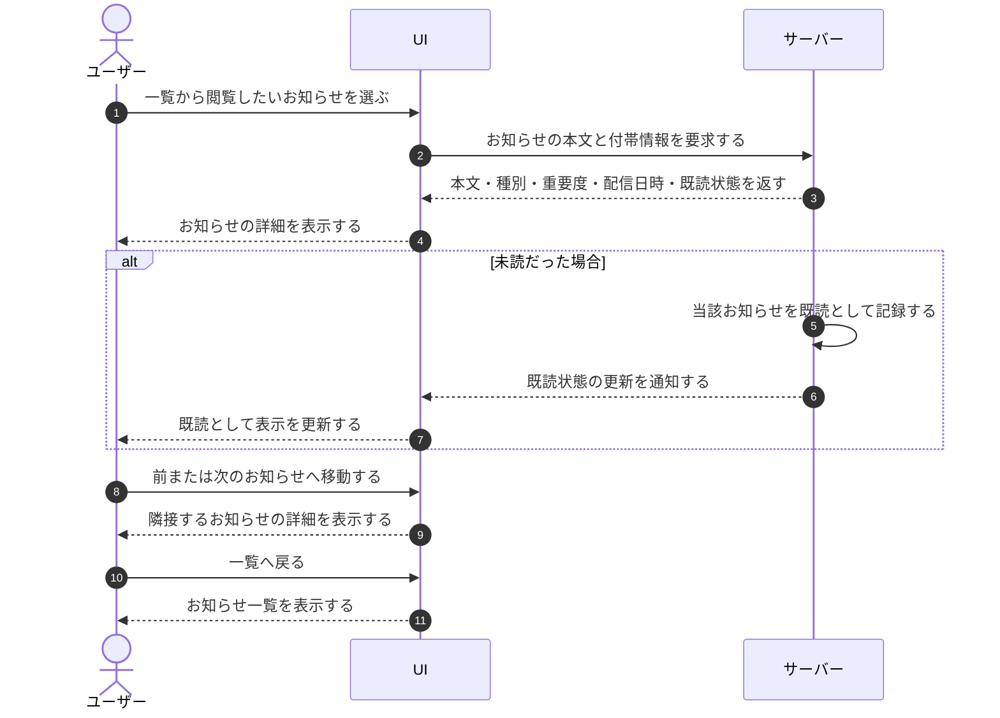

# UC-045: アカウント利用者がお知らせの詳細を閲覧する

> **この業務ユースケースは「アカウント利用者が自分が関与するプロジェクト宛のお知らせの本文と付帯情報を確認し、未読のものを読んだ時点で既読として扱う」ことを定義します。**

*主アクター アカウント利用者 ・ ステータス ドラフト*

## 概要

アカウント利用者が、自分宛に届いたお知らせの本文と、種別・重要度・配信日時などの付帯情報を詳細として確認する。未読のお知らせを初めて開いた時は、その時点で既読として扱われ、確認した状態が記録される。前後のお知らせへ続けて移動したり、一覧へ戻ったりして閲覧を続けられる。

## 主アクター

アカウント利用者

## 目的

届いたお知らせの内容を見落とさず正確に把握し、必要な対応を判断できるようにする。あわせて確認済みのお知らせを既読として整理し、未対応のものを管理しやすくする。

## 事前条件

- アカウント利用者がログインしている
- 自分が関与するプロジェクト宛のお知らせが存在し、一覧から閲覧対象のお知らせを選んでいる
- 当該お知らせの閲覧権限が本人にある

## 基本フロー

1. アカウント利用者が、一覧から閲覧したいお知らせを選ぶ。
2. システムが、選ばれたお知らせの本文と付帯情報(種別・重要度・配信日時・既読状態など)を取り出して詳細として表示する。
3. 対象のお知らせが未読だった場合、システムはその時点で当該お知らせを既読として記録し、確認済みであることがわかるよう表示を更新する。
4. アカウント利用者が、必要に応じて前のお知らせ、または次のお知らせへ続けて移動し、同様に内容を確認する。
5. アカウント利用者が、閲覧を終えて一覧へ戻る。

## 代替フロー

- 一覧の先頭のお知らせを表示している時は、前のお知らせへの移動は行えない。
- 一覧の末尾のお知らせを表示している時は、次のお知らせへの移動は行えない。
- 既に既読のお知らせを再び開いた時は、既読状態の更新は行わず内容の表示のみを行う。

## 例外フロー

- 対象のお知らせが既に削除されている、または本人の閲覧範囲外の場合は、詳細を表示せずに閲覧できない旨を伝える。

## 事後条件

- アカウント利用者が、お知らせの本文と付帯情報を確認できている。
- 未読だったお知らせが既読として記録され、確認済みの状態になっている。

## トレーサビリティ

トレーサビリティID [TR-045](../../02_basic_design/00_traceability/index.md#TR-045)。本ユースケースが対応する要件、および実現する設計(画面・システム・API・データベース・シーケンス)は当該 TR の行を参照する。

## 備考

本業務ユースケースは、お知らせ詳細の初期表示・初回閲覧時の自動既読化・前後のお知らせへの移動・一覧への復帰を 1 つの閲覧業務として統合したものである。
