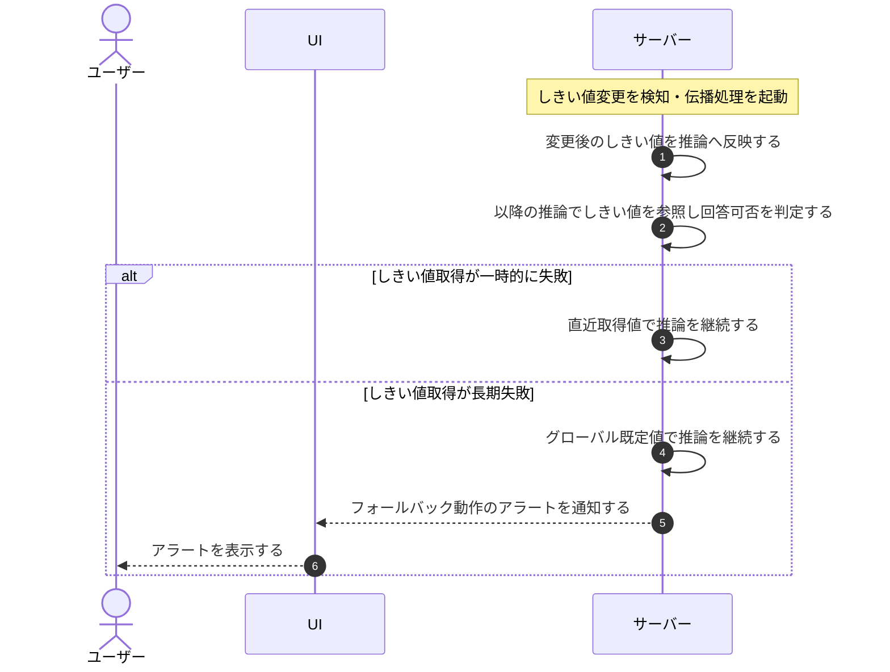

# UC-047: システムがAIしきい値変更を推論へ伝播する

> **この業務ユースケースは「プロジェクトの回答可否しきい値が変更されたとき、システムが速やかにその変更を以降の AI 推論へ反映し、しきい値の取得が長期に失敗しても既定値で推論を継続してアラートを上げる」ことを定義します。**

*主アクター システム ・ ステータス ドラフト*

## 概要

プロジェクトの回答可否しきい値が変更されたことを契機に、システムが変更後の値を以降の AI 推論へ短時間で反映します。しきい値設定の取得が一時的に失敗したときは直近に取得できた値で推論を継続し、長期に失敗したときはグローバル既定値で推論を継続したうえでアラートを通知します。

## 主アクター

システム

## 目的

しきい値の変更を待たせずに推論動作へ反映し、設定取得に障害が起きてもサービスを止めずに推論を継続しつつ運用に異常を気付かせることで、利用実態に合った回答方針と継続稼働を両立する。

## 事前条件

- 起動契機: 対象プロジェクトの回答可否しきい値が変更されたこと、または質問に伴う推論処理が発生したこと。
- 対象プロジェクトが存在し、回答可否しきい値が設定されている。
- グローバル既定値(信頼度・関連度の標準値)が定義されている。

## 基本フロー

1. 対象プロジェクトの回答可否しきい値が変更され、システムが変更を検知する。
2. システムが変更後の値を、以降の推論が参照できる状態へ反映する。
3. 以降の質問に伴う推論処理が、最新のしきい値を参照して回答可否を判定する。
4. しきい値の変更が短時間で以降の推論動作へ反映される。

## 代替フロー

—

## 例外フロー

- しきい値設定の取得が一時的にできない場合は、直近に取得できた値で推論を継続する。
- しきい値設定の取得が長期にできず直近取得値も無い場合は、グローバル既定値で推論を継続し、フォールバックで動作している間はアラートを通知する。

## 事後条件

- しきい値の変更が短時間で以降の推論動作へ反映されている。
- しきい値設定の取得が長期に失敗している間も推論は停止せず、直近取得値または既定値で継続している。
- フォールバックで動作している間はアラートが通知されている。

## トレーサビリティ

トレーサビリティID [TR-047](../../02_basic_design/00_traceability/index.md#TR-047)。本ユースケースが対応する要件、および実現する設計(画面・システム・API・データベース・シーケンス)は当該 TR の行を参照する。

## 備考

本ユースケースは、AI しきい値設定の変更を推論処理へ反映する横断的な業務処理を 1 つに統合したものである。
