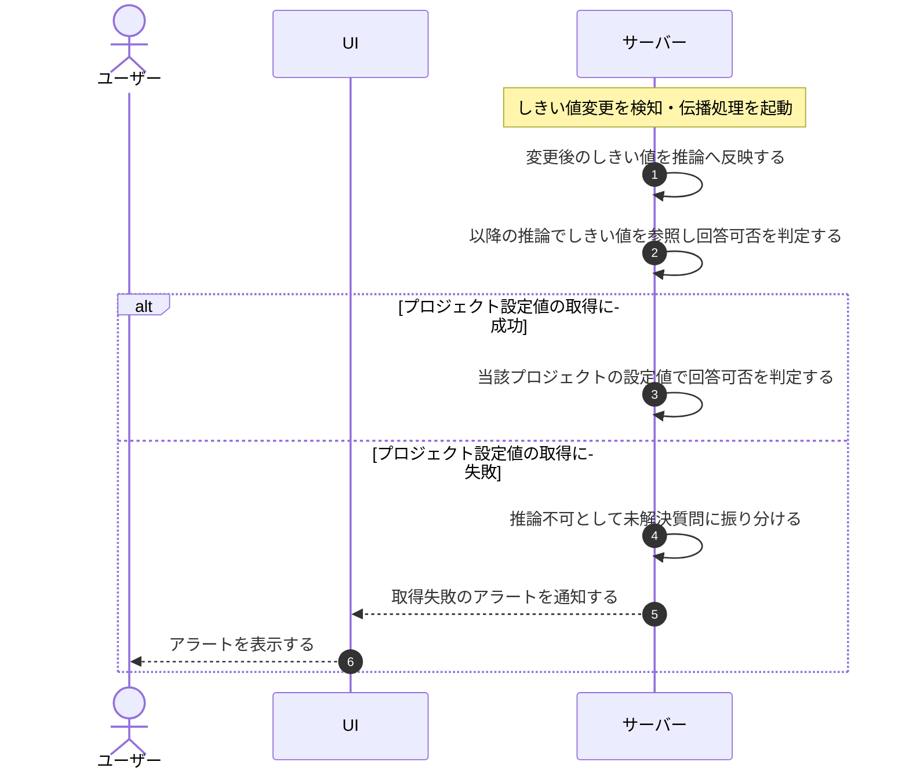

# UC-047: システムがAIしきい値変更を推論へ伝播する

> **この業務ユースケースは「プロジェクトの回答可否しきい値が変更されたとき、システムが速やかにその変更を以降の AI 推論へ反映し、プロジェクト設定値を取得できない場合は推論不可として扱いアラートを上げる」ことを定義します。**

*主アクター システム ・ ステータス ドラフト*

## 概要

プロジェクトの回答可否しきい値が変更されたことを契機に、システムが変更後の値を以降の AI 推論へ短時間で反映します。しきい値はプロジェクト作成時に必ず設定されているため未登録状態は発生せず、グローバル既定値などのフォールバック先は持ちません。プロジェクト設定値の取得に失敗した場合は、誤った基準で回答せず推論不可として扱ったうえでアラートを通知します。

## 主アクター

システム

## 目的

しきい値の変更を待たせずに推論動作へ反映し、設定取得に障害が起きた場合は誤った基準で回答せず運用に異常を気付かせることで、利用実態に合った回答方針と回答品質の保全を両立する。

## 事前条件

- 起動契機: 対象プロジェクトの回答可否しきい値が変更されたこと、または質問に伴う推論処理が発生したこと。
- 対象プロジェクトが存在する。
- 対象プロジェクトの回答可否しきい値が作成時に設定済みである。

## 基本フロー

1. 対象プロジェクトの回答可否しきい値が変更され、システムが変更を検知する。
2. システムが変更後の値を、以降の推論が参照できる状態へ反映する。
3. 以降の質問に伴う推論処理が、最新のしきい値を参照して回答可否を判定する。
4. しきい値の変更が短時間で以降の推論動作へ反映される。

## 代替フロー

—

## 例外フロー

- プロジェクト設定値を取得できない場合は、フォールバック先がないため回答可否判定を行わず推論不可として扱い(未解決質問として記録)、アラートを通知する。

## 事後条件

- しきい値の変更が短時間で以降の推論動作へ反映されている。
- プロジェクト設定値の取得に失敗した質問は推論不可として未解決質問に記録されている。
- 取得失敗時はアラートが通知されている。

## トレーサビリティ

関連する要件・基本設計の対応は [トレーサビリティ一覧](../../02_basic_design/00_traceability/index.md) で一元管理する。

## 備考

本ユースケースは、AI しきい値設定の変更を推論処理へ反映する横断的な業務処理を 1 つに統合したものである。
