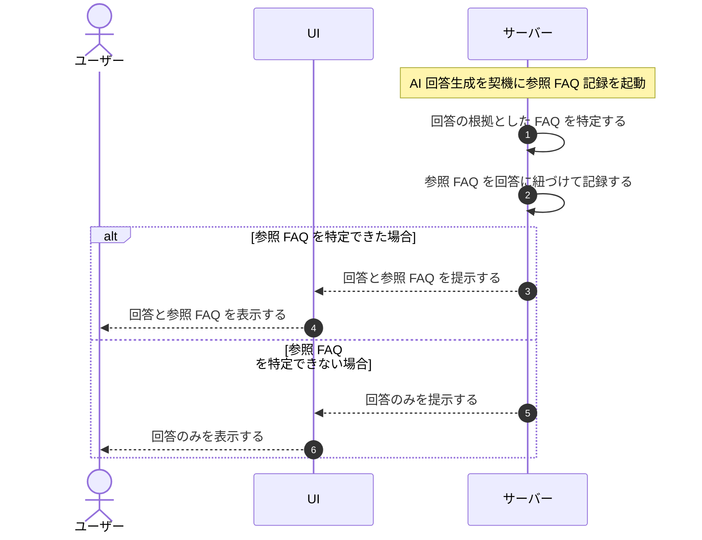

# UC-048: システムが回答に利用したFAQを記録し参照提示する

> **この業務ユースケースは「AI 回答を生成した際に根拠とした FAQ を記録し、回答とともにウィジェット利用者へ参照 FAQ を提示すること」を定義します。**

*主アクター システム ・ ステータス ドラフト*

## 概要

システムが AI 回答を生成したとき、回答の根拠とした FAQ を記録する。そして回答とあわせて参照 FAQ をウィジェット利用者へ提示し、回答の根拠を確認できるようにする。

## 主アクター

システム

## 目的

回答に利用した FAQ を記録・提示することで、AI 回答の透明性と検証可能性を確保し、ウィジェット利用者が回答の根拠を自ら確認できるようにする。

## 事前条件

- トリガー(起動契機): システムがウィジェット利用者の質問に対し、公開中の FAQ を根拠として AI 回答を生成したこと。
- 回答の根拠となった FAQ が特定できる状態であること。

## 基本フロー

1. トリガー: システムが質問に対する AI 回答を生成する。
2. システムが回答の根拠として利用した FAQ を特定する。
3. システムが利用した参照 FAQ を回答に紐づけて記録する。
4. システムが回答とともに参照 FAQ をウィジェット利用者へ提示する。

## 代替フロー

—

## 例外フロー

- 参照 FAQ を特定できない場合は、参照提示を省略して回答のみを提示する。

## 事後条件

- 回答に利用した参照 FAQ が回答に紐づけて記録されている。
- ウィジェット利用者へ回答とともに参照 FAQ が提示されている(特定できない場合は回答のみ)。

## トレーサビリティ

関連する要件・基本設計の対応は [トレーサビリティ一覧](../../02_basic_design/00_traceability/index.md) で一元管理する。

