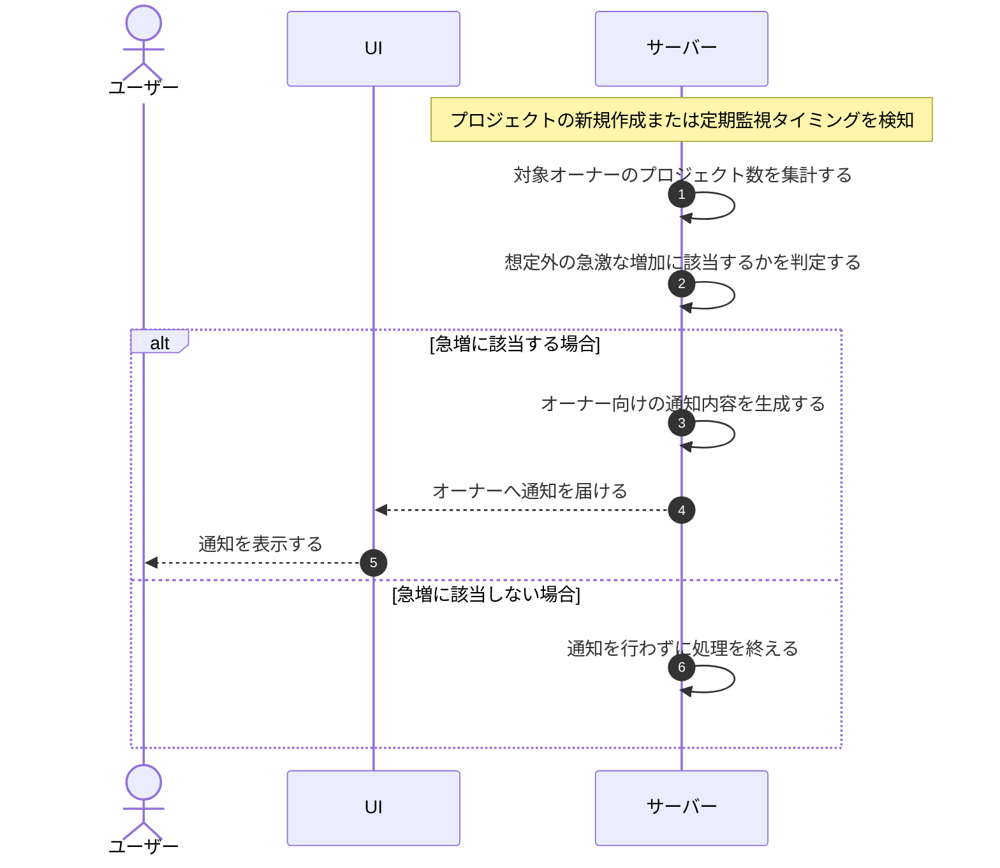

# UC-049: システムがプロジェクト数の急増を検知してオーナーへ通知する

> **このユースケースは「システムがオーナーごとのプロジェクト数を監視し、想定外の急増を検知した際にオーナーへ通知する」業務を定義します。**

*主アクター システム ・ ステータス ドラフト*

## 概要

システムはプロジェクト数に固定上限を設けず、オーナーごとに、そのオーナーが作成したプロジェクト数を監視します。プロジェクトの新規作成や定期的な監視を契機にプロジェクト数を評価し、想定外の急激な増加を検知した場合にオーナーへ通知します。

## 主アクター

システム

## 目的

固定上限による業務の妨げを避けつつ、プロジェクト数の想定外の増加を早期に検知してオーナーへ知らせ、不正利用や運用逸脱に気付けるようにする。

## 事前条件

- トリガー(起動契機): プロジェクトの新規作成、または定期的な監視タイミングが発生すること。
- 対象となるオーナーが存在し、当該オーナーが作成したプロジェクト数が集計できる状態であること。

## 基本フロー

1. プロジェクトの新規作成、または定期的な監視タイミングを契機に、システムが評価を開始する。
2. システムが対象オーナーが作成したプロジェクト数を集計する。
3. システムが集計結果をもとに、想定外の急激な増加に該当するかを判定する。
4. 急増に該当すると判定した場合、システムが当該オーナー向けの通知内容を生成する。
5. システムがオーナーへ通知を届ける。

## 代替フロー

- 増加が緩やかで急増の基準に達しない場合は、通知を行わずに処理を終える。

## 例外フロー

- 通知の生成または送信に失敗した場合は、再送の対象として記録し、後で再度通知できるようにする。

## 事後条件

- プロジェクト数の急増がオーナーへ通知される。
- 通知に失敗した場合は再送対象として記録される。

## トレーサビリティ

トレーサビリティID [TR-049](../../02_basic_design/00_traceability/index.md#TR-049)。本ユースケースが対応する要件、および実現する設計(画面・システム・API・データベース・シーケンス)は当該 TR の行を参照する。

