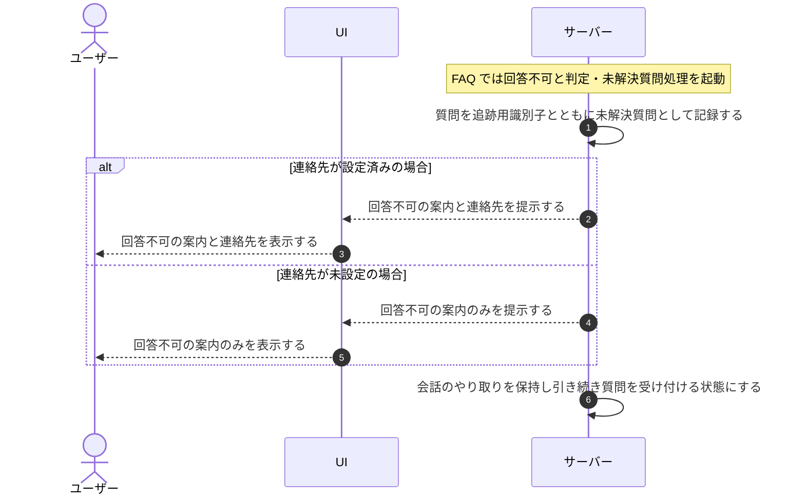

# UC-049: システムが回答不可時に未解決質問を登録し案内する

> **このユースケースは「FAQ で回答できなかった質問を未解決質問として記録し、ウィジェット利用者へ回答できなかった旨を案内する」業務を定義します。**

*主アクター システム ・ ステータス ドラフト*

## 概要

ウィジェット利用者の質問に対し、登録済み FAQ では回答できないと判定された場合に、システムが未解決質問として記録し、ウィジェット利用者へ回答できなかった旨と必要なら連絡先を案内する。質問処理そのものが障害で失敗した場合は、未解決質問として記録せずエラーである旨を案内し、両者を区別して扱う。

## 主アクター

システム

## 目的

回答できなかった質問を取りこぼさず記録して FAQ 改善の起点とし、同時にウィジェット利用者へ状況を案内して無言で失敗させないことで、問い合わせ対応の信頼性を保つ。

## 事前条件

- トリガー: ウィジェット利用者の質問に対し、登録済み FAQ では回答できないと判定される。
- 該当プロジェクトの FAQ が利用可能な状態にある。
- ウィジェット利用者との会話のやり取りが進行中である。

## 基本フロー

1. システムが、ウィジェット利用者の質問に登録済み FAQ では回答できないと判定する。
2. システムが、その質問を追跡用の管理識別子とともに未解決質問として記録する。
3. システムが、ウィジェット利用者へ回答できなかった旨を案内する。
4. 連絡先が設定済みの場合は、システムが案内に確認済みの連絡先を併せて提示する。
5. システムが、それまでの会話のやり取りを保持したまま、別の質問を引き続き受け付けられる状態にする。

## 代替フロー

- 連絡先が未設定の場合は、回答できなかった旨のみを案内する。
- 追跡用の管理識別子はウィジェット利用者には提示しない。

## 例外フロー

- 質問の処理そのものが障害で失敗した場合は、未解決質問として記録せず、処理に失敗した旨をウィジェット利用者へ案内する(回答できなかった未解決質問とは区別して扱う)。

## 事後条件

- 回答できなかった質問が未解決質問として記録され、FAQ 改善の対象として追跡できる状態になる。
- ウィジェット利用者へ回答できなかった旨(および設定済みなら連絡先)が案内されている。
- 会話のやり取りは保持され、ウィジェット利用者は引き続き質問できる。
- 処理障害の場合は、未解決質問は記録されず、エラーである旨のみが案内されている。

## トレーサビリティ

トレーサビリティID [TR-049](../../02_basic_design/00_traceability/index.md#TR-049)。本ユースケースが対応する要件、および実現する設計(画面・システム・API・データベース・シーケンス)は当該 TR の行を参照する。

## 備考

回答できなかった未解決質問の登録と、処理エラー時のエラー案内とを区別して扱う点に留意する。
