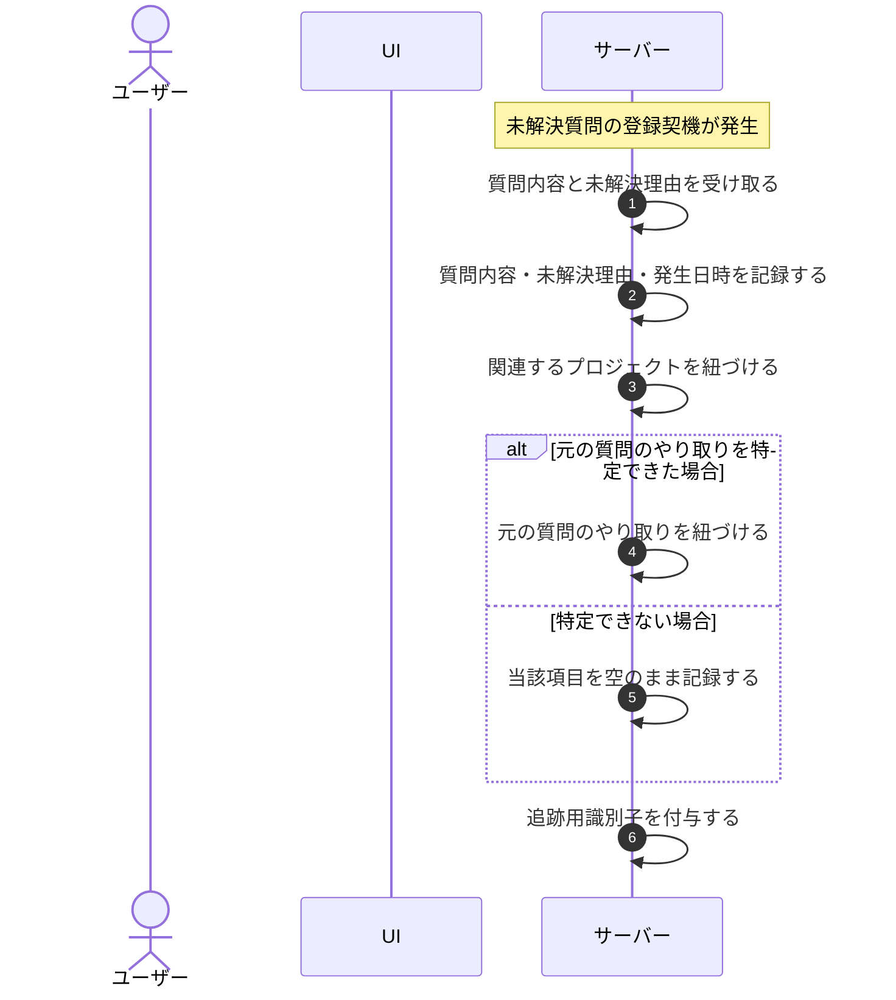

# UC-050: システムが未解決質問に必要項目を記録する

> **この業務ユースケースは「システムが未解決質問を記録するとき、後の調査と FAQ 改善に必要な項目を残すこと」を定義します。**

*主アクター システム ・ ステータス ドラフト*

## 概要

未解決質問の登録契機が発生したとき、システムが質問内容・未解決となった理由・発生日時を記録し、あわせて関連するプロジェクトや元となった質問のやり取りを紐づける。後からの調査と FAQ 改善・サポート対応に必要な情報と追跡用の識別子を残す。

## 主アクター

システム

## 目的

未解決質問に必要な項目を漏れなく記録し、後からの調査・FAQ 改善・サポート対応をたどれる状態にする。

## 事前条件

- 未解決質問の登録契機(システムが回答できなかった、または利用者が未解決と申告した等)が発生している。
- 記録対象の質問内容と、未解決となった理由が判別できる。

## 基本フロー

1. トリガー: 未解決質問の登録契機が発生する。
2. システムが、登録対象となる質問内容と未解決理由を受け取る。
3. システムが、質問内容・未解決理由・発生日時を未解決質問として記録する。
4. システムが、関連するプロジェクトを未解決質問に紐づける。
5. システムが、元となった質問のやり取りを未解決質問に紐づける。
6. システムが、後の調査・改善・サポート対応をたどるための追跡用識別子を付与する。

## 代替フロー

—

## 例外フロー

- 元となった質問のやり取りを特定できない場合は、当該項目を空のまま未解決質問を記録する。

## 事後条件

- 未解決質問に、質問内容・未解決理由・発生日時・関連プロジェクト・関連する質問のやり取り・追跡用識別子が記録される。
- 記録された未解決質問が、後続の調査・FAQ 改善・サポート対応の対象となる。

## トレーサビリティ

トレーサビリティID [TR-050](../../02_basic_design/00_traceability/index.md#TR-050)。本ユースケースが対応する要件、および実現する設計(画面・システム・API・データベース・シーケンス)は当該 TR の行を参照する。

