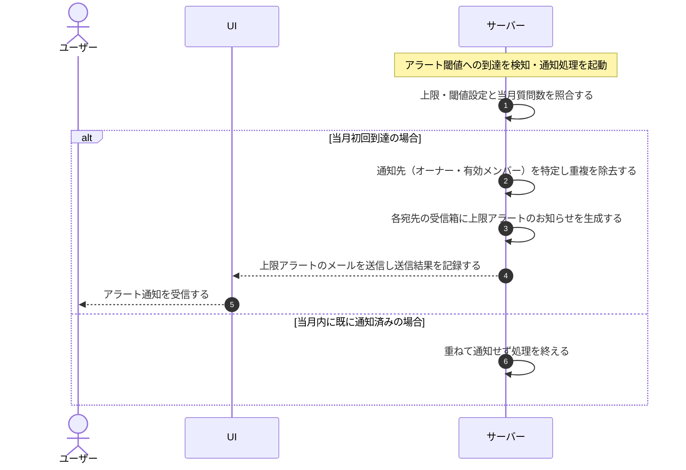

# UC-052: システムが質問数上限アラートを通知する

> **この業務ユースケースは「設定された質問数アラート閾値へ当月初めて到達したとき、システムがオーナーと当該プロジェクトの有効なメンバーへ通知する」ことを定義します。**

*主アクター システム ・ ステータス ドラフト*

## 概要

プロジェクトの当月質問数が、設定済みのアラート閾値へ当月初めて到達したことを契機に、システムが上限到達前の気づきを促す通知を生成し、当該プロジェクトのオーナーと有効なメンバーへ届ける。上限到達前にオーナーやメンバーが利用量へ気づき、上限引き上げや利用の抑制といった対処を取れるようにする。

## 主アクター

システム

## 目的

想定外の超過課金を防ぐため、上限到達前に当該プロジェクトのオーナーやメンバーが利用量の増加へ気づき対処できるよう、設定された閾値への到達を関係者へ確実に知らせる。

## 事前条件

- 当該プロジェクトの質問数上限が有効で、アラート閾値が一つ以上設定されている。
- 当月の質問数の集計が継続して行われている。
- 起動契機(トリガー): 当月の質問数が、設定されたいずれかのアラート閾値へ到達したことをシステムが検知する。

## 基本フロー

1. システムが、当月質問数がいずれかの設定済み閾値へ到達したことを検知し、通知処理を起動する。
2. システムが、当該プロジェクトの上限・閾値設定と当月の質問数を照合する。
3. システムが、その閾値への到達が当月で初めてかを判定する。当月で初めての到達であれば通知を続行する。
4. システムが、通知先としてオーナーと当該プロジェクトの有効なメンバーを特定し、宛先の重複を取り除く。
5. システムが、各宛先の受信箱に上限アラートのお知らせを生成する。
6. システムが、各宛先へ上限アラートのメールを送信し、その送信結果を記録する。

## 代替フロー

—

## 例外フロー

- **当月内の再到達**: 同じプロジェクト・同じ請求月・同じ閾値で既に通知済みの場合は、重ねて通知せずに処理を終える。
- **閾値が未設定**: アラート閾値が一つも設定されていない場合は、アラートを通知しない。
- **メール送信の失敗**: 受信箱のお知らせは生成済みとし、メール送信が失敗した場合はその失敗を記録して、後続の通知再送の対象とする。

## 事後条件

- 設定された閾値への当月初回到達時に限り、オーナーと当該プロジェクトの有効なメンバーへアラートが届く。
- 同じプロジェクト・同じ請求月・同じ閾値の通知は受信者ごとに一度だけ行われ、二重通知が起きない。
- 各宛先の受信箱に上限アラートのお知らせが生成され、送信結果が記録される。

## トレーサビリティ

関連する要件・基本設計の対応は [トレーサビリティ一覧](../../02_basic_design/00_traceability/index.md) で一元管理する。

## 備考

質問数の上限到達による受付停止そのものは別の業務ユースケースが扱い、本ユースケースは上限到達前のアラート通知のみを範囲とする。
