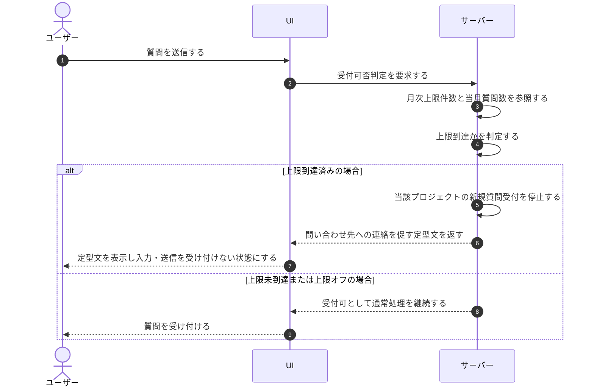

# UC-053: システムが上限到達時にウィジェット受付を停止する

> **この業務ユースケースは「質問送信時にプロジェクトの月次質問数が上限に到達していたら、新規の質問受付を止めて安全な定型文を返す」ことを定義します。**

*主アクター システム ・ ステータス ドラフト*

## 概要

ウィジェット利用者の質問送信を受け付ける際に、システムが当該プロジェクトの当月質問数が月次上限件数に到達しているかを判定する。到達済みであれば、支払方法の有無に関わらず当該プロジェクトのウィジェット新規質問受付を停止し、ウィジェット利用者には問い合わせ先を案内する安全な定型文を返す。停止は当該プロジェクト単位にとどまり、当該プロジェクト自体は有効のまま維持する(同じオーナー・アカウントが関与する他のプロジェクトには波及しない)。

## 主アクター

システム

## 目的

想定外の超過課金からプロジェクトのオーナーを守るため、月次質問数が上限に到達したプロジェクトの新規受付を自動で止め、ウィジェット利用者にも不安を与えない案内を返す。停止は当該プロジェクトに限定し、同じオーナー・アカウントが関与する他のプロジェクトには影響を及ぼさない。

## 事前条件

- トリガー(起動契機): ウィジェット利用者の質問送信を受け付けたとき、システムが受付可否判定を同期で起動する。
- 当該プロジェクトの質問数月次上限がオンで、上限件数が設定されている。
- 当月の利用量(質問数)が計測されている。

## 基本フロー

1. ウィジェット利用者の質問送信を契機に、システムが当該プロジェクトの受付可否判定を起動する。
2. システムが当該プロジェクトの月次上限件数と当月の質問数を参照する。
3. システムが当月の質問数が月次上限件数に到達しているかを判定する。
4. 到達済みの場合、システムは支払方法の有無に関わらず当該プロジェクトのウィジェット新規質問受付を停止する。
5. システムはウィジェット利用者へ、プロジェクトの問い合わせ先への連絡を促す安全な定型文を返し、これ以上の質問入力・送信を受け付けない状態とする。
6. 当該プロジェクトは有効のまま維持し、サスペンションは発生させない。停止は当該プロジェクト単位にとどめ、同じオーナー・アカウントが関与する他のプロジェクトの受付には影響させない。

## 代替フロー

- 未到達(または上限オフ): 当月の質問数が上限件数に未到達、あるいは月次上限がオフのプロジェクトは、受付を停止せず通常どおり質問を受け付ける。

## 例外フロー

- 集計遅延・誤差により上限を超過したと検知した場合も、受付は停止のままとし、超過分の追加対処へ引き継ぐ。

## 事後条件

- 上限到達時は当該プロジェクトのウィジェット新規質問受付が停止し、安全な定型文が返り、入力・送信が受け付けられない状態になる。
- 当該プロジェクトは有効のまま維持され、サスペンションは発生しない。停止の影響は当該プロジェクトに限定され、同じオーナー・アカウントが関与する他のプロジェクトには波及しない。
- 翌月のリセット・上限引き上げ・上限オフのいずれかにより、受付は即時に復帰する。

## トレーサビリティ

関連する要件・基本設計の対応は [トレーサビリティ一覧](../../02_basic_design/00_traceability/index.md) で一元管理する。

## 備考

利用量の計測・閾値到達検知、上限到達前のアラート通知は別の業務ユースケースが扱い、本ユースケースは質問送信時の受付可否判定と停止挙動を範囲とする。
