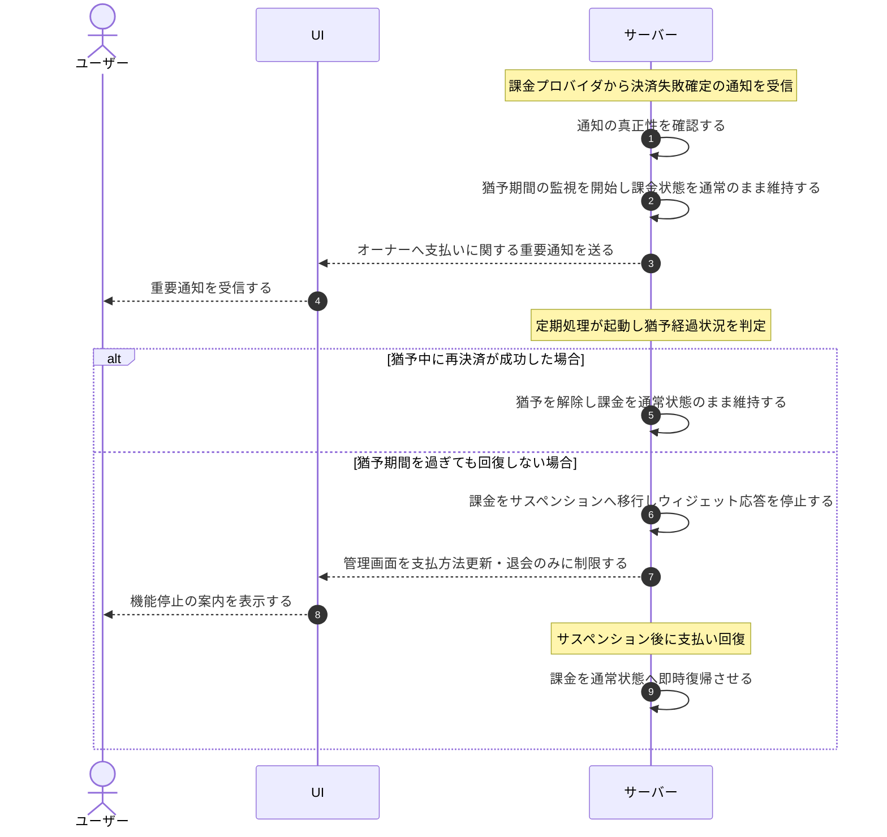

# UC-055: システムが決済失敗から猶予を経てサスペンションへ移行する

> **この業務ユースケースは「決済失敗の確定通知を受けたアカウントの課金を一定の猶予期間で監視し、猶予中に支払いが回復しなければアカウントの課金をサスペンションへ移行し、回復すればいつでも通常状態へ戻す」ことを定義します。**

*主アクター 外部システム ・ ステータス ドラフト*

## 概要

課金プロバイダから決済失敗確定の通知を受けたアカウントについて、システムが一定の猶予期間で支払い回復を待ち受ける。猶予中に再決済が成功すれば即時に通常状態を維持し、猶予期間を過ぎても回復しなければアカウントの課金をサスペンションへ移行し、当該オーナーが作成したプロジェクトのウィジェット応答を停止する。サスペンション後でも支払いが回復すれば通常状態へ復帰させる。

## 主アクター

外部システム

## 目的

未払いのまま利用が続くことを防ぎつつ、オーナーに支払い回復の機会を確保し、決済状態とアカウントの課金状態の整合性を保つ。

## 事前条件

- 起動契機: 課金プロバイダからの決済失敗確定の通知受信、または猶予経過を判定する定期処理の起動。
- 対象となるアカウントと、そのアカウント単位の課金情報が存在する。
- 決済失敗に対する猶予期間がサービスの方針として定められている。
- 課金プロバイダからの通知の真正性を確認する仕組みが有効である。

## 基本フロー

1. 課金プロバイダが決済失敗確定の通知を送信し、システムが通知の真正性を確認する。
2. システムが受信時点を起点に猶予期間の監視を開始し、アカウントの課金は通常利用可能な状態のまま維持する。
3. システムがアカウント保有者であるオーナーへ支払いに関する重要通知を行い、猶予中もユーザー単位の支払方法の更新を受け付ける。
4. 定期処理が起動し、猶予中の各アカウントについて経過状況を判定する。
5. 猶予期間を過ぎても再決済が成立していないアカウントの課金を、システムがサスペンションへ移行する。サスペンション中は当該オーナーが作成したプロジェクトのウィジェット応答を機能停止の案内へ切り替え、管理画面の操作を復旧のための支払方法更新と退会の手続きのみに限定する。
6. 猶予中・サスペンション中のいずれであっても、再決済成功または解除の通知を受けた時点で、システムがアカウントの課金を通常状態へ即時復帰させる。

## 代替フロー

- **猶予中の支払い回復**: 猶予期間を過ぎる前に再決済成功の通知を受けた場合は、サスペンションへ移行せず猶予を解除し、アカウントの課金を通常状態のまま維持する。

## 例外フロー

- **通知の真正性が確認できない場合**: 受信した通知を処理せず拒否し、アカウントの課金状態や猶予を変更しない。
- **同じ通知を重複して受信した場合**: 重複分は冪等に扱い、猶予の開始や状態の移行を二重に適用しない。

## 事後条件

- 猶予期間を過ぎても支払いが回復しないアカウントの課金はサスペンションへ移行し、当該オーナーが作成したプロジェクトのウィジェット応答は機能停止になり、管理画面の操作は復旧のための支払方法更新と退会のみになる。
- 再決済成功または解除の通知を受けたアカウントの課金は通常状態へ復帰する。
- 真正性が確認できない通知や重複受信による誤った状態変更は行われない。

## トレーサビリティ

関連する要件・基本設計の対応は [トレーサビリティ一覧](../../02_basic_design/00_traceability/index.md) で一元管理する。

## 備考

決済失敗確定・再決済成功・解除の通知受信(イベント)と、猶予経過を判定する定期処理の起動(定期)の 2 系統を契機とする。なお、支払方法未登録による無料枠超過時のウィジェット受付停止は決済失敗によるサスペンションとは別の経路であり、本ユースケースの対象外である。
