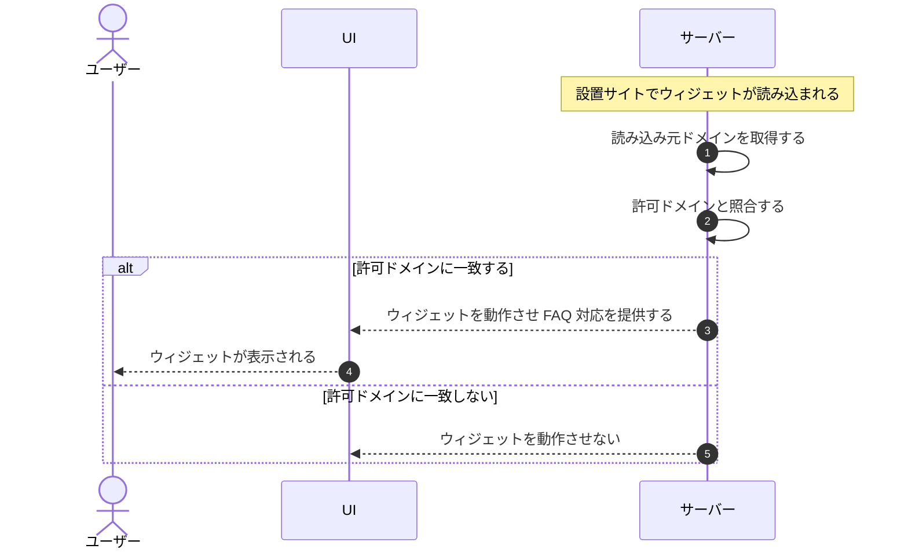

# UC-057: システムが許可ドメイン上でのみウィジェットを動作させる

> **この業務ユースケースは「設置サイトの読み込み元ドメインを許可ドメインと照合し、許可されたドメイン上でのみウィジェットを動作させる」ことを定義します。**

*主アクター システム ・ ステータス ドラフト*

## 概要

ウィジェットが設置サイトで読み込まれた際に、システムが読み込み元のドメインをあらかじめ登録された許可ドメインと照合する。許可ドメイン上での読み込みのみウィジェットを動作させ、許可外ドメインでは動作させない。これにより不正設置や他プロジェクトのデータ参照を防ぐ。

## 主アクター

システム

## 目的

ウィジェットの動作を許可ドメイン上に限定することで、不正設置を防ぎ、プロジェクト間のデータ隔離を担保する。

## 事前条件

- トリガー: 設置サイト上でウィジェットが読み込まれる。
- 対象プロジェクトに許可ドメインが設定されている。

## 基本フロー

1. 設置サイトでウィジェットが読み込まれることを契機に、システムが読み込み処理を受け付ける。
2. システムが読み込み元のドメインを取得する。
3. システムが読み込み元ドメインを、対象プロジェクトに登録された許可ドメインと照合する。
4. 読み込み元が許可ドメインに一致する場合、システムがウィジェットを動作させ、対象プロジェクトのFAQ対応を提供する。
5. システムが当該プロジェクトの範囲内でのみFAQ・回答を取り扱い、他プロジェクトのデータが混入しないようにする。

## 代替フロー

- 読み込み元が許可ドメインに一致しない場合、システムはウィジェットを動作させない。

## 例外フロー

- 対象プロジェクトに許可ドメインが設定されていない場合、システムはウィジェットを動作させない。

## 事後条件

- 許可ドメイン上でのみウィジェットが動作している。
- 許可外ドメインではウィジェットが動作していない。
- 対象プロジェクトのデータ範囲が他プロジェクトから隔離されている。

## トレーサビリティ

トレーサビリティID [TR-057](../../02_basic_design/00_traceability/index.md#TR-057)。本ユースケースが対応する要件、および実現する設計(画面・システム・API・データベース・シーケンス)は当該 TR の行を参照する。

